# 树和森林

## 树的存储结构

> 对于存储结构，可能会联想到前面的**顺序存储和链式存储结构**。但是对于数这种可能会有很多孩子的特殊数据结构，只用顺序存储结构或者链式存储结构很难实现，那么可以将这两者结合，产生主要的三种存储结构表示法：**双亲表示法、孩子表示法、孩子兄弟表示法。**


### 双亲表示法

**定义：**

> 假设以<mark>一组连续空间存</mark>储树的结点，同时在每个结点中，**附设一个指示器指示其双亲结点到链表中的位置**。


**结点结构：**

|    data(数据域)    |          parent(指针域)          |
| :----------------: | :------------------------------: |
| 存储结点的数据信息 | 存储该结点的双亲所在数组中的下标 |


**Code**

```c
/* 树的双亲表法结点结构定义*/
#define MAX_TREE_SIZE 100
typedef int  ElemeType;

typedef struct PTNode{ // 结点结构
    ElemeType data; //结点数据
    int parent;    // 双亲位置
}PTNode;

typedef struct { // 树结构
    PTNode nodes[MAX_TREE_SIZE];   // 结点数组
    int r; // 根的位置
    int n; // 结点数
}PTree;
```


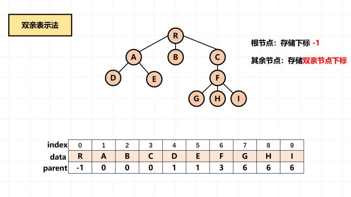

**特点：**

- 由于**根结点是没有双亲的**，约定根结点的位置位置域为-1.
- 根据结点的`parent`指针**很容易找到它的双亲结点**。所用时间复杂度为O(1)，直到parent为-1时，表示找到了树结点的根。
- 缺点：如果要找到孩子结点，**需要遍历整个结构才行**。


### 孩子表示法

**定义：**

> 把每个结点的孩子结点排列起来，以**单链表作为存储结构**，则n个结点有n个孩子链表，如果是叶子结点则此单链表为空。然后**n个头指针又组成一个线性表，采用顺序存储结构**，存放进一个一维数组中。


**结点结构：**

孩子表示法有两种结点结构：**孩子链表的孩子结点**和**表头数组的表头结点**

- 孩子链表的孩子结点

  |         child(数据域)          |             next(指针域)             |
  | :----------------------------: | :----------------------------------: |
  | 存储某个结点在表头数组中的下标 | 存储指向某结点的下一个孩子结点的指针 |

- 表头数组的表头结点

  |      data(数据域)      |     firstchild(头指针域)     |
  | :--------------------: | :--------------------------: |
  | 存储某个结点的数据信息 | 存储该结点的孩子链表的头指针 |

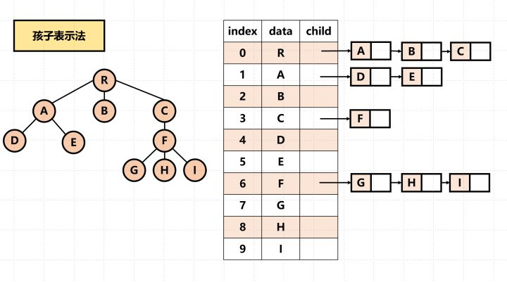

**Code**

```c
/* 树的孩子表示法结构定义*/
#define MAX_TREE_SIZE 100
typedef int  ElemeType;

typedef struct CTNode{  // 孩子结点
    int child; // 孩子结点的下标
    struct CTNode * next; // 指向下一结点的指针
}*ChildPtr;

typedef struct {  // 表头结构
    ElemeType data; // 存放在数中的结点数据
    ChildPtr firstchild; // 指向第一个孩子的指针
}CTBox;

typedef struct {  // 树结构
    CTBox nodes[MAX_TREE_SIZE]; // 结点数组
    int r;  // 根的位置
    int n;  // 结点树
}CTree;
```

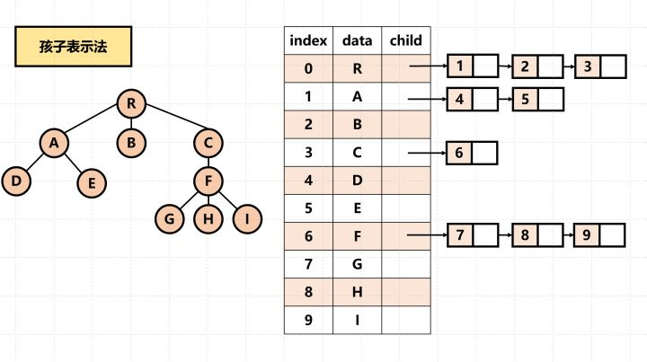

**特点：**

- 适用于查找某结点的孩子结点，不适用于查找其父结点


### 孩子兄弟表示法

**定义：**

> 又称为二叉树表示法，或二叉链表表示法。即以二叉链表作树的存储结构。链表中结点的两个链域分别指向该结点的第一个孩子结点和下一个兄弟结点。

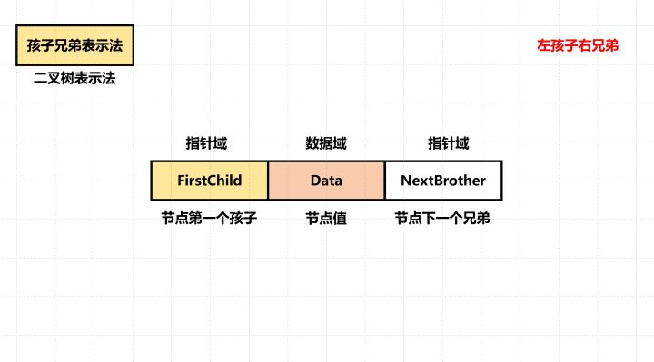

**结点结构：**

|    data(数据域)    |        firstchild(指针域)        |           nextsib(指针域)            |
| :----------------: | :------------------------------: | :----------------------------------: |
| 存储结点的数据信息 | 存储该结点的第一个孩子的存储地址 | **存储该结点的右兄弟结点的存储地址** |

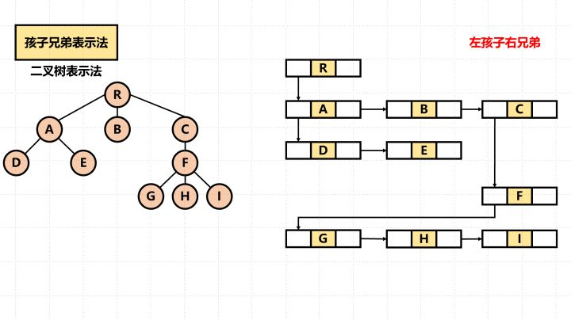

**Code**

```c
/* 树的孩子兄弟表示法结构定义*/
#define MAX_TREE_SIZE 100
typedef int  ElemeType;

typedef struct CSNode{
    ElemeType data;
    struct CSNode * firstchild;
    struct CSNode * rightsib;
    
}CSNode, *CSTree;
```


## 森林与二叉树的转换

### 转换原理

二叉树和树都可用**二叉链表**作为存储结构，则二叉链表作为媒介可导出树与二叉树之间的一个对应关系。也就是说，给定一棵树，可以找到唯一的一棵二叉树与之对应。从物理结构上看，它们的二叉链表是相同的，只是解释不同而已

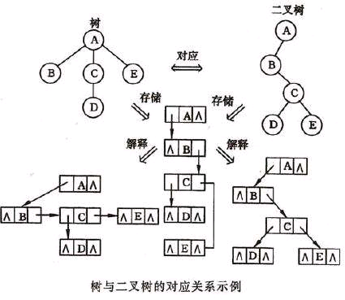


### 转换步骤

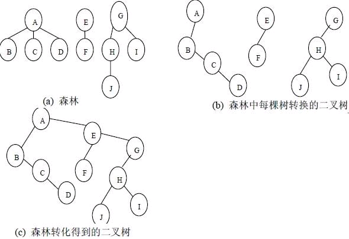

而森林是由多棵树组成，为了便于对森林的遍历等操作，需要将森林中的所有树都组合成一颗大的二叉树，转化步骤为：

1. 首先将森林中树各自转化为二叉树；
2. 森林中第一棵二叉树的树根作为转化后二叉树的树根；
3. 其他树的树根作为第一棵树树根的兄弟结点，进行连接；

 


## 树和森林的遍历

### 树的遍历

**按照某种方式访问树中的每个结点，且仅访问一次。**

- **先根遍历：**若树非空，则先访问根结点，再按从左到右的顺序遍历根结点的每棵子树。
- **后根遍历：**若树非空，则先按从左到右的顺序遍历根结点的每棵子树，再访问根结点。

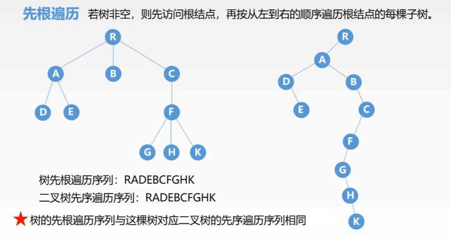

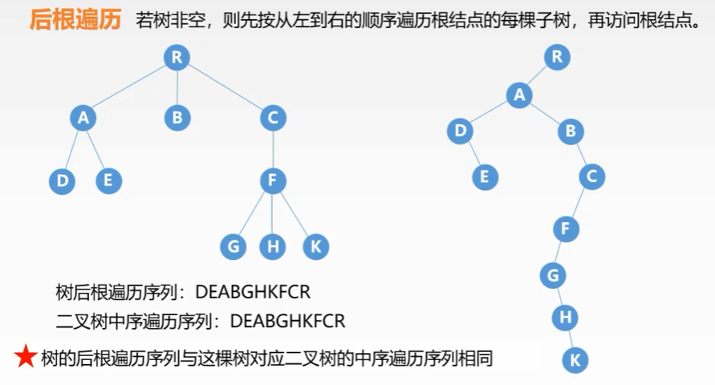


### 森林的遍历

- **先序遍历：**若森林非空，则
  - 访问森林中第一棵树的根结点
  - 先序遍历第一棵树的子树森林
  - 先序遍历除去第一棵树之后剩余的树构成的子树森林
- **中序遍历：**若森林非空，则
  - 中序遍历第一棵树的根结点的子树森林
  - 访问第一棵树的根结点
  - 中序遍历除去第一棵树之后剩余的树构成的子树森林

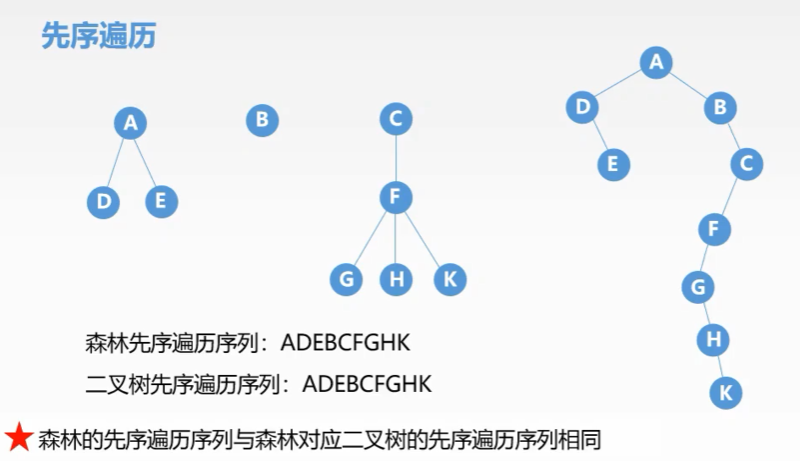

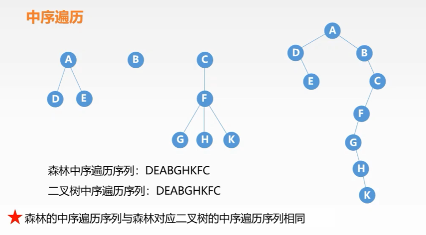


## 遍历序列对应关系


|    树    |   森林   |  二叉树  |
| :------: | :------: | :------: |
| 先根遍历 | 先序遍历 | 先序遍历 |
| 后根遍历 | 中序遍历 | 中序遍历 |


