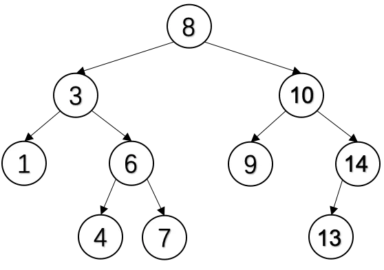
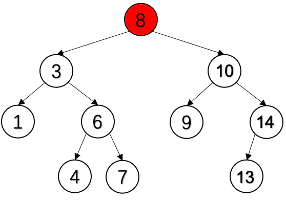
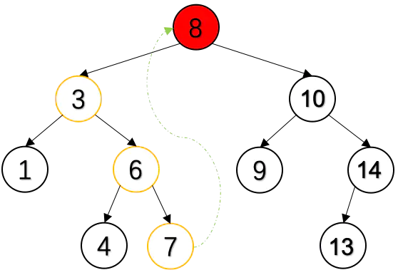
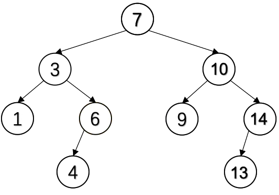
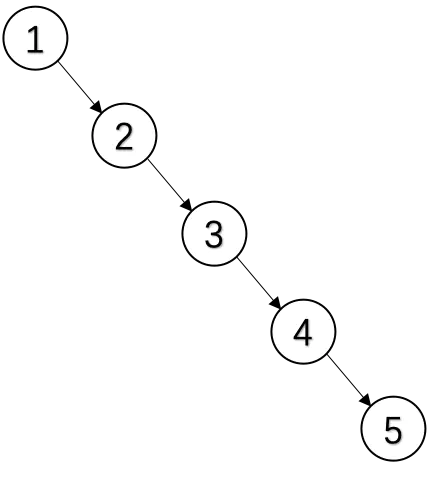

# BST

## 前言

大家都知道，链表适合需要频繁插入、删除数据的场景。但虽然说链表的插入、删除操作比数组性能好很多，但是在插入、删除之前仍需要从头遍历找到该元素，这同样是比较耗时的。因此，人们想到借助二分的方法优化链表的查找——二叉查找树登上舞台，提高数据插入和删除的效率。今天这篇博文带大家一起探讨一下二叉查找树的内容。

## 定义和性质

二叉查找树（Binary Search Tree），又称为二叉排序树（Binary Sort Tree）。二叉查找树或者是一棵空树，或者是具有下列性质的二叉树：

- 若左子树不空，则左子树上所有节点的值**均小于**它的根节点的值；
- 若右子树不空，则右子树上所有节点的值**均大于**或等于它的根节点的值；
- 左、右子树也分别为二叉查找树；
- **没有值相等的节点**

下图二叉树便是一棵典型的二叉查找树。<mark>对二叉查找树进行**中序遍历**便可得到有序序列。</mark>

## 设计实现

[BSTpython实现](https://github.com/pankypan/DataStructureAndAlgo/blob/master/data_structure/e_tree/binary_search_tree.py)

### 查找元素

根据二叉查找树的性质，想要查找树中一个值，只需要从根节点开始查找，如果目标值小于根节点的值就在根节点的左子树中查找，否则就在根节点的右子树中查找；在子树的根节点仍然按照同样的原则进行查找。因此，这是一个递归过程。在理想情况下，每次比较过后，树会被砍掉一半，近乎折半查找。

### 增加元素

二叉排序树的插入是建立在二叉排序的查找之上的，原因很简单，添加一个节点到合适的位置，就是通过查找发现合适位置，把节点直接插入即可。

### 删除元素

在二叉查找树删去一个节点，分三种情况讨论：

- 若目标节点O为叶子节点，即OL（左子树）和OR（右子树）均为空树。由于删去叶子节点不破坏整棵树的结构，则只需修改其双亲节点的指针即可。
- 若目标节点O只有左子树OL或右子树OR，此时只要令OL或OR直接成为其父节点P的左子树（当O只有左子树时）或右子树（当O只有右子树时）即可，作此修改也不破坏二叉查找树的特性。
- 若目标节点O的左子树和右子树均不空。在删去目标节点O之后，为保持其它元素之间的相对位置不变，可按中序遍历保持有序进行调整，可以有两种做法：
  - 令O的左子树为其父节点P的左/右子树（依O是P的左子树还是右子树而定），节点S为O左子树的最右下的节点，而O的右子树为P的右子树；
  - 令O的直接前驱（in-order predecessor）或直接后继（in-order successor）替代O，然后再从二叉查找树中删去它的直接前驱（或直接后继）

由于前两种情况比较直观，因此这里只着重说明一下第3中情况。以图1中的二叉树为例，想要删除**节点8**（例子中，我们使用直接前驱替换O，然后再删除O的直接前驱策略，当然使用直接后继替换也是可以的）。

首先，找到该节点的左子树最右下的节点7，因为节点7是节点的**直接前继**。

最后，用节点7代替节点8，然后删除节点7即可。

**完整代码：**

[BSTpython实现](https://github.com/pankypan/DataStructureAndAlgo/blob/master/data_structure/e_tree/binary_search_tree.py)

## 效率分析

1. **查找代价**：任何一个数据的查找过程都需要从根结点出发，沿某一个路径朝叶子结点前进。因此查找中数据比较次数与树的形态密切相关。

   1. 当树中每个节点左右子树高度大致相同时，树高为logN。则平均查找长度与logN成正比，查找的平均时间复杂度在O(logN)数量级上。

   2. 当先后插入的关键字有序时，BST退化成单支树结构。此时树高n。平均查找长度为(n+1)/2，查找的平均时间复杂度在O(N)数量级上。如图所示。

      

2. **插入代价**：新节点插入到树的叶子上，完全不需要改变树中原有结点的组织结构。插入一个节点的代价与查找一个不存在的数据的代价完全相同。

3. **删除代价**：当删除一个节点P，首先需要定位到这个结点P，这个过程需要一个查找的代价。然后稍微改变一下树的形态。如果被删除节点的左、右子树只有一个存在，则改变形态的代价仅为O(1)。如果被删除节点的左、右子树均存在，只需要将当P的左孩子的最右下的叶子结点与P互换，再改变一些左右子树即可。因此删除操作的时间复杂度最大不会超过O(logN)。

   