# 数据结构与算法(6-2)--图的存储结构及基本操作

## 存储结构

### 邻接矩阵法

#### 定义

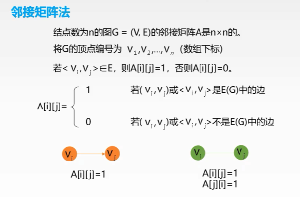


#### 有向图邻接矩阵存储

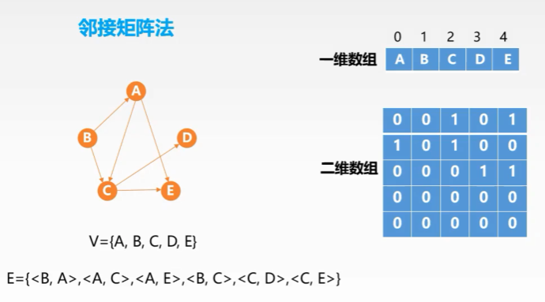


#### 无向图邻接矩阵存储

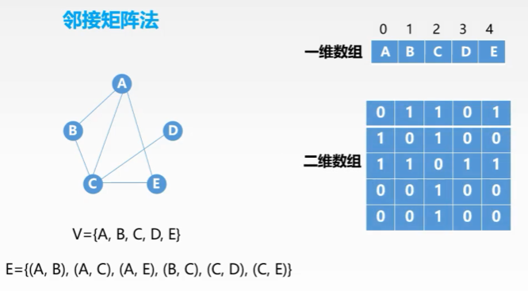


#### 带权邻接矩阵

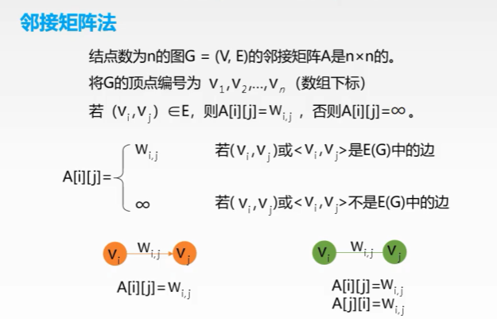

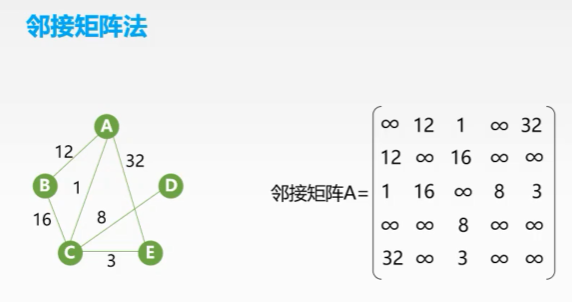


#### 邻接矩阵存储性质

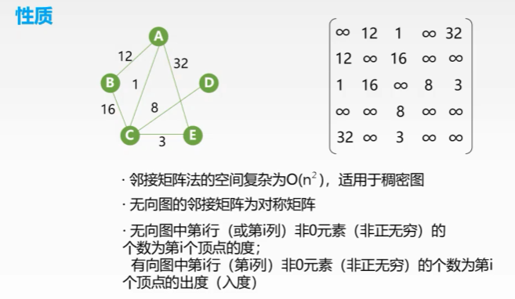

**$A^n$的含义**

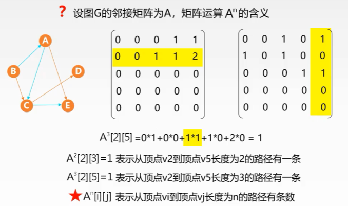


### 邻接表法

#### 定义

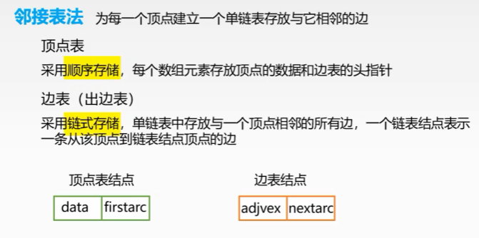


#### 有向图邻接表存储

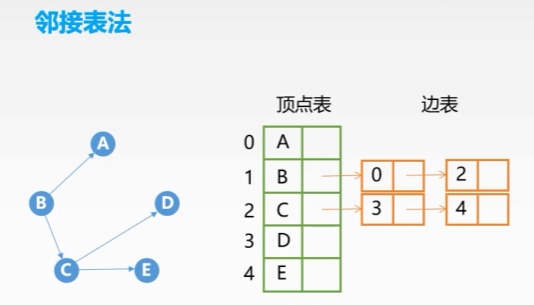


#### 无向图邻接表存储

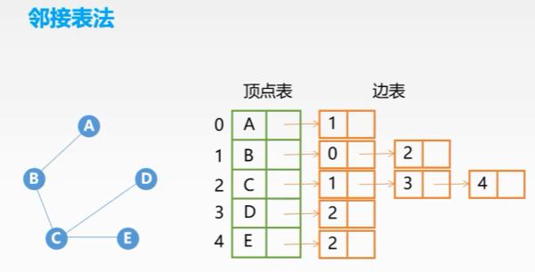


#### 邻接表性质

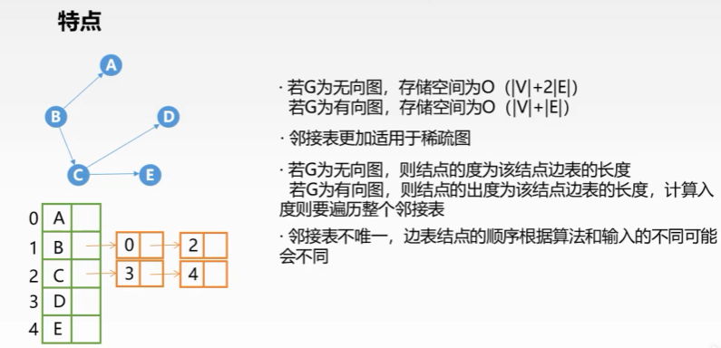


### 邻接矩阵与邻接表对比

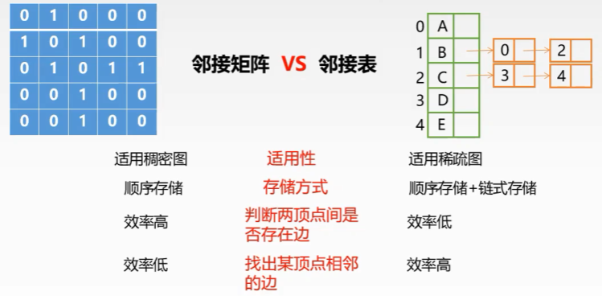


### 十字链表法

**针对有向图**

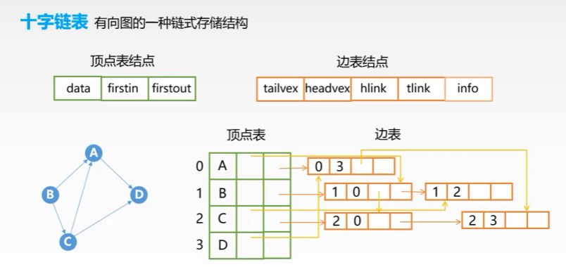


```python
"""
有向图的存储：十字链表

有向图的十字链表存储结构，是有一种链式存储结构，可以看成是【邻接表】和【逆邻接表】
的结合。
图中每条边对应一个【边表结点】，每个顶点对应一个【顶点结点】

边表结点
--------------------------------------------
| tailvex | headvex | hlink | tlink | info |
--------------------------------------------
talivex:以该边为【尾】的结点在图中的位置
headvex:以该边为【头】的结点在图中的位置
hlink:  下一条与该边有【相同边头的边】
tlink:  下一条与该边有【相同边尾的边】
info:   边的相关信息，权值等

顶点结点
-----------------------------
| data | firstin | firstout |
-----------------------------
data:    该结点的数据
firstin: 第一条以该边为边头的【边表结点】
firstout:第一条以该边为边尾的【边表结点】
"""
```


### 邻接多重表法

**针对无向图**

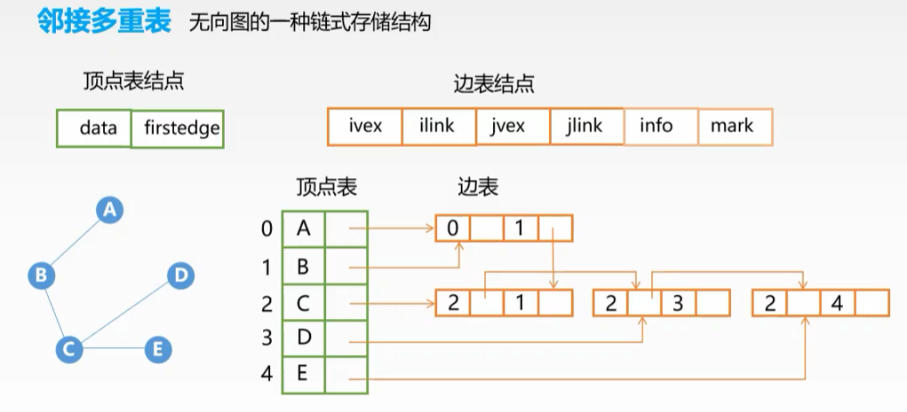

**顶点表结点：**

- `data`：存储此顶点的数据；
- `firstedge`：指针域，用于指向同该顶点有直接关联的存储其他顶点的节点。


**边表结点：**

- `ivex` 和` jvex`：数据域，分别存储图中各边两端的顶点所在数组中的位置下标；
- `ilink`：指针域，指向下一个存储与 ivex 有直接关联顶点的节点；
- `jlink`：指针域，指向下一个存储与 jvex 有直接关联顶点的节点；
- `info`：指针域，用于存储与该顶点有关的其他信息，比如无向网中各边的权；
- `mark`：标志域，用于标记此节点是否被操作过，例如在对图中顶点做遍历操作时，为了防止多次操作同一节点，mark 域为 0 表示还未被遍历；mark 为 1 表示该节点已被遍历；


### 十字链表与邻接多重表对比

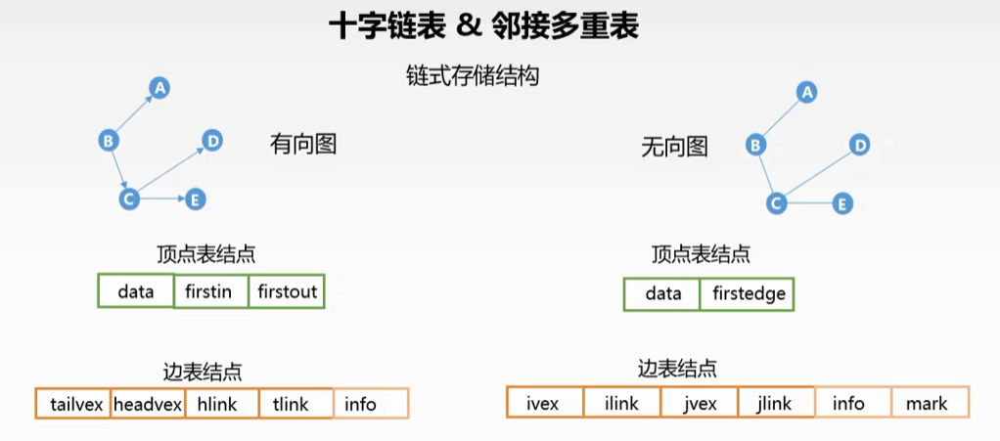


## 图的基本操作

### 判断图G是否存在边<x, y>或(x, y)

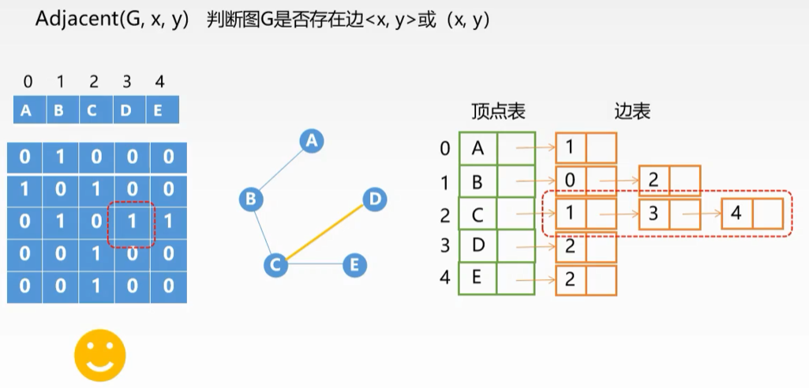

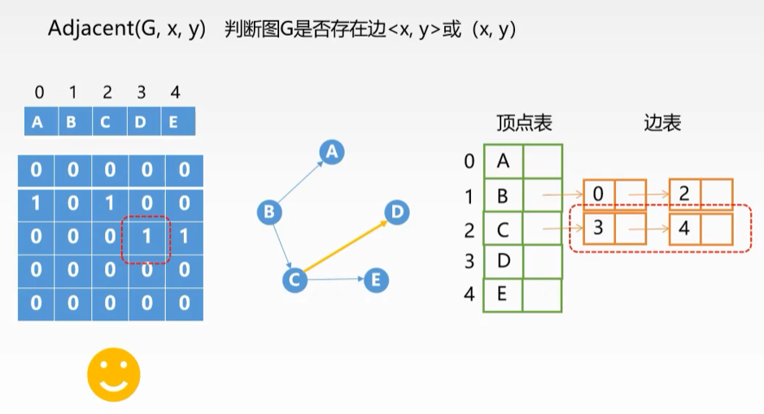


### 列出图G中与结点x邻接的边

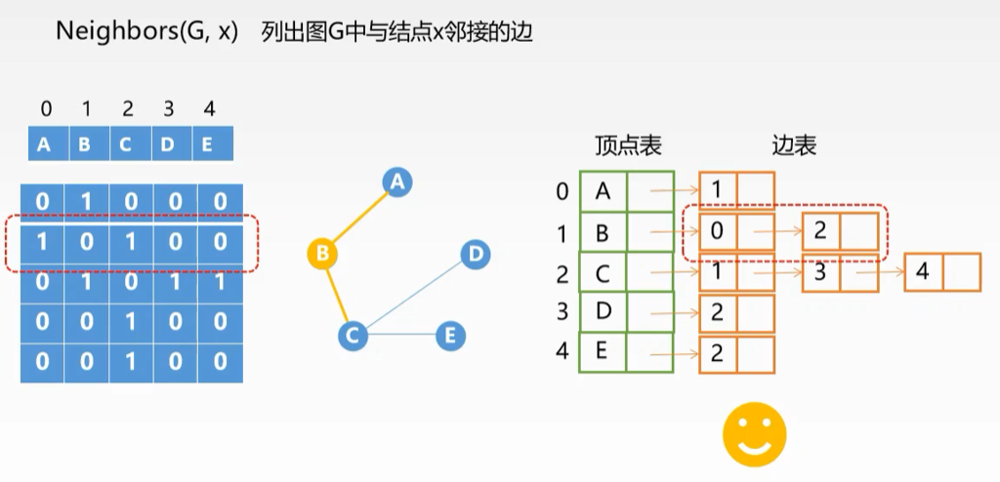

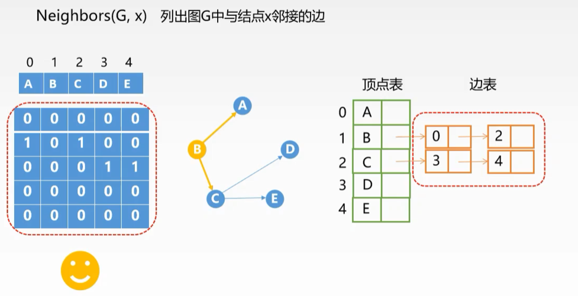


### 在图G中插入顶点x

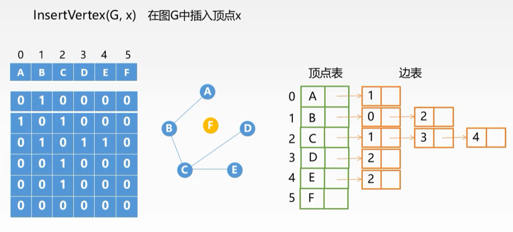


### 从图G中删除顶点x

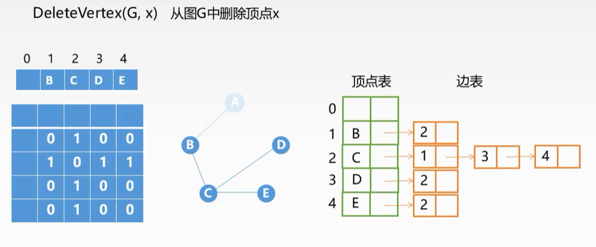


### 向图G中添加边<x, y>或(x, y)

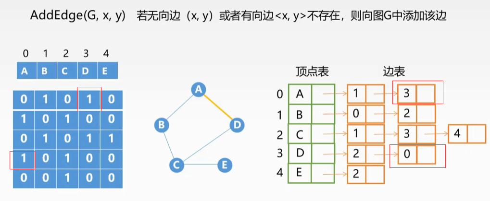


### 从图G中删除边<x, y>或(x, y)

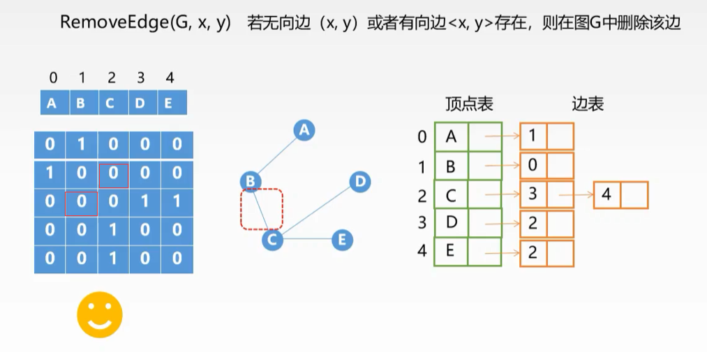


### 求图G的邻接点

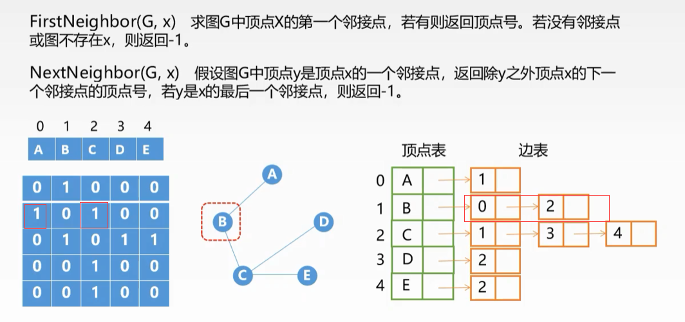


### 图G的边的权值设置及获取

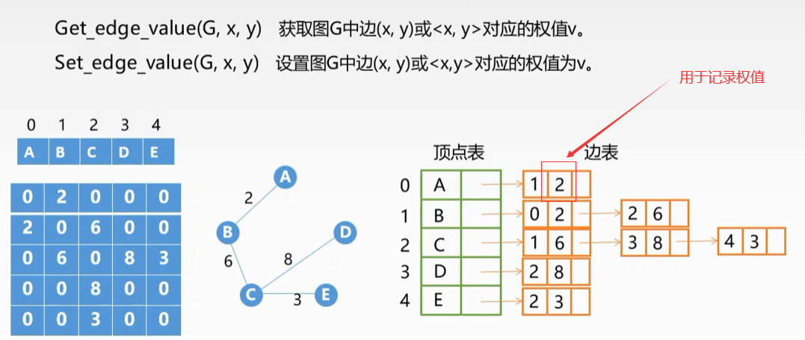


