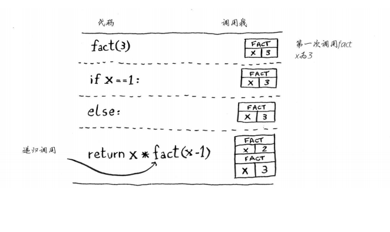
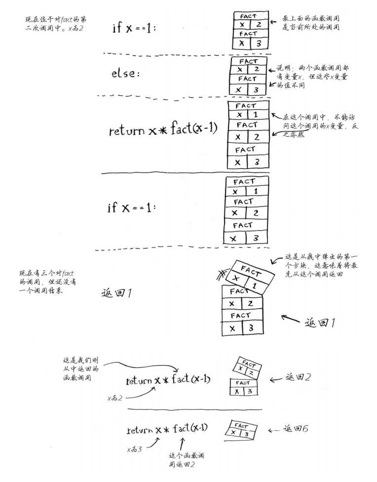
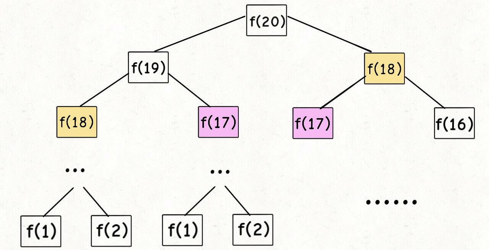

# 数据结构与算法Algo(1)--递归

## 递归函数

> 递归是一种解决问题的有效方法，在递归过程中，函数将自身作为子例程调用


你可能想知道如何实现调用自身的函数。诀窍在于，每当递归函数调用自身时，它都会**将给定的问题拆解为子问题**。递归调用继续进行，直到到子问题无需进一步递归就可以解决的地步。

为了确保递归函数不会导致无限循环，它应具有以下属性：

1. 一个简单的<mark>`基本情况（basic case）`</mark>（或一些案例） —— 能够不使用递归来产生答案的终止方案。
2. 一组规则，也称作<mark>`递推关系（recurrence relation）`</mark>，可将所有其他情况拆分到基本案例。

注意，函数可能会有多个位置进行自我调用。


**递归小结：**

- 递归指的是调用自己的函数。
-  每个递归函数都有两个条件：基线条件和递归条件。
- 所有函数调用都进入调用栈。
- 调用栈可能很长，这将占用大量的内存 


## 画调用栈理解递归

### 调用栈概念

> 这个栈用于存储多个函数的变量，被称为调用栈。 

<mark>一个函数调用另一个函数时，当前函数暂停并处于未完成状态。  </mark>


### 递归调用栈案例

```python
def fact(x):
    """阶乘函数"""
    if x == 1:
        return 1
    else:
        res = x * fact(x - 1)
        return res
```



!

<mark>注意，每个fact调用都有自己的x变量。在一个函数调用中不能访问另一个的x变量  </mark>


## 画递归执行树理解递归

### 斐波那契数列案例

**斐波那契数列的递归实现:**

```python
def fib(n):
    if n == 1 or n == 2:
        return 1
    ret = fib(n - 1) + fib(n - 2)
    return ret
```


### 画出递归执行树




## 记忆化技术

通常情况下，递归是一种直观而有效的实现算法的方法。 但是，如果我们不明智地使用它，可能会给性能带来一些不希望的损失，*例如*重复计算。

`记忆化（memoization）`，可以用来避免这个问题

为了消除上述情况中的重复计算，正如许多人已经指出的那样，其中一个想法是将中间结果**存储**在**缓存**中，以便我们以后可以重用它们，而不需要重新计算。

这个想法也被称为*记忆化*，这是一种经常与递归一起使用的技术。

> [记忆化](https://baike.so.com/doc/4953402-5174974.html) 是一种优化技术，主要用于**加快**计算机程序的速度，方法是**存储**昂贵的函数调用的结果，并在相同的输入再次出现时返回缓存的结果


## 递归--时间复杂度

> 给出一个递归算法，其时间复杂度$ {\mathcal{O}(T)}$ 通常是**递归调用的数量**（记作$ {R}$） 和计算的时间复杂度的乘积（表示为 ${\mathcal{O}(s)}$）的乘积：
>
> ${\mathcal{O}(T) = R * \mathcal{O}(s)}$


### 示例

在[反转字符串](https://leetcode-cn.com/explore/orignial/card/recursion-i/256/principle-of-recursion/1198/)问题中，我们需要以相反的顺序打印字符串，解决问题的递归关系可以表示如下：

```python
printReverse(str) = printReverse(str[1...n]) + print(str[0])
```

其中 `str[1...n]` 是输入字符串 `str` 的子串，仅不含前导字符 `str[0]`。

如您所见，该函数将被递归调用 n 次，其中 n 是输入字符串的大小。在每次递归结束时，我们只是打印前导字符，因此该特定操作的时间复杂度是恒定的，即$ {\mathcal{O}(1)}$。

总而言之，我们的递归函数 `printReverse(str)` 的总体时间复杂度为 

${\mathcal{O}(printReverse) = n * \mathcal{O}(1) = \mathcal{O}(n)}$


### 执行树

对于递归函数，递归调用的数量很少与输入的大小呈线性关系。如果你还记得我们在前一章中讨论过的[斐波那契数](https://leetcode-cn.com/explore/orignial/card/recursion-i/258/memoization/1212/)问题，其递推关系被定义为 `f(n) = f(n-1) + f(n-2)`。乍一看，在执行斐波那契函数期间计算递归调用的数量似乎并不简单。

> 在这种情况下，最好采用**执行树**，这是一个用于表示递归函数的执行流程的树。树中的每个节点都表示递归函数的调用。因此，<mark>树中的节点总数对应于执行期间的递归调用的数量。</mark>

<mark>递归函数的执行树将形成 `n 叉树`</mark>，其中 `n` 作为递推关系中出现递归的次数。例如，斐波那契函数的执行将形成二叉树，下面的图示展现了用于计算斐波纳契数 `f(4)` 的执行树。


在 n 层的完全二叉树中，节点的总数为 ${2^n -1}$。因此 `f(n)` 中递归数目的上限（尽管不严格）也是 ${2^n -1}$。那么我们可以估计 `f(n)` 的时间复杂度为 ${\mathcal{O}(2^n)}$。


## 递归--空间复杂度

> 在计算递归算法的空间复杂度时，应该考虑造成空间消耗的两个部分：递归相关空间（`recursion related space）和非递归相关空间`（`non-recursion related space`）。
>

### 递归相关空间

递归相关空间是指由递归直接引起的内存开销，即用于跟踪递归函数调用的堆栈。为了完成典型的函数调用，系统应该在栈中分配一些空间来保存三个重要信息：

1. 函数调用的返回地址。一旦函数调用完成，程序应该知道返回的位置，即函数调用之前的点；
2. 传递给函数调用的参数； 
3. 函数调用中的局部变量。

栈中的这个空间是函数调用期间产生的最小成本。然而，一旦完成函数调用，就会释放该空间。

对于递归算法，函数调用将连续链接直到它们到达基本情况（*也称为* 底层情况）。这意味着用于每个函数调用的空间也会累积。

> 对于递归算法，如果没有产生其他内存消耗，则此递归引起的空间将是算法的空间上限。


例如，在练习[反转字符串](https://leetcode-cn.com/explore/orignial/card/recursion-i/256/principle-of-recursion/1198/)中，我们没有使用额外的内存，因为我们仅仅是打印一个字符。对于每个递归调用，我们假设它可能需要一个最大为某一常量值的空间。并且递归调用最多可以链接 `n` 次，其中 `n` 是输入字符串的大小。因此，该递归算法的空间复杂度就是 {\mathcal{O}(n)}O(*n*)。

为了更好地说明这一点，接下来我们将会展示递归调用` f(x1) -> f(x2) -> f(x3)` 的执行顺序以及栈空间的分配情况。


栈中的空间将会分配给 `f(x1)` 来调用 `f(x2)`。类似的情况也同样发生在 `f(x2)` 中，系统会为 `f(x3) 的调用分配另一个空间，最后在` `f(x3)` 中，我们到达基本情况，因此在 `f(x3)` 中没有进行进一步的递归调用。

正是由于这些与递归相关的空间消耗，有时可能会遇到称为[堆栈溢出](https://baike.baidu.com/item/堆栈溢出/1231765?fr=aladdin)的情况，其中为程序分配的堆栈达到其最大空间限制并导致程序最终失败。在设计递归算法时，应该仔细评估在输入规模扩大时是否存在堆栈溢出的可能性。


### 非递归相关空间

正如名称所示，非递归相关空间指的是与递归过程没有直接关系的内存空间，通常包括为全局变量分配的空间（通常在堆中）。

不管是否递归，你都可能需要在任何函数调用之前将问题的输入存储为全局变量。你可能还需要保存递归调用的中间结果。后者就是我们前面提到过的**记忆化技术**。例如，在使用带有记忆化技术的递归算法解决斐波那契数问题时,我们使用映射（map）来跟踪在递归调用期间产生的所有中间斐波那契数。因此，在分析空间复杂度时，我们应该考虑到因采用记忆化技术所导致的空间成本。


## 尾递归

在上一篇文章中，我们讨论了由于递归调用而在系统调用栈上产生的隐式额外空间。然而，你应该学习识别一种称为[尾递归](https://baike.baidu.com/item/尾递归/554682)的特殊递归情况，它不受此空间开销的影响。

> 尾递归函数是递归函数的一种，其中递归调用是递归函数中的最后一条指令。并且在函数中应该只有一次递归调用。

我们已经在[反转字符串的解决方案](https://leetcode-cn.com/explore/orignial/card/recursion-i/256/principle-of-recursion/1199/)中看到了尾递归的例子。这里的另一个例子说明了非尾递归和尾递归之间的区别。请注意，非尾递归示例中，在最后一次递归调用之后有一个额外的计算。

```python
def sum_non_tail_recursion(ls):
    """
    :type ls: List[int]
    :rtype: int, the sum of the input list.
    """
    if len(ls) == 0:
        return 0
    
    # not a tail recursion because it does some computation after the recursive call returned.
    return ls[0] + sum_non_tail_recursion(ls[1:])


def sum_tail_recursion(ls):
    """
    :type ls: List[int]
    :rtype: int, the sum of the input list.
    """
    def helper(ls, acc):
        if len(ls) == 0:
            return acc
        # this is a tail recursion because the final instruction is a recursive call.
        return helper(ls[1:], ls[0] + acc)
    
    return helper(ls, 0)
```

尾递归的好处是，它可以避免递归调用期间栈空间开销的累积，因为系统可以为每个递归调用重用栈中的固定空间。

例如，对于递归调用序列` f(x1) -> f(x2) -> f(x3)`，如果函数 `f(x)` 以尾递归的形式实现。那么其执行步骤的顺序和栈空间的分配如下所示：


请注意，在尾递归的情况下，一旦从递归调用返回，我们也会立即返回，因此我们可以跳过整个递归调用返回链，直接返回到原始调用方。这意味着我们根本不需要所有递归调用的调用栈，这为我们节省了空间。

例如，在步骤（1）中，栈中的一个空间将被分配给 `f(x1)`，以便调用 `f(x2)`。然后，在步骤（2）中，函数 `f(x2)` 能够递归地调用 `f(x3)`，但是，系统不需要在栈上分配新的空间，而是可以简单地重用先前分配给第二次递归调用的空间。最后，在函数 `f(x3)` 中，我们达到了基本情况，该函数可以简单地将结果返回给原始调用方，而不会返回到之前的函数调用中。

尾递归函数可以作为非尾递归函数来执行，也就是说，带有调用栈并不会对结果造成影响。通常，编译器会识别尾递归模式，并优化其执行。然而，并不是所有的编程语言都支持这种优化，比如 C，C++ 支持尾递归函数的优化。另一方面，Java 和 Python 不支持尾递归优化。


## 递归经典案例实战

### 杨辉三角

给定一个非负整数 *numRows，*生成杨辉三角的前 *numRows* 行。


在杨辉三角中，**每个数是它左上方和右上方的数的和**。

**示例:**

```
输入: 5
输出:
[
     [1],
    [1,1],
   [1,2,1],
  [1,3,3,1],
 [1,4,6,4,1]
]
```


#### 递推关系

首先，我们定义一个函数$f(i, j)$，它将会返回帕斯卡三角形`第 i 行`、`第 j 列`的数字。

我们可以用下面的公式来表示这一递推关系：
$$
f(i, j) = f(i-1, j-1) + f(i -1, j)
$$


#### 基本情况

可以看到，每行的最左边和最右边的数字是`基本情况`，在这个问题中，它总是等于 1。

因此，我们可以将基本情况定义如下:
$$
f(i, j) = 1 \quad where \; j=1 \; or\; j=i
$$


<mark>一旦我们定义了 `递推关系` 和 `基本情况`，递归函数的实现变得更加直观</mark>

```python
class Solution:
    memory_cache = {}  # 使用缓存

    def generate(self, numRows: int) -> list:
        if numRows == 0:
            return []
        ret = [[self.get_item_value(i, j) for j in range(1, i + 1)] for i in range(1, numRows + 1)]
        return ret

    def get_item_value(self, i, j):
        """
        获取第i行，第j列的值
        :param i:
        :param j:
        :return:
        """
        if self.memory_cache.get((i, j)):  # 取缓存
            return self.memory_cache[(i, j)]
        if j == 1 or i == j:
            return 1
        ret = self.get_item_value(i - 1, j - 1) + self.get_item_value(i - 1, j)
        self.memory_cache[(i, j)] = ret  # 载入缓存
        return ret

    def generate_ii(self, numRows: int) -> list:
        """
        递归法
        :param numRows:
        :return:
        """
        if numRows == 0:
            return []
        if numRows == 1:
            return [[1]]
        elif numRows == 2:
            return [[1], [1, 1]]

        ret = self.generate(numRows - 1) + [[self.get_item_value(numRows, j) for j in range(1, numRows + 1)]]
        return ret
```


### 两两交换链表中的节点

给定一个链表，两两交换其中相邻的节点，并返回交换后的链表。

**你不能只是单纯的改变节点内部的值**，而是需要实际的进行节点交换。

 

**示例:**

```
给定 1->2->3->4, 你应该返回 2->1->4->3.
```


按照我们上面列出的步骤，我们可以按下面的流程来实现函数：

1. 首先，我们交换列表中的前两个节点，也就是 `head` 和 `head.next`；
2. 然后我们以 `swap(head.next.next)` 的形式调用函数自身，以交换头两个节点之后列表的其余部分。
3. 最后，我们将步骤（2）中的子列表的返回头与步骤（1）中交换的两个节点相连，以形成新的链表。

```python
# Definition for singly-linked list.
# class ListNode:
#     def __init__(self, x):
#         self.val = x
#         self.next = None

class Solution:
    def swapPairs(self, head: ListNode) -> ListNode:
        def swap(head):
            if not head or not head.next:
                return head
            temp = head.next.next
            head_right = head.next
            head_right.next = head
            head.next = swap(temp)
            return head_right
        return swap(head)
```


### 反转链表

反转一个单链表。

**示例:**

```
输入: 1->2->3->4->5->NULL
输出: 5->4->3->2->1->NULL
```

**进阶:**
你可以迭代或递归地反转链表。你能否用两种方法解决这道题？

```python
class ListNode:
    def __init__(self, x):
        self.val = x
        self.next = None


class Solution:
    def reverse_list(self, head: ListNode) -> ListNode:
        print(self)
        # prev = None
        # cur = head
        prev, cur = None, head
        while cur:
            # temp = cur.next
            # cur.next = prev
            # prev = cur
            # cur = temp
            cur.next, prev, cur = prev, cur, cur.next
        return prev

    def reverse_list_II(self, head:ListNode) -> ListNode:
        """Use recursion"""
        if not head or not head.next:
            return head
        N = self.reverse_list_II(head.next)
        head.next.next = head
        head.next = None
        return N
```


### 斐波那契数列

**斐波那契数**，通常用 `F(n)` 表示，形成的序列称为**斐波那契数列**。该数列由 `0` 和 `1` 开始，后面的每一项数字都是前面两项数字的和。也就是：

```
F(0) = 0,   F(1) = 1
F(N) = F(N - 1) + F(N - 2), 其中 N > 1.
```

给定 `N`，计算 `F(N)`。


```python
class Solution:
    cache = {}  # 缓存
    def fib(self, N: int) -> int:
        if self.cache.get(N):  # 获取缓存
            return self.cache.get(N)
        if N == 0:
            return 0
        if N == 1:
            return 1
        ret = self.fib(N - 1) + self.fib(N - 2)
        self.cache[N] = ret
        return ret
```


### 爬楼梯

假设你正在爬楼梯。需要 *n* 阶你才能到达楼顶。

每次你可以爬 1 或 2 个台阶。你有多少种不同的方法可以爬到楼顶呢？

**注意：**给定 *n* 是一个正整数。

**示例 1：**

```
输入： 2
输出： 2
解释： 有两种方法可以爬到楼顶。
1.  1 阶 + 1 阶
2.  2 阶
```

**示例 2：**

```
输入： 3
输出： 3
解释： 有三种方法可以爬到楼顶。
1.  1 阶 + 1 阶 + 1 阶
2.  1 阶 + 2 阶
3.  2 阶 + 1 阶
```


```python
class Solution:
    cache = {}  # 缓存，解决递归的重复计算

    def climbStairs(self, n: int) -> int:
        """
        递归公式: f(n) = f(n-1) + f(n-2)
        :param n:
        :return:
        """
        if self.cache.get(n):
            return self.cache.get(n)
        if n <= 2:
            return n
        ret = self.climbStairs(n - 1) + self.climbStairs(n - 2)
        self.cache[n] = ret
        print(self.cache)
        return ret
```


