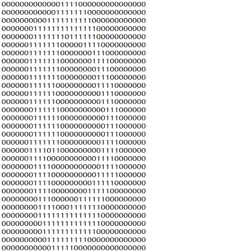
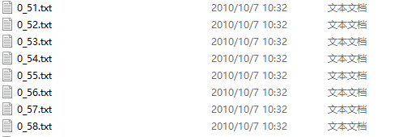
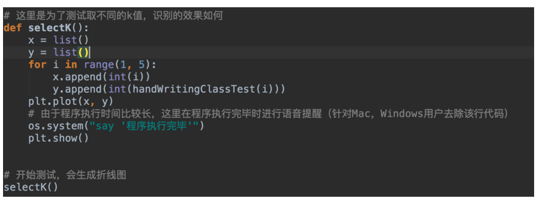
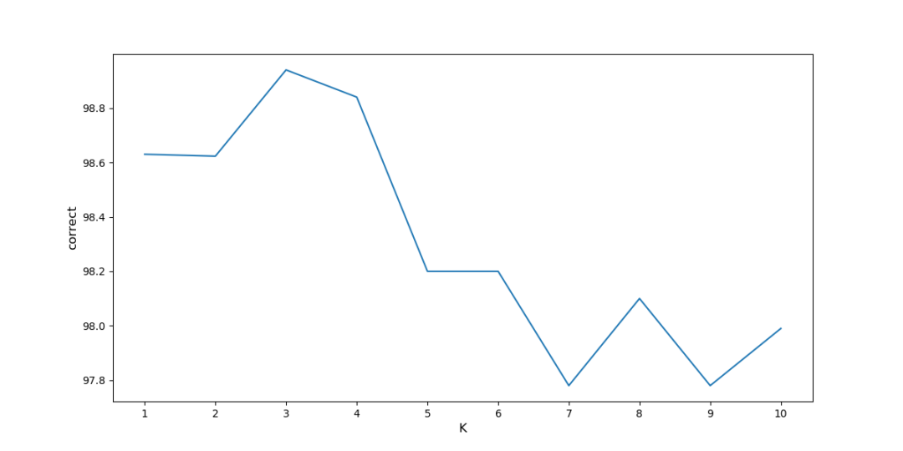
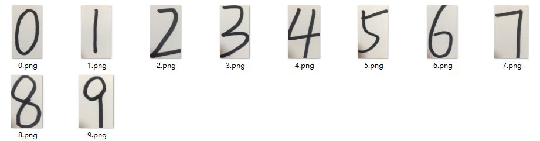

# KNN算法经典之手写数字识别

## 算法简介

手写数字识别是KNN算法一个特别经典的实例，其数据源获取方式有两种，一种是来自MNIST数据集，另一种是从UCI欧文大学机器学习存储库中下载，本文基于后者讲解该例。基本思想就是利用KNN算法推断出如下图一个32x32的二进制矩阵代表的数字是处于0-9之间哪一个数字。



数据集包括两部分，一部分是训练数据集，共有1934个数据；另一部分是测试数据集，共有946个数据。两个数据集中所有数据命名格式都是统一的，例如数字5的第56个样本—>**5_56.txt**，这样做为了方便提取出样本的真实标签。



数据的格式也有两种，一种是像上图一样由0、1组成的文本文件；另一种则是手写数字图片，需要对图片做一些处理，转化成像上图一样的文本格式，下文皆有介绍。


## 算法步骤

1. 收集数据：公开数据源
2. 分析数据，构思如何处理数据
3. 导入训练数据，转化为结构化的数据格式
4. 计算距离（欧式距离）
5. 导入测试数据，计算模型准确率
6. 手写数字，实际应用模型

**由于所有数据皆由0和1构成，所以不需要数据标准化和归一化这一步骤**


## 算法实现

### 处理数据

在计算两个样本之间的距离时，每一个属性是一一对应的，所以这里将32x32的数字矩阵转化成1x1024数字矩阵，方便计算样本之间距离。

```python
#处理文本文件
def img_deal(file):
    #创建一个1*1024的一维零矩阵
    the_matrix = np.zeros((1,1024))
    fb = open(file)
    for i in range(32):
        #逐行读取
        lineStr = fb.readline()
        for j in range(32):
            #将32*32=1024个元素赋值给一维零矩阵
            the_matrix[0,32*i+j] = int(lineStr[j])
    return the_matrix
```


### 计算欧式距离

**numpy**有一个**tile**方法，可以将一个一维矩阵横向复制若干次，纵向复制若干次，所以将一个测试数据经过**tile**方法处理后再减去训练数据，得到新矩阵后，再将该矩阵中每一条数据(横向)平方加和并开根号后即可得到测试数据与每一条训练数据之间的距离。

下一步将所有距离升序排列，取到前K个，并在这个范围里，每个数字类别的个数，并返回出现次数较多那个数字类别的标签。

```python
# KNN分类器
def classifier(test_data,train_data,label,k):
    Size = train_data.shape[0]
    #将测试数据每一行复制Size次减去训练数据，横向复制Size次，纵向复制1次
    the_matrix = np.tile(test_data,(Size,1)) - train_data
    #将相减得到的结果平方
    sq_the_matrix = the_matrix ** 2
    #平方加和，axis = 1 代表横向
    all_the_matrix = sq_the_matrix.sum(axis = 1)
    #结果开根号得到最终距离
    distance = all_the_matrix ** 0.5
    #将距离由小到大排序，给出结果为索引
    sort_distance = distance.argsort()
    dis_Dict = {}
    #取到前k个
    for i in range(k):
        #获取前K个标签
        the_label = label[sort_distance[i]]
        #将标签的key和value传入字典
        dis_Dict[the_label] = dis_Dict.get(the_label,0)+1
    #将字典按value值的大小排序，由大到小，即在K范围内，筛选出现次数最多几个标签
    sort_Count = sorted(dis_Dict.items(), key=operator.itemgetter(1), reverse=True)
    #返回出现次数最多的标签
    return sort_Count[0][0]
```


### 测试数据集应用

首先要对训练数据集处理，**listdir**方法是返回一个文件夹下所有的文件，随后生成一个行数为文件个数，列数为1024的训练数据矩阵，并且将训练数据集中每条数据的真实标签切割提取存入至**labels**列表中，即计算距离**classify**函数中需要传入的**label**。

然后对测试训练数据集做与上述一样的处理，并将**测试数据矩阵TestClassify**、**训练数据矩阵train_matrix**、**训练数据真实标签labels**、**K**共4个参数传入计算距离**classify**函数中，最后计算出模型准确率并输出预测错误的数据。

```python
def hand_writing_class_test(k):
    labels = []
    # listdir方法是返回一个文件夹中包含的文件
    train_data = os.listdir('trainingDigits')
    # 获取该文件夹中文件的个数
    m_train = len(train_data)
    # 生成一个列数为train_matrix，行为1024的零矩阵
    train_matrix = np.zeros((m_train, 1024))
    for i in range(m_train):
        file_name_str = train_data[i]
        file_str = file_name_str.split('.')[0]
        # 切割出训练集中每个数据的真实标签
        file_num = int(file_str.split('_')[0])
        labels.append(file_num)
        # 将所有训练数据集中的数据都传入到train_matrix中
        train_matrix[i, :] = img_2_vector('trainingDigits/%s' % file_name_str)

    error = []
    test_matrix = os.listdir('testDigits')
    correct, error_count = 0.0, 0.0
    m_test = len(test_matrix)
    for i in range(m_test):
        file_name_str = test_matrix[i]
        file_str = file_name_str.split('.')[0]
        # 测试数据集每个数据的真实结果
        file_num = int(file_str.split('_')[0])
        vector_test = img_2_vector('testDigits/%s' % file_name_str)
        classify_result = classifier(vector_test, train_matrix, labels, k)
        print('预测结果：%s\t真实结果：%s' % (classify_result, file_num))
        if classify_result == file_num:
            correct += 1.0
        else:
            error_count += 1.0
            error.append((file_name_str, classify_result))
    print("正确率:{:.2f}%".format(correct / float(m_test) * 100))
    print('error', len(error), error)
    return error_count
```


### K值

下图是K值与模型准确率的关系变化图，K = 3时，模型准确率达到峰值，随着K增大，准确率越来越小，所以这份数据的噪声还是比较小的。






### 手写数字测试

建模完成了，模型的准确率也不错，为何自己手写的数字测试一下呢？所以偶就手动写了几个数字




正常拍出的图片是RGB彩色图片，并且像素也各不相同，所以需要对图片做两项处理：转化成黑白图片、将像素转化为32x32，这样才符合我们上文算法的要求；对于像素点，数值一般位于0-255，255代表白、0代表黑，但因为手写数字像素点颜色并不规范，所以我们设置一个阈值(170)用以判断黑白之分。图片转文本代码如下：

```python
def img_2_txt():
    for i in range(0, 10):
        img = Image.open(r'.\handwritten\%s.png' % i)
        # 将图片像素更改为32X32
        img = img.resize((32, 32))
        # 将彩色图片变为黑白图片
        img = img.convert('L')
        # 保存
        path = r'.\handwritten\%s_new.jpg' % i
        img.save(path)

    for i in range(0, 10):
        fb = open(r'.\hand_written\%s_handwritten.txt' % i, 'w')
        new_img = Image.open(r'.\handwritten\%s_new.jpg' % i)
        # 读取图片的宽和高
        width, height = new_img.size
        for i2 in range(height):
            for j in range(width):
                # 获取像素点
                color = new_img.getpixel((j, i2))
                # 像素点较高的为图片中的白色
                if color > 170:
                    fb.write('0')
                else:
                    fb.write('1')
            fb.write('\n')
        fb.close()
```

正确率为**70%**，毕竟测试数据很小，10个数字中4、7、8三个数字预测错误，还算可观；由于光线问题，有几个数字左下角会有一些黑影，也会对测试结果产生一定的影响，若避免类似情况，并且多增加一些测试数据，正确率定会得到提升的。


### 完整版代码

```python
import os
import operator

import numpy as np
from PIL import Image
from matplotlib import pyplot as plt


def img_2_txt():
    for i in range(0, 10):
        img = Image.open(r'.\handwritten\%s.png' % i)
        # 将图片像素更改为32X32
        img = img.resize((32, 32))
        # 将彩色图片变为黑白图片
        img = img.convert('L')
        # 保存
        path = r'.\handwritten\%s_new.jpg' % i
        img.save(path)

    for i in range(0, 10):
        fb = open(r'.\hand_written\%s_handwritten.txt' % i, 'w')
        new_img = Image.open(r'.\handwritten\%s_new.jpg' % i)
        # 读取图片的宽和高
        width, height = new_img.size
        for i2 in range(height):
            for j in range(width):
                # 获取像素点
                color = new_img.getpixel((j, i2))
                # 像素点较高的为图片中的白色
                if color > 170:
                    fb.write('0')
                else:
                    fb.write('1')
            fb.write('\n')
        fb.close()


# 处理文本文件
def img_2_vector(file):
    # 创建一个1*1024的一维零矩阵
    the_matrix = np.zeros((1, 1024))
    fb = open(file)
    for i in range(32):
        # 逐行读取
        line_str = fb.readline()
        for j in range(32):
            # 将32*32=1024个元素赋值给一维零矩阵
            the_matrix[0, 32 * i + j] = int(line_str[j])
    return the_matrix


# 将txt文件转换为 png 图片
def file_2_img(filename, target):
    fr = open(filename)
    name = filename.split('/')[-1][:-4]
    print(name)
    image = Image.new('L', (32, 32))
    for i in range(32):
        line_str = fr.readline()
        for j in range(32):
            color_value = int(line_str[j])
            if color_value == 1:
                color_value = 255
            image.putpixe((j, i), int(color_value))
            image.save(target + '/' + name + '.png')


# 生成图片
def gen_img(filename, target):
    file_list = os.listdir(filename)
    m = len(file_list)
    if not os.path.exists(target):
        os.mkdir(target)

    for i in range(m):
        file_2_img(filename + file_list[i], target)


# KNN分类器
def classifier(test_data, train_data, label, k):
    size = train_data.shape[0]
    # 将测试数据每一行复制size次减去训练数据，横向复制size次，纵向复制1次
    the_matrix = np.tile(test_data, (size, 1)) - train_data
    # 将相减得到的结果平方
    sq_the_matrix = the_matrix ** 2
    # 平方加和，axis = 1 代表横向
    all_the_matrix = sq_the_matrix.sum(axis=1)
    # 结果开根号得到最终距离
    distance = all_the_matrix ** 0.5
    # 将距离由小到大排序，给出结果为索引
    sort_distance = distance.argsort()
    dis_dict = {}
    # 取到前k个
    for i in range(k):
        # 获取前K个标签
        the_label = label[sort_distance[i]]
        # 将标签的key和value传入字典
        dis_dict[the_label] = dis_dict.get(the_label, 0) + 1
    # 将字典按value值的大小排序，由大到小，即在K范围内，筛选出现次数最多几个标签
    sort_count = sorted(dis_dict.items(), key=operator.itemgetter(1), reverse=True)
    # 返回出现次数最多的标签
    return sort_count[0][0]


def hand_writing_class_test(k):
    labels = []
    # listdir方法是返回一个文件夹中包含的文件
    train_data = os.listdir('trainingDigits')
    # 获取该文件夹中文件的个数
    m_train = len(train_data)
    # 生成一个列数为train_matrix，行为1024的零矩阵
    train_matrix = np.zeros((m_train, 1024))
    for i in range(m_train):
        file_name_str = train_data[i]
        file_str = file_name_str.split('.')[0]
        # 切割出训练集中每个数据的真实标签
        file_num = int(file_str.split('_')[0])
        labels.append(file_num)
        # 将所有训练数据集中的数据都传入到train_matrix中
        train_matrix[i, :] = img_2_vector('trainingDigits/%s' % file_name_str)

    error = []
    test_matrix = os.listdir('testDigits')
    correct, error_count = 0.0, 0.0
    m_test = len(test_matrix)
    for i in range(m_test):
        file_name_str = test_matrix[i]
        file_str = file_name_str.split('.')[0]
        # 测试数据集每个数据的真实结果
        file_num = int(file_str.split('_')[0])
        vector_test = img_2_vector('testDigits/%s' % file_name_str)
        classify_result = classifier(vector_test, train_matrix, labels, k)
        print('预测结果：%s\t真实结果：%s' % (classify_result, file_num))
        if classify_result == file_num:
            correct += 1.0
        else:
            error_count += 1.0
            error.append((file_name_str, classify_result))
    print("正确率:{:.2f}%".format(correct / float(m_test) * 100))
    print('error', len(error), error)
    return error_count


# 测试不同的k值，识别的效果如何
def select_k():
    x, y = list(), list()
    for i in range(1, 5):
        x.append(i)
        y.append(int(hand_writing_class_test(i)))

    plt.plot(x, y)

    os.system('say completed!')
    plt.show()
```


`KNNTest.py`

```python
# coding=utf-8

import KNN
KNN.testHandWritingClass()
```


