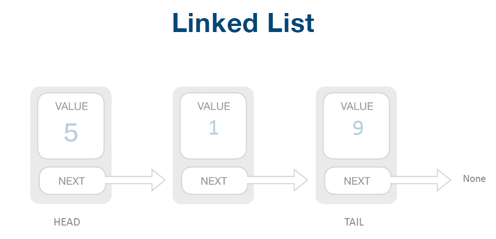

# 定义及特性

## 定义

> 是n个数据元素的有限序列，若将线性表记为$(a_1,...,a_{i-1},a_i,a_{i+1},...,a_n)$，则表中$a_{i-1}$领先于$a_i$，$a_i$领先于$a_i+1$，称$a_{i-1}$是$a_i$的直接前驱元素，$a_{i+1}$是$a_i$的直接后继元素。
>
> 线性表元素的个数$n(n>=0)$定义为线性表的长度，当$n=0$时，称为空表。


其它定义介绍：

- 数据项（`item`）：一个数据元素可以由若干个数据项构成
- 记录（`record`）：数据元素称为记录
- 文件（`file`）：含有大量记录的线性表称为文件


## 特性

- 表中元素的个数有限。
- 表中元素具有逻辑上的顺序性，在序列各元素排序有其先后次序。
- 表中元素都是数据元素，每个元素都是单元素。
- 表中元素的数据类型都相同，这意味着每一个元素占有相同大小的存储空间。
- 表中元素具有抽样性，即仅讨论元素之间的逻辑关系，不考虑元素究竟表示什么内容。


**对于非空的线性表或者线性结构的特点：**

- 存在唯一的一个被称作“第一个”的数据元素；
- 存在唯一的一个被称作“最后一个”的数据元素；
- 除第一个外，结构中的每个数据元素均只有一个前驱；
- 除最后一个外，结构中的每个数据元素均只有一个后继；


# 顺序表示和实现

## 定义

> 用一组地址连续的存储单元依次存储线性表的数据元素，这种存储结构的线性表称为顺序表示

特点：<mark>逻辑上相邻的数据元素，物理次序也是相邻的。</mark>


## 实现

只要确定好了存储线性表的起始位置，线性表中任一数据元素都可以随机存取，所以线性表的顺序存储结构是一种随机存取的储存结构，因为高级语言中的数组类型也是有随机存取的特性，所以通常我们都使用数组来描述数据结构中的顺序储存结构，用动态分配的一维数组表示线性表。

以最简单的学生信息管理为例：

首先先创建两个数据结构，如下：

```c
#define maxsize 100 //定义学生最大数量
#define OK 1       //正确标志
#define ERROR 0     //失败标志
//学生信息的数据结构
typedef struct
{
    int id;   //学生id
    char name[30];   //学生姓名
    
}Student;
 
 
//顺序表数据结构
typedef struct
{
    Student *elem;   //储存空间的基地址
    int length;      //数据结构的长度
}SqList;
 
 
//定义SqList类型的变量
SqList L;
```

描述线性表顺序存储的三个属性：

- 存储空间的起始位置：数组data,它的位置就是存储空间的存储位置。
- 线性表的最大存储容量：数组长度MAXSIZE。
- 线性表的当前长度：length。


## 基本算法
[python版实现](https://github.com/pankypan/DataStructureAndAlgo/blob/master/data_structure/a_array/arrays.py)


# 链式表示和实现

## 定义

> 概念：用一组任意的存储单元存储线性表的数据元素（这组存储单元可以是连续的，也可以是不连续的），包括数据域和指针域，数据域存数据，指针域指示其后继的信息。




## 基本算法

[python版实现](https://github.com/pankypan/DataStructureAndAlgo/blob/master/data_structure/b_linked_list/linked_lists.py)


