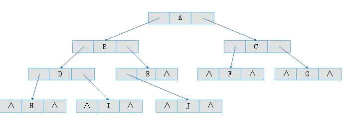
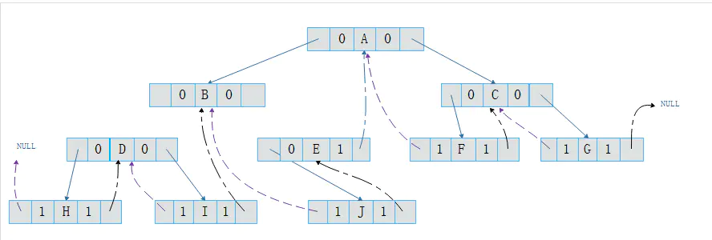

# 线索二叉树

## 产生背景

现有一棵结点数目为n的二叉树，采用二叉链表的形式存储。对于每个结点均有指向左右孩子的两个指针域，而结点为n的二叉树一共有n-1条有效分支路径。那么，则二叉链表中存在2n-(n-1)=n+1个空指针域。那么，这些空指针造成了空间浪费。
 例如：下图所示一棵二叉树一共有10个结点，空指针^有11个。



此外，当对二叉树进行中序遍历时可以得到二叉树的中序序列。例如：图所示二叉树的中序遍历结果为HDIBJEAFCG，可以得知A的前驱结点为E，后继结点为F。但是，这种关系的获得是建立在完成遍历后得到的，那么可不可以在建立二叉树时就记录下前驱后继的关系呢，那么在后续寻找前驱结点和后继结点时将大大提升效率。


## 线索化

现将某结点的空指针域指向该结点的前驱后继，定义规则如下：

> 若结点的左子树为空，则该结点的左孩子指针指向其前驱结点。
> 若结点的右子树为空，则该结点的右孩子指针指向其后继结点。

这种指向前驱和后继的指针称为**线索**。<mark>将一棵普通二叉树以某种次序遍历，并添加线索的过程称为线索化。</mark>

按照规则将上图所示二叉树线索化后如图所示：


图中黑色点画线为指向后继的线索，紫色虚线为指向前驱的线索。
可以看出通过线索化，既解决了空间浪费问题，又解决了前驱后继的记录问题。


## 线索化带来的新问题

将一棵二叉树线索化为一棵线索二叉树，那么新的问题产生了。我们如何区分一个结点的lchild指针是指向左孩子还是前驱结点呢？例如：对于图2.2所示的结点E，如何区分其lchild的指向的结点J是其左孩子还是前驱结点呢？

 为了解决这一问题，现需要添加标志位ltag，rtag。并定义规则如下：

> ltag为0时，指向左孩子，为1时指向前驱
> rtag为0时，指向右孩子，为1时指向后继

添加ltag和rtag属性后的结点结构如下：


将线索二叉树转变为图所示的添加标志位的二叉树。




## 线索二叉树结点数据结构

```c
//#define Link 0//指针标志  
//#define Thread 1//线索标志  
typedef char TElemType;   
//中序线索二叉树  
typedef enum PointerTag {Link, Thread};//结点的child域类型，link表示是指针，指向孩子结点，thread表示是线索，指示前驱或后继结点  
//定义结点数据结构
typedef struct ThrBiNode{  
    TElemType data;  
    ThrBiNode *lchild, *rchild;//左右孩子指针  
    PointerTag lTag, rTag;//左右标志  
}ThrBiNode, *ThrBiTree;  
```


## 中序遍历建立线索二叉树

中序遍历实现线索化的过程就是在中序遍历同时修改结点空指针的指向。

```c
//中序遍历进行中序线索化
void inThreading(ThrBiTree T, ThrBiTree &pre){  
    if(T){  
        inThreading(T->lchild, pre);//左子树线索化  
  
        if(!T->lchild){//当前结点的左孩子为空  
            T->lTag = Thread;  
            T->lchild = pre;  
        }else{  
            T->lTag = Link;  
        }  
  
        if(!pre->rchild){//前驱结点的右孩子为空  
            pre->rTag = Thread;  
            pre->rchild = T;  
        }else{  
            pre->rTag = Link;  
        }  
        pre = T;          
        inThreading(T->rchild, pre);//右子树线索化  
    }  
}  
```


## 加上头结点，遍历线索二叉树

加上线索的二叉树结构是一个双向链表结构，为了便于遍历线索二叉树，我们为其添加一个头结点，头结点左孩子指向原二叉树的根结点，右孩子指针指向中序遍历的最后一个结点。同时，将第一个结点左孩子指针指向头结点，最后一个结点的右孩子指针指向头结点。

线索二叉树添加头结点后如图所示：


带有头结点的线索二叉树遍历代码如下：

```c
//T指向头结点，头结点的lchild链域指针指向二叉树的根结点  
//中序遍历打印二叉线索树T（非递归算法）  
void inOrderTraversePrint(ThrBiTree T){  
    ThrBiNode *p = T->lchild;//p指向根结点  
      
    while(p != T){//空树或遍历结束时，p == T  
        while(p->lTag == Link){  
            p = p->lchild;  
        }  
        //此时p指向中序遍历序列的第一个结点（最左下的结点）  
  
        printf("%c ", p->data);//打印（访问）其左子树为空的结点  
  
        while(p->rTag == Thread && p->rchild != T){  
            p = p->rchild;  
            printf("%c ", p->data);//访问后继结点  
        }  
        //当p所指结点的rchild指向的是孩子结点而不是线索时，p的后继应该是其右子树的最左下的结点，即遍历其右子树时访问的第一个节点  
        p = p->rchild;  
    }  
    printf("\n");  
}  
```


## 结语

**线索二叉树充分利用了指针空间，同时又便于寻找结点的前驱结点和后继结点。**线索二叉树适用于经常需要遍历寻找结点前驱或者后继结点的二叉树。

