# 图的基本概念

## 图

> 图：图G由顶点集V和边集E组成，记为G=(V, E)；其中V(G)表示图G中顶点的有限非空集；E(G)表示图G中顶点之间的关系(边)集合；
>
> |V|表示图G中顶点的个数，也称图G的阶；|E|表示图G中边的条数

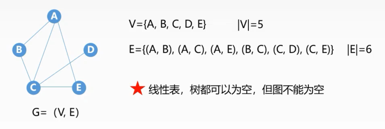

## 无向图&有向图

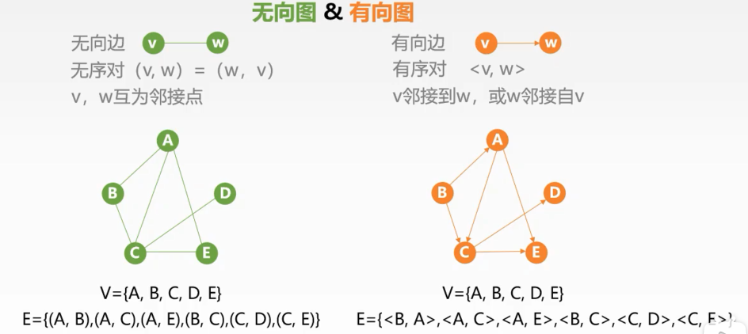

## 简单图&多重图

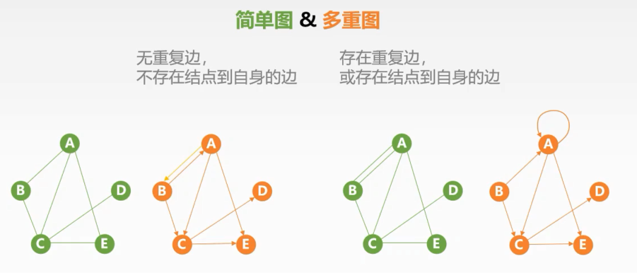

## 完全图

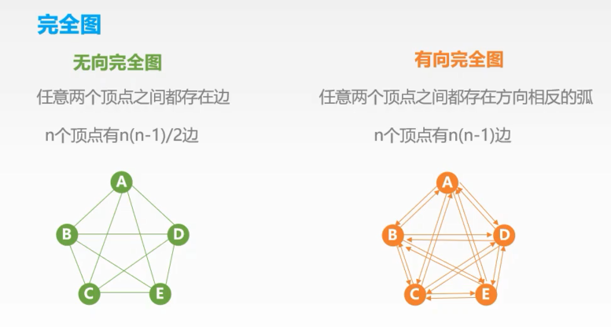

## 子图

> 子图：设两个图G(V, E)和G'=(V', E')，若V'是V的子集，且E'是E的子集，则称G'是G的子图，且若V(G)=V(G')则称G'是G的生成子图

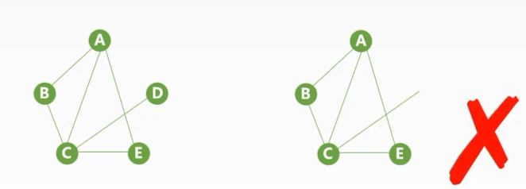

## 连通&连通图

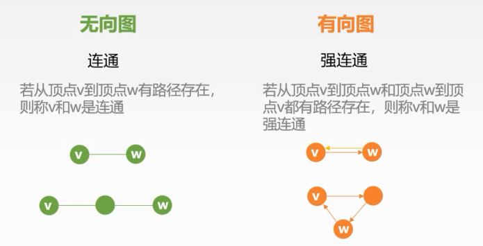

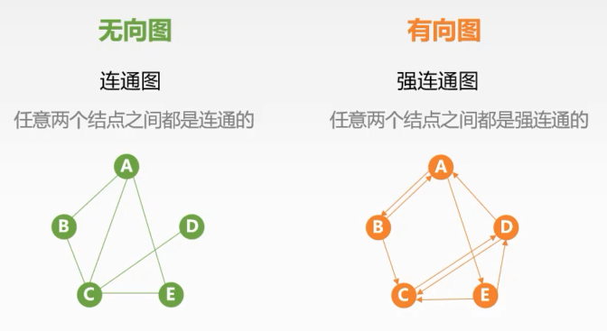

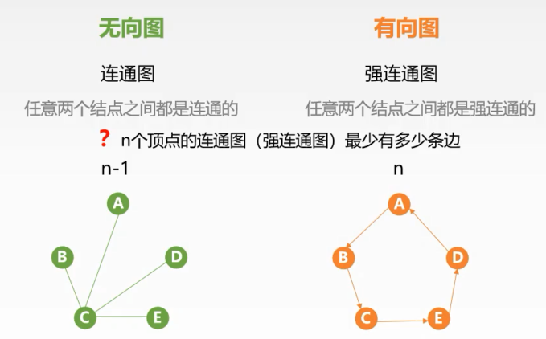

## 连通分量

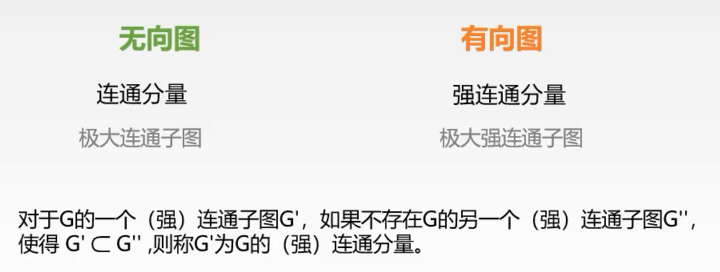

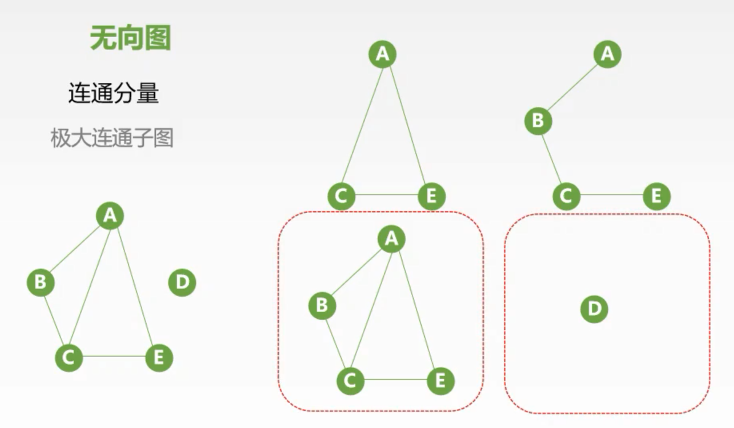

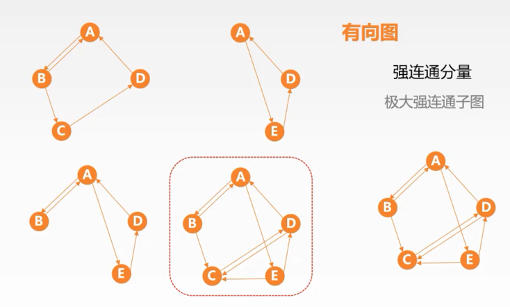

## 生成树、生成森林

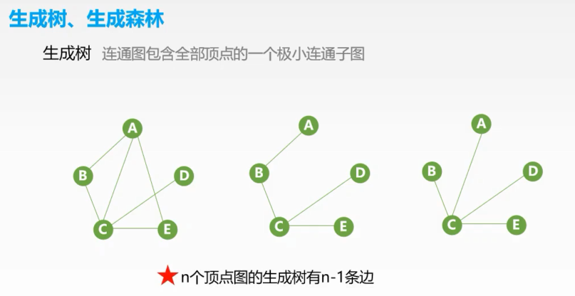

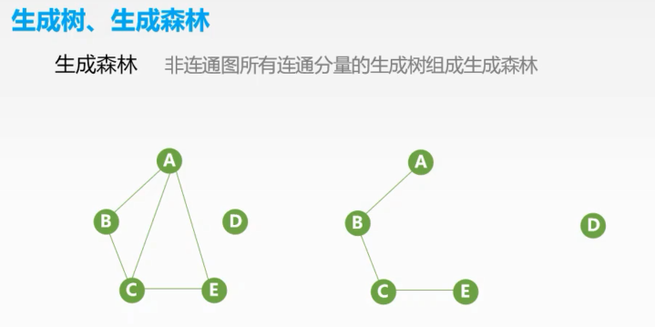

## 顶点的度

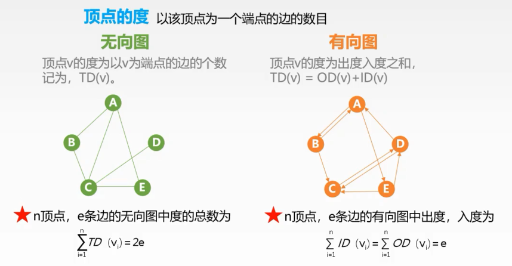

## 网

## 稠密图&稀疏图

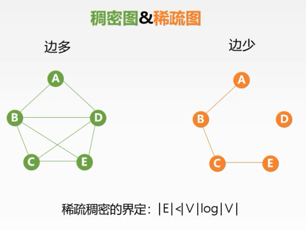

## 特殊图--有向树

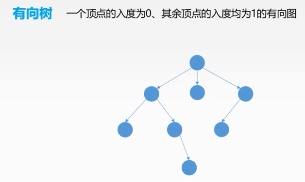

## 路径

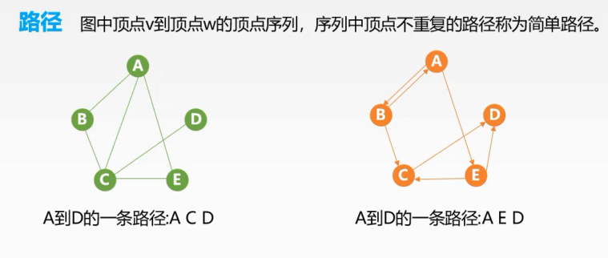

## 回路

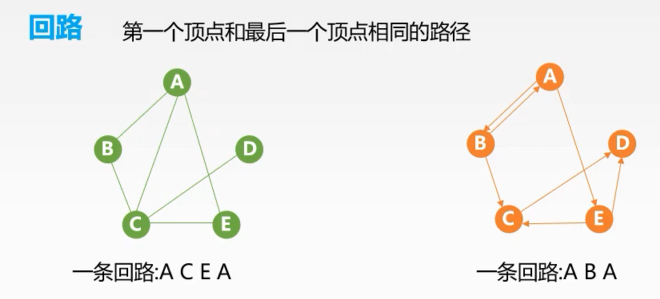

