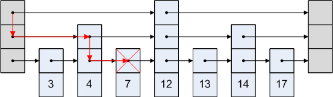

# 跳表

## 跳表介绍


> Skip lists are a data structure that can be used in place of balanced trees.
> Skip lists use probabilistic balancing rather than strictly enforced balancing and as a result the algorithms for insertion and deletion in skip lists are much simpler and significantly faster than equivalent algorithms for balanced trees.

<mark>跳表可以用来替代红黑树，使用概率均衡技术，插入、删除操作更简单、更快。</mark>


上图a，已排好序的链表，查找一个结点最多需要比较`N`个结点。

上图b，每隔2个结点增加一个指针，指向该结点间距为2的后续结点，那么查找一个结点最多需要比较`ceil(N/2)+1`个结点。

上图c，每隔4个结点增加一个指针，指向该结点间距为4的后续结点，那么查找一个结点最多需要比较`ceil(N/4)+1`个结点。

如果每第`2^i`个结点都有一个指向间距为2^i的后续结点的指针，这样不断增加指针，比较次数会降为`log(N)`。这样的话，搜索会很快，但插入和删除会很困难。

一个拥有*k*个指针的结点称为一个*k*层结点（*level k node*）。按照上面的逻辑，50%的结点为1层，25%的结点为2层，12.5%的结点为3层...如果每个结点的层数随机选取，但仍服从这样的分布呢（上图e，对比上图d）？

使一个*k*层结点的第*i*个指针指向第*i*层的下一个结点，而不是它后面的第*2^(i-1)*个结点，那么结点的插入和删除只需要原地修改操作；一个结点的层数，是在它被插入的时候随机选取的，并且永不改变。因为这样的数据结构是基于链表的，并且额外的指针会跳过中间结点，所以作者称之为跳表（Skip Lists）。


## 搜索

按key搜索，找到返回该key对应的value，未找到则返回null。

通过遍历forward数组来需找特定的searchKey。假设skip list的key按照从小到大的顺序排列，那么从跳表的当前最高层listLevel开始寻找searchKey。在某一层找到一个非小于searchKey的结点后，跳到下一层继续找，直到最底层为止。那么根据最后搜索停止位置的下一个结点，就可以判断searchKey在不在跳表中。

下图为在跳表中找8的过程：




## 插入和删除

插入的删除的方法相似，都是通过查找与连接（search and splice），如下图：


维护一个`update`数组，在搜索结束之后，`update[i]`保存的是待插入/删除结点在第i层的左侧结点。

1. **插入**

   若`key`不存在，则插入该`key`与对应的`value`；若`key`存在，则更新`value`。

   如果待插入的结点的层数高于跳表的当前层数`listLevel`，则更新`listLevel`。

   选择待插入结点的层数`randomLevel`：

   `randomLevel`只依赖于跳表的最高层数和概率值`p`。算法在后面的代码中。

2. **删除**

   删除特定的`key`与对应的`value`。

   如果待删除的结点为跳表中层数最高的结点，那么删除之后，要更新`listLevel`。


## 代码实现

**跳表特点：**

- 代码实现相对简单
- 时间复杂度能达到$O(\log n)$

```java
public class SkipList<T> {

    // 最高层数
    private final int MAX_LEVEL;
    // 当前层数
    private int listLevel;
    // 表头
    private SkipListNode<T> listHead;
    // 表尾
    private SkipListNode<T> NIL;
    // 生成randomLevel用到的概率值
    private final double P;
    // 论文里给出的最佳概率值
    private static final double OPTIMAL_P = 0.25;

    public SkipList() {
        // 0.25, 15
        this(OPTIMAL_P, (int)Math.ceil(Math.log(Integer.MAX_VALUE) / Math.log(1 / OPTIMAL_P)) - 1);
    }

    public SkipList(double probability, int maxLevel) {
        P = probability;
        MAX_LEVEL = maxLevel;

        listLevel = 1;
        listHead = new SkipListNode<T>(Integer.MIN_VALUE, null, maxLevel);
        NIL = new SkipListNode<T>(Integer.MAX_VALUE, null, maxLevel);
        for (int i = listHead.forward.length - 1; i >= 0; i--) {
            listHead.forward[i] = NIL;
        }
    }

    // 内部类
    class SkipListNode<T> {
        int key;
        T value;
        SkipListNode[] forward;
        
        public SkipListNode(int key, T value, int level) {
            this.key = key;
            this.value = value;
            this.forward = new SkipListNode[level];
        }
    }

    public T search(int searchKey) {
        SkipListNode<T> curNode = listHead;

        for (int i = listLevel; i > 0; i--) {
            while (curNode.forward[i].key < searchKey) {
                curNode = curNode.forward[i];
            }
        }

        if (curNode.key == searchKey) {
            return curNode.value;
        } else {
            return null;
        }
    }

    public void insert(int searchKey, T newValue) {
        SkipListNode<T>[] update = new SkipListNode[MAX_LEVEL];
        SkipListNode<T> curNode = listHead;

        for (int i = listLevel - 1; i >= 0; i--) {
            while (curNode.forward[i].key < searchKey) {
                curNode = curNode.forward[i];
            }
            // curNode.key < searchKey <= curNode.forward[i].key
            update[i] = curNode;
        }

        curNode = curNode.forward[0];

        if (curNode.key == searchKey) {
            curNode.value = newValue;
        } else {
            int lvl = randomLevel();

            if (listLevel < lvl) {
                for (int i = listLevel; i < lvl; i++) {
                    update[i] = listHead;
                }
                listLevel = lvl;
            }

            SkipListNode<T> newNode = new SkipListNode<T>(searchKey, newValue, lvl);

            for (int i = 0; i < lvl; i++) {
                newNode.forward[i] = update[i].forward[i];
                update[i].forward[i] = newNode;
            }
        }
    }

    public void delete(int searchKey) {
        SkipListNode<T>[] update = new SkipListNode[MAX_LEVEL];
        SkipListNode<T> curNode = listHead;

        for (int i = listLevel - 1; i >= 0; i--) {
            while (curNode.forward[i].key < searchKey) {
                curNode = curNode.forward[i];
            }
            // curNode.key < searchKey <= curNode.forward[i].key
            update[i] = curNode;
        }

        curNode = curNode.forward[0];

        if (curNode.key == searchKey) {
            for (int i = 0; i < listLevel; i++) {
                if (update[i].forward[i] != curNode) {
                    break;
                }
                update[i].forward[i] = curNode.forward[i];
            }

            while (listLevel > 0 && listHead.forward[listLevel - 1] == NIL) {
                listLevel--;
            }
        }
    }

    private int randomLevel() {
        int lvl = 1;
        while (lvl < MAX_LEVEL && Math.random() < P) {
            lvl++;
        }
        return lvl;
    }

    public void print() {
        for (int i = listLevel - 1; i >= 0; i--) {
            SkipListNode<T> curNode = listHead.forward[i];
            while (curNode != NIL) {
                System.out.print(curNode.key + "->");
                curNode = curNode.forward[i];
            }
            System.out.println("NIL");
        }
    }

    public static void main(String[] args) {
        SkipList<Integer> sl = new SkipList<Integer>();
        sl.insert(20, 20);
        sl.insert(5, 5);
        sl.insert(10, 10);
        sl.insert(1, 1);
        sl.insert(100, 100);
        sl.insert(80, 80);
        sl.insert(60, 60);
        sl.insert(30, 30);
        sl.print();
        System.out.println("---");
        sl.delete(20);
        sl.delete(100);
        sl.print();
    }
}
```


