# 数据结构与Python实现

## 分类和时空复杂度

**分类：**

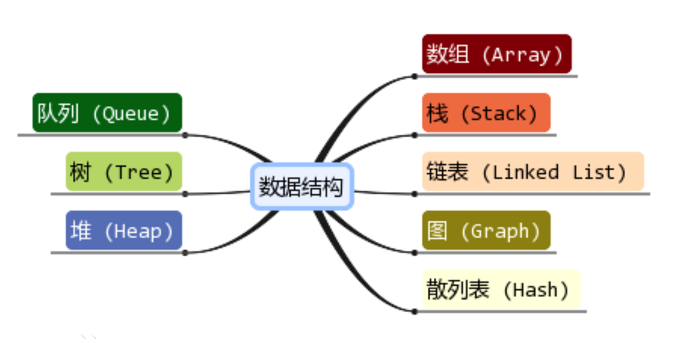

**时间和空间复杂度：**

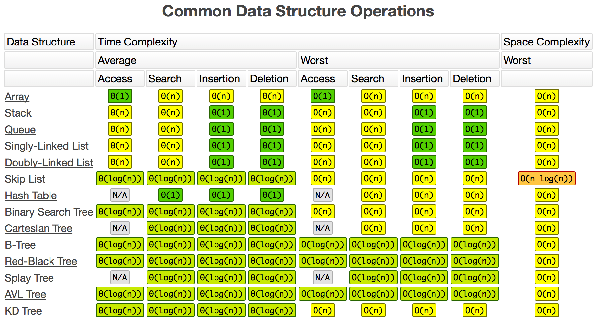

 

## Array

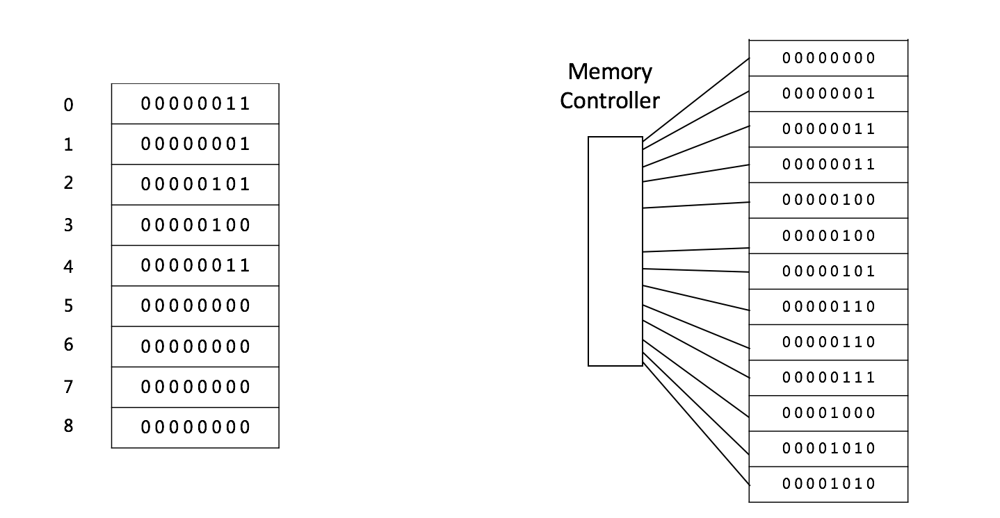

**数组**是可以再内存中**连续存储多个元素的结构**，在<u>内存中的分配也是连续的</u>，数组中的元素通过数组**下标**进行访问，数组**下标从0开始**。

**适用场景：**

+ 频繁查询，对存储空间要求不大，很少增加和删除的情况

**优点：**

+ 按照索引查询元素速度快
+ 按照索引遍历数组方便

**缺点：**

+ 数组的大小固定后就无法扩容了
+ 数组只能存储一种类型的数据
+ 添加，删除的操作慢，因为要移动其他的元素

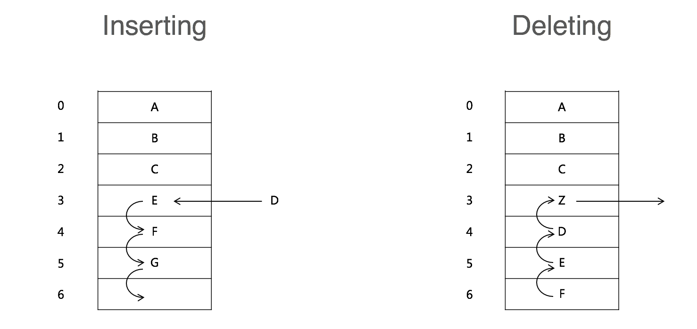

| 时间复杂度 | O()  |
| :--------: | :--: |
|   Access   | O(1) |
|   Insert   | O(n) |
|   Delete   | O(n) |

## Linked List

### Linked List

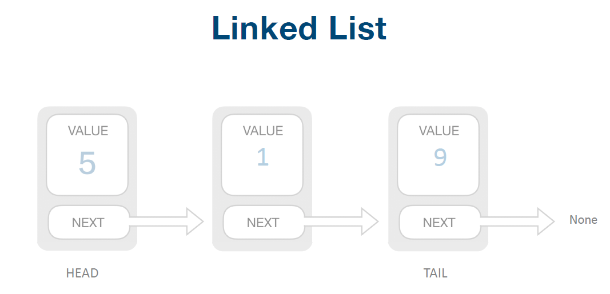

**链表**是物理存储单元上**非连续的、非顺序**的存储结构；

数据元素的逻辑顺序是通过链表的指针地址实现，每个**元素（结点）**包含两个域，一个是存储元素的**数据域 (内存空间)**，另一个是指向下一个结点地址的**指针域**。

根据指针的指向，链表能形成不同的结构，例如**单链表，双向链表，循环链表**等。

**链表插入Node：**

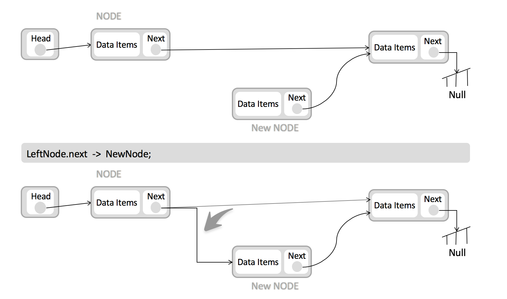

**链表删除Node：**

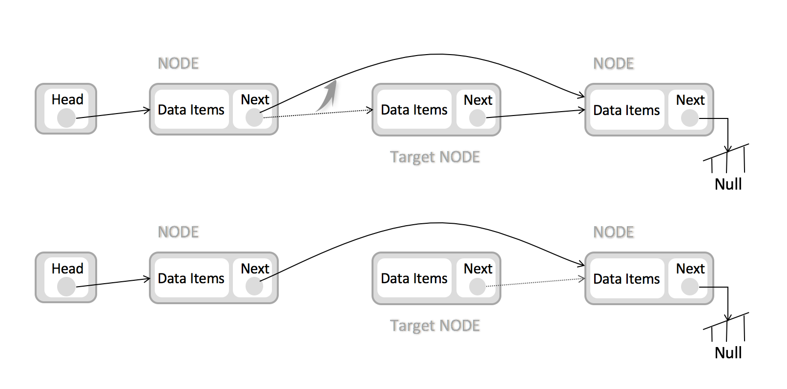

| 时间复杂度 | O()  |
| :--------: | :--: |
|   space    | O(1) |
|  prepend   | O(1) |
|   append   | O(1) |
|   lookup   | O(n) |
|   insert   | O(1) |
|   delete   | O(1) |

### Double Linked List

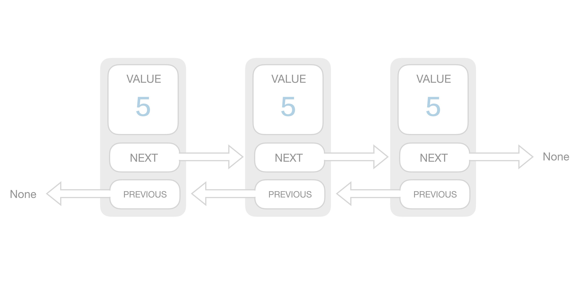

### Circular Linked List

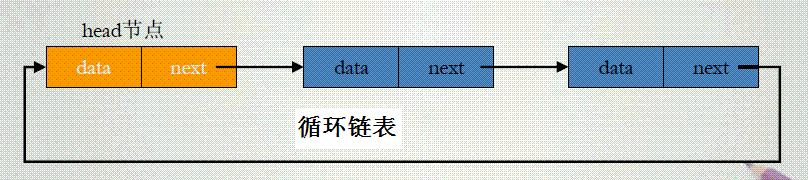

 

## Stack

**栈**是一种特殊的线性表；仅能在线性表的**一端操作**，<u>栈顶</u>允许操作，<u>栈底</u>不允许操作。 

**栈的特点：**

+ **后进先出**，从栈顶放入元素的操作叫**入栈**，取出元素叫**出栈**。

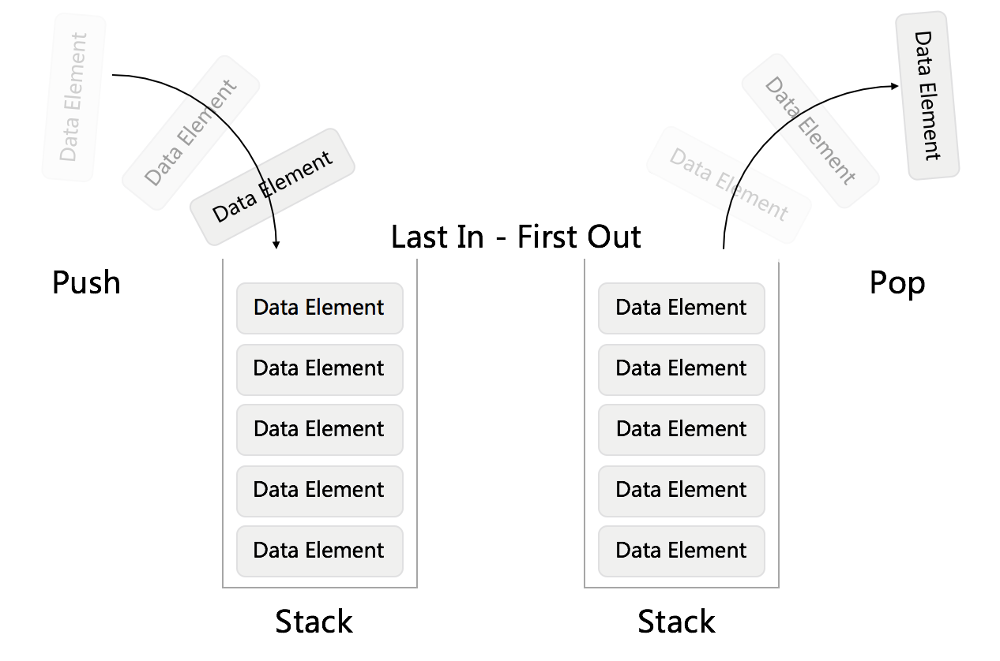

 

## Queue

### Queue

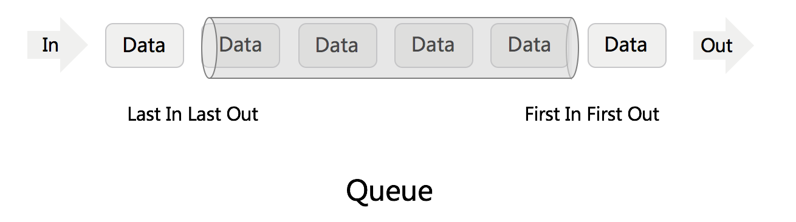

**队列**与栈一样，也是一种线性表；队列可以在**一端添加元素**，在**另一端取出元素**，也就是“先进先出”；从一端放入元素的操作称为**入队**，取出元素为**出队** ；

**使用情景：**

+ 在<u>多线程阻塞队列管</u>理中非常适用

### Double-ended Queue

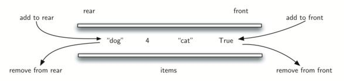

**双端队列**和普通队列区别在于：==队头和队尾都可以插入和删除元素；==

### Priority Queue

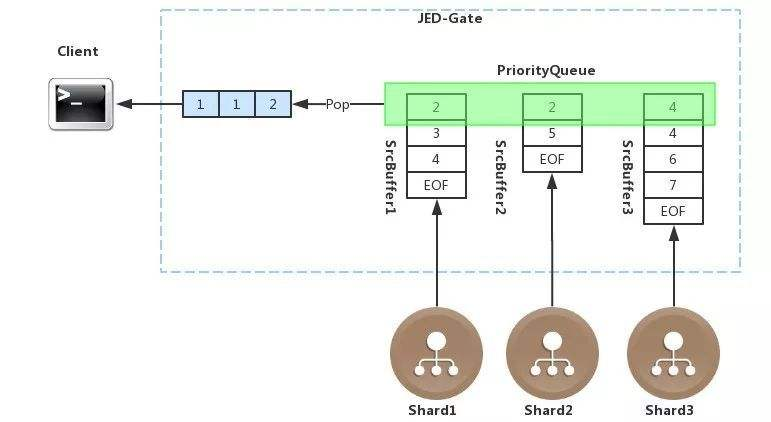

**优先队列：**正常⼊、按照优先级出

 

## Tree

### Tree

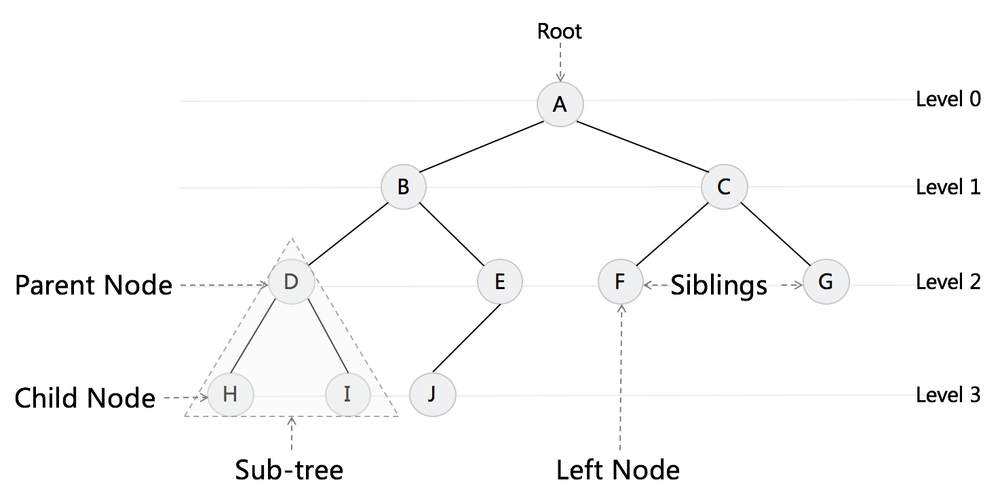

树是一种数据结构，它是由n（n>=1）个有限节点组成一个具有层次关系的集合。把它叫做 “树” 是因为它看起来像一棵倒挂的树，也就是说它是根朝上，而叶朝下的。

**树的特点：**

+ 每个节点有零个或多个子节点
+ 没有父节点的节点称为根节点
+ 每一个非根节点有且只有一个父节点
+ 除了根节点外，每个子节点可以分为多个不相交的子树

### Binary Tree

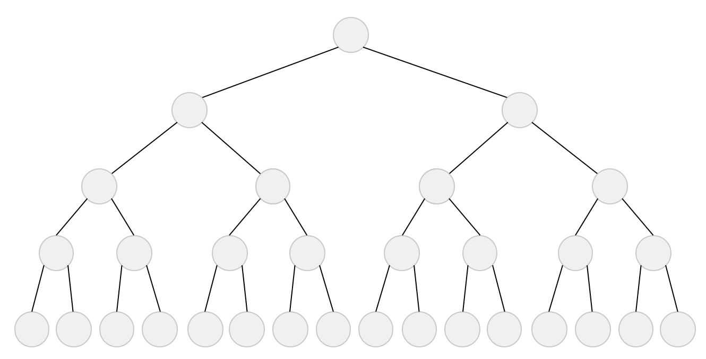

**二叉树：**

+ 每个结点最多有两颗子树，**结点的度**最大为2
+ ==左子树和右子树是有顺序的==，次序不能颠倒
+ 即使某结点只有一个子树，也要<u>区分左右子树</u>

### Binary Search Tree

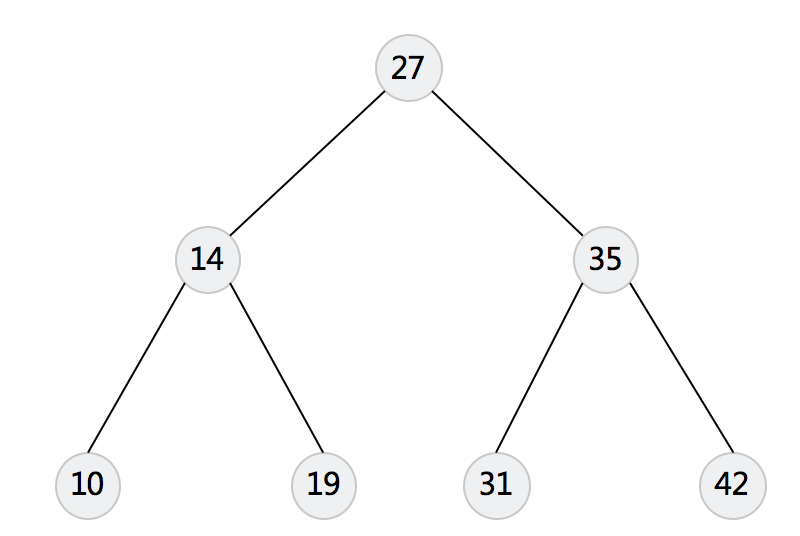

**二叉搜索树：**

+ 若任意节点的左⼦子树不为空，则左子树上所有结点的值均小于它的根结点的值；
+ 若任意节点的右⼦子树不为空，则右子树上所有结点的值均大于它的根结点的值；
+ 任意节点的左、右子树也分别为二叉搜索树

 

## Heap

堆是一种比较特殊的数据结构，可以被看做一棵树的数组对象，具有以下的性质：

+ 堆中某个**节点的值**总是不大于或不小于其**父节点的值**
+ 堆总是一棵**完全二叉树**

### Mini Heap

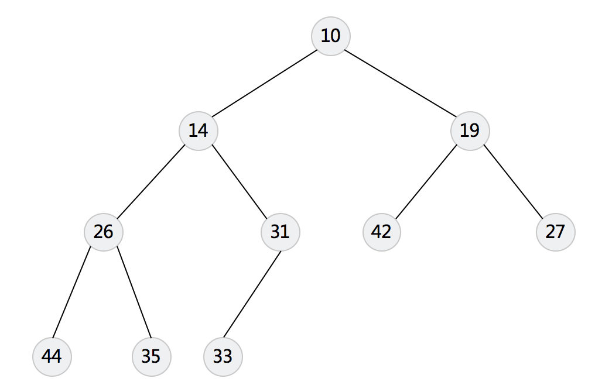

**小顶堆特点：**

+ 任意节点的值**小于**父节点的值
+ 完整的二叉树

### Max Heap

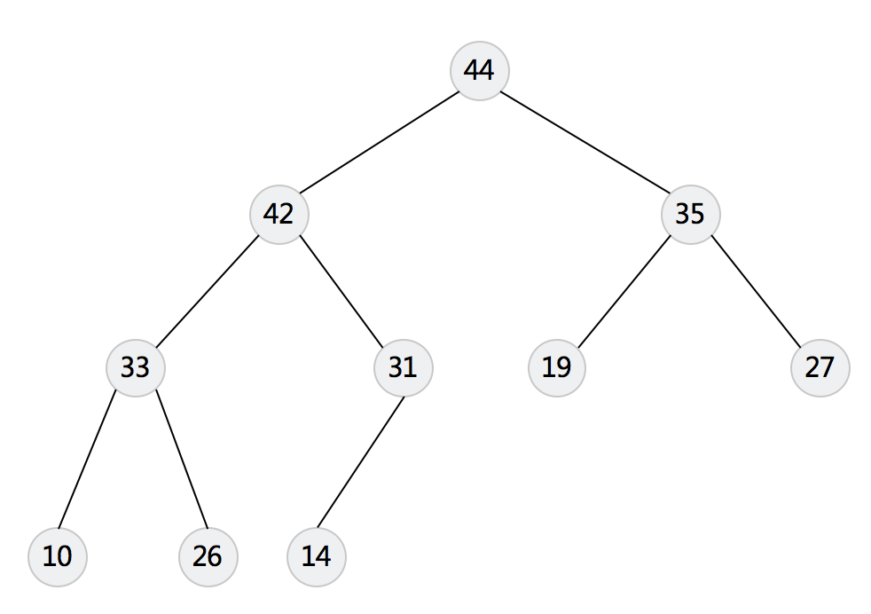

**大顶堆特点：**

+ 任意节点的值**大于**父节点的值
+ 完全的二叉树

 

## Graph

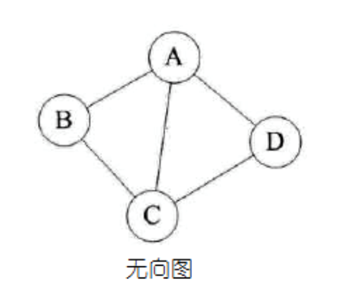

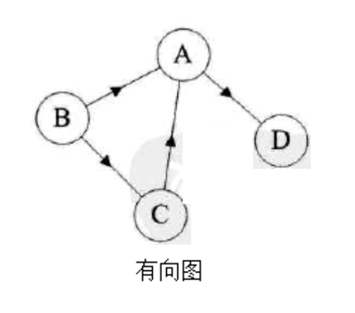

图是由结点的有穷集合V和边的集合E组成。其中，为了与树形结构加以区别，在图结构中常常将结点称为顶点，边是顶点的有序偶对；若两个顶点之间存在一条边，就表示这两个顶点具有相邻关系。

 

## Hash Table

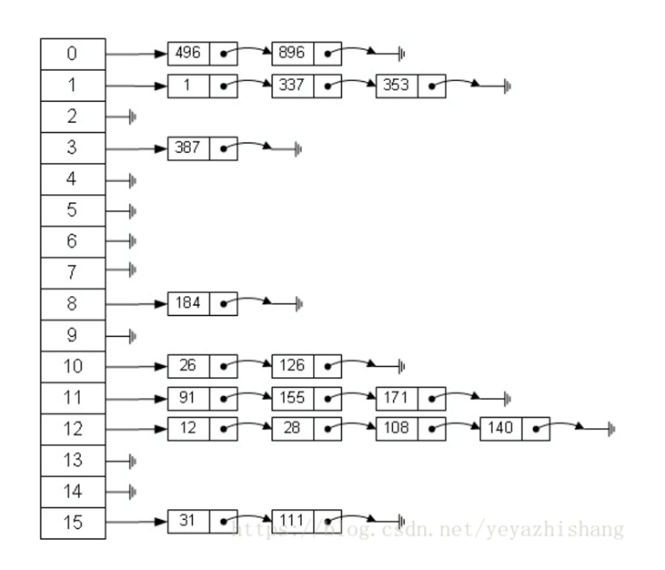

**哈希表**，是根据关键码和值 **(key和value)** **直接进行访问的数据结构**，哈希底层算法是取模（取余）运算，所以会产生哈希冲突。

哈希冲突解决：**拉链法**

 
 
