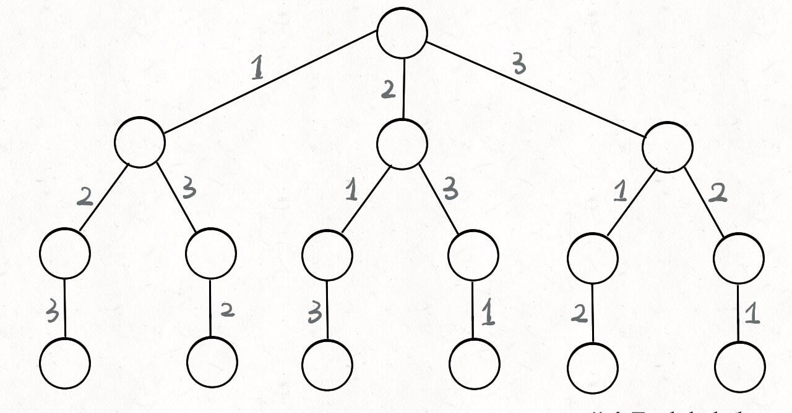
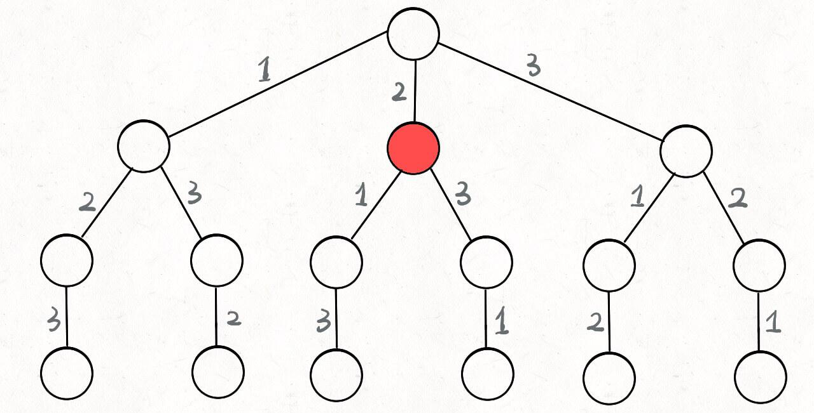
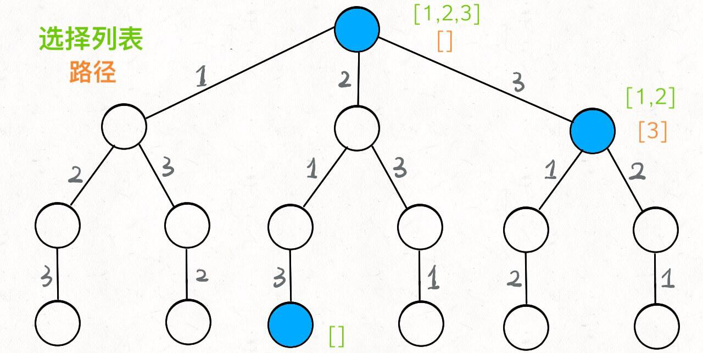
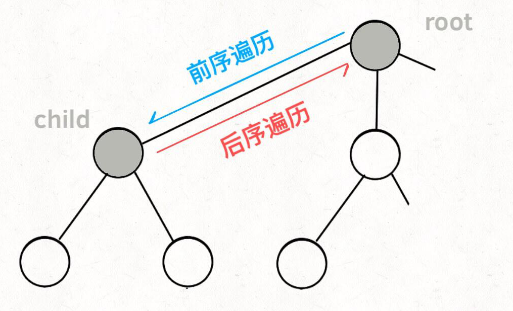
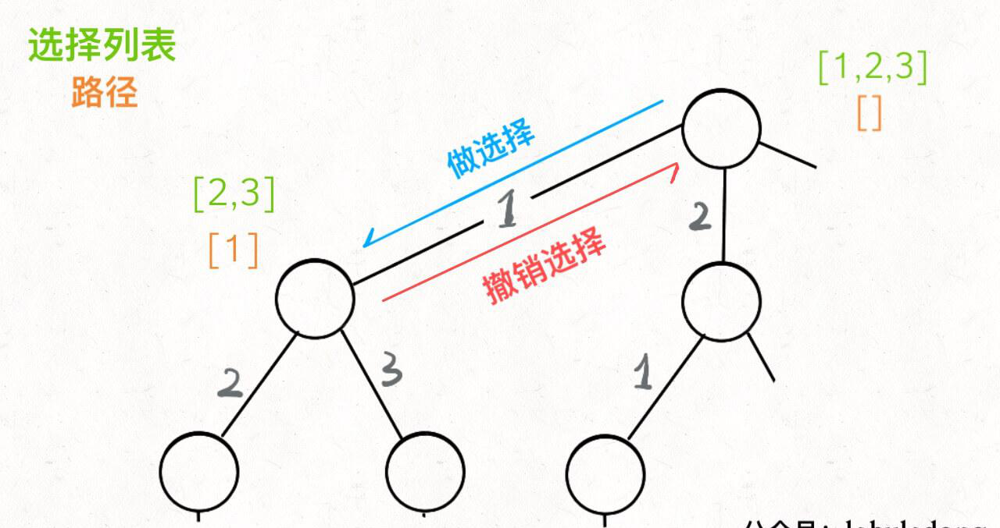
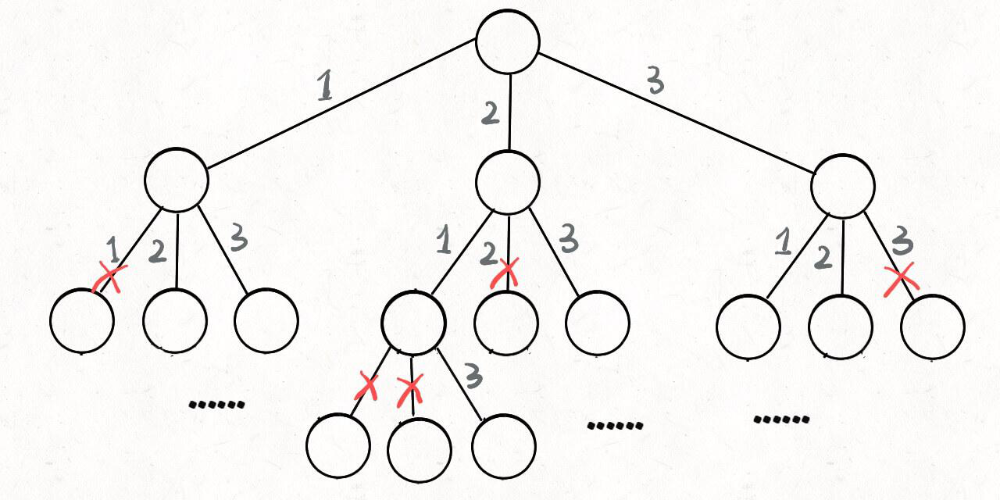

# 数据结构与算法Algo(6)--回溯

## 回溯算法概述

其实回溯算法其实就是我们常说的 DFS 算法，本质上就是一种暴力穷举算法。

废话不多说，直接上回溯算法框架。**解决一个回溯问题，实际上就是一个决策树的遍历过程**。你只需要思考 3 个问题：

1. 路径：也就是已经做出的选择。
2. 选择列表：也就是你当前可以做的选择。
3. 结束条件：也就是到达决策树底层，无法再做选择的条件。


回溯算法的框架：

```python
result = []
def backtrack(路径, 选择列表):
    if 满足结束条件:
        result.add(路径)
        return

    for 选择 in 选择列表:
        做选择
        backtrack(路径, 选择列表)
        撤销选择
```

其核心就是<mark> **for 循环里面的递归，在递归调用之前「做选择」，在递归调用之后「撤销选择」**</mark>


## 全排列问题

我们在高中的时候就做过排列组合的数学题，我们也知道 `n` 个不重复的数，全排列共有 n! 个。

PS：**为了简单清晰起见，我们这次讨论的全排列问题不包含重复的数字**。

那么我们当时是怎么穷举全排列的呢？比方说给三个数 `[1,2,3]`，你肯定不会无规律地乱穷举，一般是这样：

先固定第一位为 1，然后第二位可以是 2，那么第三位只能是 3；然后可以把第二位变成 3，第三位就只能是 2 了；然后就只能变化第一位，变成 2，然后再穷举后两位……

其实这就是回溯算法，我们高中无师自通就会用，或者有的同学直接画出如下这棵回溯树：



只要从根遍历这棵树，记录路径上的数字，其实就是所有的全排列。**我们不妨把这棵树称为回溯算法的「决策树」**。

**为啥说这是决策树呢，因为你在每个节点上其实都在做决策**。比如说你站在下图的红色节点上：



你现在就在做决策，可以选择 1 那条树枝，也可以选择 3 那条树枝。为啥只能在 1 和 3 之中选择呢？因为 2 这个树枝在你身后，这个选择你之前做过了，而全排列是不允许重复使用数字的。

**现在可以解答开头的几个名词：****`[2]`** **就是「路径」，记录你已经做过的选择；****`[1,3]`** **就是「选择列表」，表示你当前可以做出的选择；「结束条件」就是遍历到树的底层，在这里就是选择列表为空的时候**。

如果明白了这几个名词，**可以把「路径」和「选择」列表作为决策树上每个节点的属性**，比如下图列出了几个节点的属性：



**我们定义的** **`backtrack`** **函数其实就像一个指针，在这棵树上游走，同时要正确维护每个节点的属性，每当走到树的底层，其「路径」就是一个全排列**。


再进一步，如何遍历一棵树？这个应该不难吧。各种搜索问题其实都是树的遍历问题，而多叉树的遍历框架就是这样：

```python
def traverse(root: TreeNode):
    for child in root.children:
        # 前序遍历需要的操作
        traverse(child)
        # 后续遍历需要的操作
```

而所谓的前序遍历和后序遍历，他们只是两个很有用的时间点，我给你画张图你就明白了：



**前序遍历的代码在进入某一个节点之前的那个时间点执行，后序遍历代码在离开某个节点之后的那个时间点执行**。


回想我们刚才说的，「路径」和「选择」是每个节点的属性，函数在树上游走要正确维护节点的属性，那么就要在这两个特殊时间点搞点动作：



现在，你是否理解了回溯算法的这段核心框架？

```python
for 选择 in 选择列表:
    # 做选择
    将该选择从选择列表移除
    路径.add(选择)
    backtrack(路径, 选择列表)
    # 撤销选择
    路径.remove(选择)
    将该选择再加入选择列表
```


**我们只要在递归之前做出选择，在递归之后撤销刚才的选择**，就能正确得到每个节点的选择列表和路径。

下面，直接看全排列代码：

```python
from copy import deepcopy
from typing import List


class Solution:
    def __init__(self):
        self.ans, self.choices, self.track = list(), list(), list()

    def backtracking(self):
        # base case
        if len(self.track) == len(self.choices):
            self.ans.append(deepcopy(self.track))
            return

        for choice in self.choices:
            # 排除不合法的选择
            if choice in self.track: continue
            # 选择
            self.track.append(choice)
            # 进入下一层决策树
            self.backtracking()
            # 撤销选择
            self.track.pop()

    def permute(self, nums: List[int]) -> List[List[int]]:
        # 初始化，挂载数据到对象空间
        self.ans, self.choices, self.track = list(), nums, list()

        # 回溯
        self.backtracking()
        return self.ans
```

我们这里稍微做了些变通，没有显式记录「选择列表」，而是通过 `nums` 和 `track` 推导出当前的选择列表：



至此，我们就通过全排列问题详解了回溯算法的底层原理。当然，这个算法解决全排列不是很高效，应为对链表使用 `contains` 方法需要 O(N) 的时间复杂度。有更好的方法通过交换元素达到目的，但是难理解一些，这里就不写了，有兴趣可以自行搜索一下。

但是必须说明的是，不管怎么优化，都符合回溯框架，而且时间复杂度都不可能低于 O(N!)，因为穷举整棵决策树是无法避免的。**这也是回溯算法的一个特点，不像动态规划存在重叠子问题可以优化，回溯算法就是纯暴力穷举，复杂度一般都很高**。


## N皇后问题

这个问题很经典了，简单解释一下：给你一个 N×N 的棋盘，让你放置 N 个皇后，使得它们不能互相攻击。

PS：皇后可以攻击同一行、同一列、左上左下右上右下四个方向的任意单位。


这个问题本质上跟全排列问题差不多，决策树的每一层表示棋盘上的每一行；每个节点可以做出的选择是，在该行的任意一列放置一个皇后。


直接套用框架:

```python
# https://leetcode-cn.com/problems/n-queens/
from typing import List


class Solution:
    def __init__(self):
        self.board, self.ans = list(), list()

    def init_board(self, n):
        self.board = [['.' for _ in range(n)] for _ in range(n)]

    def is_valid(self, row: int, col: int):
        """
        是否可以在 board[row][col] 放置皇后？
        :param row:
        :param col:
        :return:
        """
        n = len(self.board)

        # 检查列是否有皇后互相冲突
        for i in range(n):
            if self.board[i][col] == 'Q': return False

        # 检查右上方是否有皇后互相冲突
        i, j = row -1, col + 1
        while i >= 0 and j < n:
            if self.board[i][j] == 'Q': return False
            i, j = i - 1, j + 1

        # 检查左上方是否有皇后互相冲突
        i, j = row - 1, col - 1
        while i >= 0 and j >= 0:
            if self.board[i][j] == 'Q': return False
            i, j = i - 1, j - 1

        return True

    def backtracking(self, row: int):
        """
        路径：board 中小于 row 的那些行都已经成功放置了皇后
        选择列表：第 row 行的所有列都是放置皇后的选择
        结束条件：row 超过 board 的最后一行
        :param row:
        :return:
        """
        # 结束条件
        if row == len(self.board):
            self.ans.append([''.join(row) for row in self.board])
            return

        n_col = len(self.board[row])
        for col in range(n_col):
            # 排除不合法选择
            if not self.is_valid(row, col): continue
            # 做选择
            self.board[row][col] = 'Q'
            # 进入下一层决策
            self.backtracking(row + 1)
            # 撤销选择
            self.board[row][col] = '.'

    def solveNQueens(self, n: int) -> List[List[str]]:
        self.ans = list()
        # '.' 表示空，'Q' 表示皇后，初始化空棋盘
        self.init_board(n)

        # 回溯
        self.backtracking(0)
        return self.ans


if __name__ == '__main__':
    s = Solution()
    print(s.solveNQueens(4))
    pass
```

函数 `backtrack` 依然像个在决策树上游走的指针，通过 `row` 和 `col` 就可以表示函数遍历到的位置，通过 `isValid` 函数可以将不符合条件的情况剪枝：


如果直接给你这么一大段解法代码，可能是懵逼的。但是现在明白了回溯算法的框架套路，还有啥难理解的呢？无非是改改做选择的方式，排除不合法选择的方式而已，只要框架存于心，你面对的只剩下小问题了。

当 `N = 8` 时，就是八皇后问题，数学大佬高斯穷尽一生都没有数清楚八皇后问题到底有几种可能的放置方法，但是我们的算法只需要一秒就可以算出来所有可能的结果。

不过真的不怪高斯。这个问题的复杂度确实非常高，看看我们的决策树，虽然有 `isValid` 函数剪枝，但是最坏时间复杂度仍然是 O(N^(N+1))，而且无法优化。如果 `N = 10` 的时候，计算就已经很耗时了。

**有的时候，我们并不想得到所有合法的答案，只想要一个答案，怎么办呢**？比如解数独的算法，找所有解法复杂度太高，只要找到一种解法就可以。

其实特别简单，只要稍微修改一下回溯算法的代码即可：

```c
// 函数找到一个答案后就返回 true
bool backtrack(vector<string>& board, int row) {
    // 触发结束条件
    if (row == board.size()) {
        res.push_back(board);
        return true;
    }
    ...
    for (int col = 0; col < n; col++) {
        ...
        board[row][col] = 'Q';

        if (backtrack(board, row + 1))
            return true;
        
        board[row][col] = '.';
    }

    return false;
}
```

这样修改后，只要找到一个答案，for 循环的后续递归穷举都会被阻断。也许你可以在 N 皇后问题的代码框架上，稍加修改，写一个解数独的算法？


## 总结

回溯算法就是个多叉树的遍历问题，关键就是在前序遍历和后序遍历的位置做一些操作，算法框架如下：

```python
def backtrack(...):
    for 选择 in 选择列表:
        做选择
        backtrack(...)
        撤销选择
```

**写 `backtrack` 函数时，需要维护走过的「路径」和当前可以做的「选择列表」，当触发「结束条件」时，将「路径」记入结果集**。

其实想想看，回溯算法和动态规划是不是有点像呢？我们在动态规划系列文章中多次强调，动态规划的三个需要明确的点就是「状态」「选择」和「base case」，是不是就对应着走过的「路径」，当前的「选择列表」和「结束条件」？

某种程度上说，动态规划的暴力求解阶段就是回溯算法。只是有的问题具有重叠子问题性质，可以用 dp table 或者备忘录优化，将递归树大幅剪枝，这就变成了动态规划。而今天的两个问题，都没有重叠子问题，也就是回溯算法问题了，复杂度非常高是不可避免的。