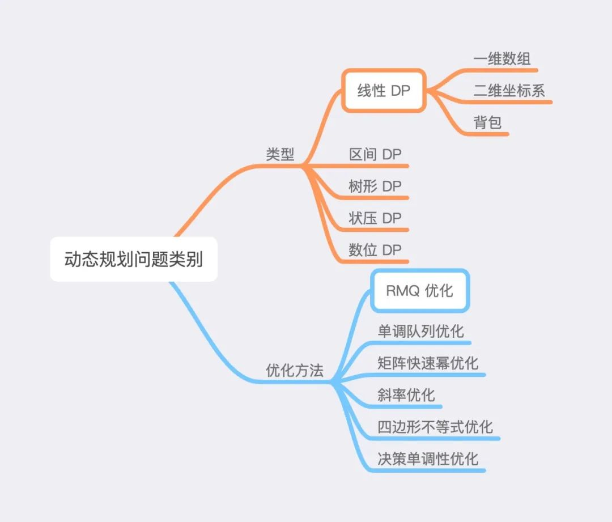
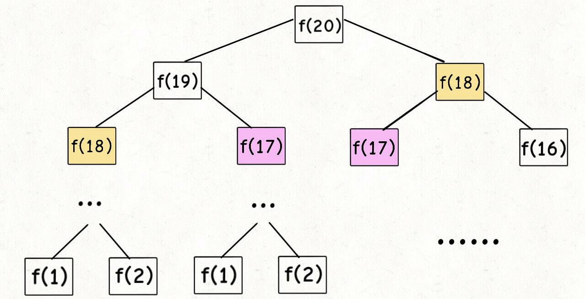
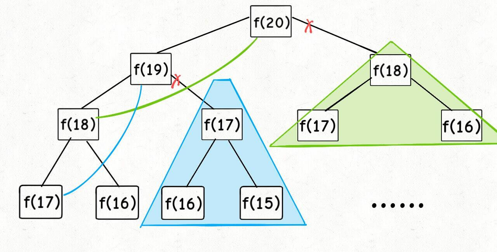
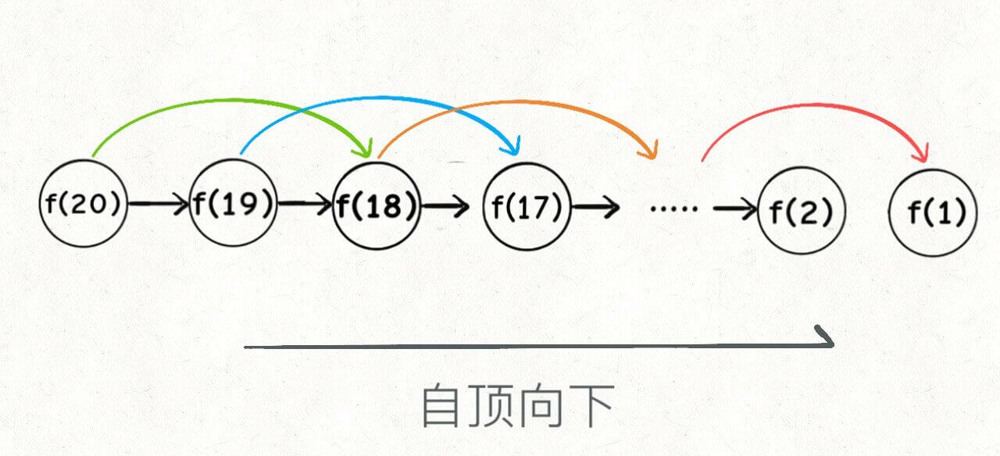
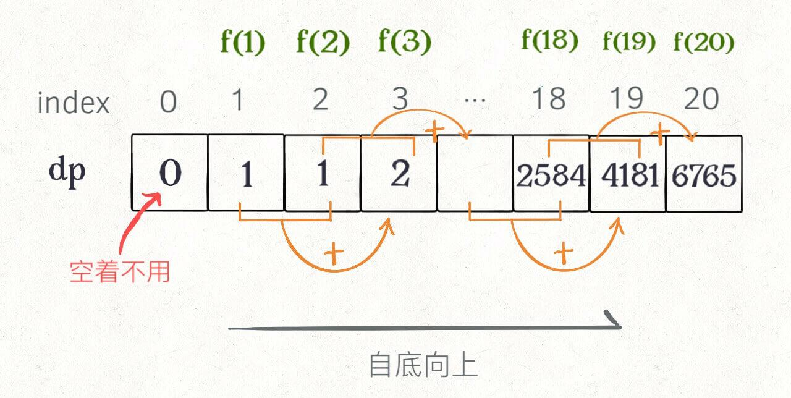
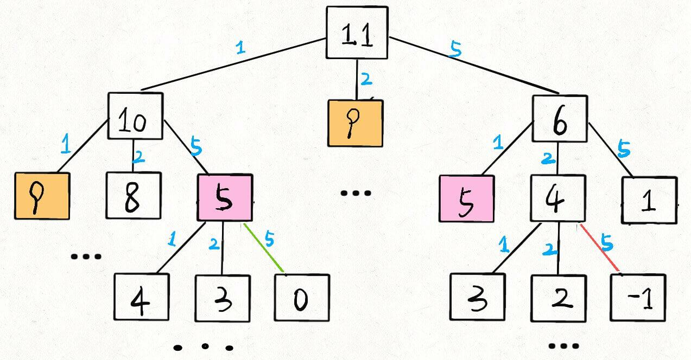
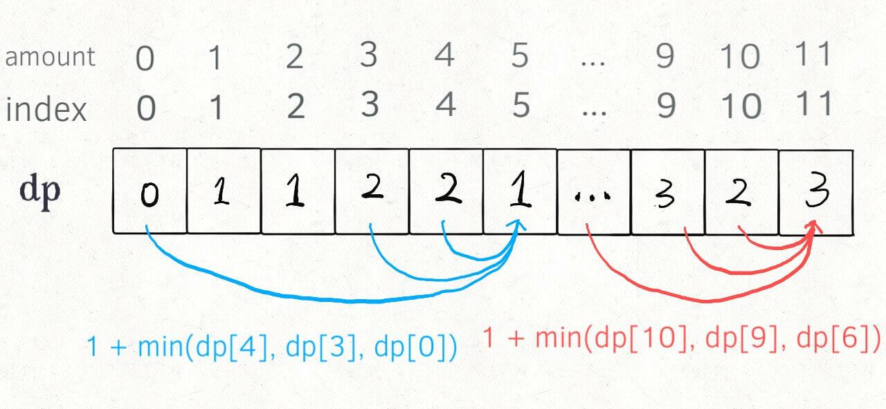

# 算法Algo(7)--动态规划

## 动态规划概述

动态规划（Dynamic Programming），因此常用 DP 指代动态规划。

**定义：**

- 本质：递归
- 原问题(N) -> 子问题(N - 1) -> 原问题(N)
- **最优子结构**
  - 子问题最优决策可导出原问题最优决策
  - 无后效性
- **重叠子问题**
  - 去冗余
  - 空间换时间(注意分析时空复杂度)


动态规划主要分为两个核心部分：

- **DP 状态**
- **DP 转移方程**


### DP状态

「DP 状态」的确定主要有两大原则：

- **最优子结构**
- **无后效性**


#### 最优子结构

将原有问题化分为一个个子问题，即为子结构。而对于每一个子问题，其最优值均由「更小规模的子问题的最优值」推导而来，即为最优子结构。

因此「DP 状态」设置之前，需要将原有问题划分为一个个子问题，且需要确保**子问题的最优值**由「更小规模子问题的最优值」推出，此时**子问题的最优值**即为**「DP 状态」的定义**。


#### 无后效性

而对于「无后效性」，顾名思义，就是我们只关心子问题的最优值，不关心子问题的最优值是怎么得到的。


#### 概括

最后概括一下，<mark>「**最优子结构**」就是 DP状态最优值 由更小规模的  DP状态最优值 推出</mark>，此处 **DP 状态即为子问题最优值**。而**「无后效性」**就是无论 DP 状态是如何得到的，都不会影响后续 DP 状态的取值。


### DP转移方程

有了「DP 状态」之后，我们只需要用「分类讨论」的思想来枚举所有小状态向大状态转移的可能性即可推出「DP 转移方程」。


## 动态规划问题

### 类别

DP 问题主要分为两大类，第一大类是 DP 类型，第二大类是 DP 优化方法。



其中在 DP 类型部分，面试中最常考察的就是「线性 DP」，而在优化方法部分，最常见的是「RMQ 优化」，即使用线段树或其它数据结构查询区间最小值，来优化 DP 的转移过程。


### 问题共性

- 套路
  - 最优、最大、最小、最长、计数
- 离散问题
  - 容易设计状态(整数01 背包问题)
- 最优子结构
  - N-1可以推到出N

如果一个问题满足以下两点，那么它就

**能用动态规划解决**：

1. **问题的答案依赖于问题的规模**，也就是问题的所有答案构成了一个数列。
2. **大规模问题的答案可以由小规模问题的答案递推得到**，也就是`f(n)`的值可以由`{f(i)|i<n}`中的个别求得。

能用动态规划解决，不代表适合用。比如刚刚的"数腿"例子，你可以写成`f(n) = 2n`的显式表达形式，那么就不必用动态规划了。但是，**在许多场景下，`f(n)`的显式式子是不易得到的，大多数情况下甚至无法得到**，动态规划的魅力就出来了


## 动态规划解题步骤

**四个步骤：**

- **设计暴力算法，找到冗余**
- **设计并存储状态(一维、二维、三维数组，甚至用Map)**
- **状态转移方程(递归式子)**
- **自底向上计算最优解(编程方式)**  自底向上迭代


## 实战理解动态规划

### 一、斐波那契数列

> 斐波那契数列：0，1，2，3，5，8，13，...
>
> 遵循规律：当前值为前两个值的和。
>
> 那么第n个值为多少？


首先，我们可以很容易得到状态转移方程：
$$
f(n) = 
\begin{cases}
0 & \text{n<=0} \\
1 & \text{n=1} \\
f(n-1) + f(n-2) & \text{n>1}
\end{cases}
$$

#### 1.暴力递归

```python
class Solution:
    def fib_recursion(self, n: int) -> int:
        """暴力递归法"""
        # base case
        if n <= 0:
            return 0
        if n == 1:
            return 1

        return self.fib_recursion(n - 1) + self.fib_recursion(n - 2)
```

代码虽然简洁易懂，但是十分低效，低效在哪里？假设 n = 20，画出递归树：



**递归算法时间复杂度计算：** **子问题个数** x **解决一个子问题需要的时间​**

首先计算子问题个数，即递归树中节点的总数。显然二叉树节点总数为指数级别，所以子问题个数为 O(2^n)。

然后计算解决一个子问题的时间，在本算法中，没有循环，只有 `f(n - 1) + f(n - 2)` 一个加法操作，时间为 O(1)。

所以，这个算法的时间复杂度为二者相乘，即 O(2^n)，指数级别，爆炸。

观察递归树，很明显发现了算法低效的原因：**存在大量重复计算**，比如 `f(18)` 被计算了两次，而且你可以看到，以 `f(18)` 为根的这个递归树体量巨大，多算一遍，会耗费巨大的时间。更何况，还不止 `f(18)` 这一个节点被重复计算，所以这个算法及其低效。

这就是动态规划问题的第一个性质：**重叠子问题**


#### 2.带备忘录的递归解法

即然耗时的原因是重复计算，那么我们可以造一个「备忘录」，每次算出某个子问题的答案后别急着返回，先记到「备忘录」里再返回；每次遇到一个子问题先去「备忘录」里查一查，如果发现之前已经解决过这个问题了，直接把答案拿出来用，不要再耗时去计算了。

一般使用一个数组充当这个「备忘录」，当然也可以使用哈希表（字典），思想都是一样的。

```python
class Solution:
    def helper(self, memory: list, n: int):
        # base case
        if n <= 0:
            return 0
        if n == 1:
            return 1

        # 已经计算过
        if memory[n] != 0:
            return memory[n]
        # 未计算过,计算并记录
        memory[n] = self.helper(memory, n - 1) + self.helper(memory, n - 2)
        return memory[n]

    def fib_memo_recur(self, n: int) -> int:
        """带备忘录的递归法，记忆优化"""
        if n < 1:
            return 0
        # 备忘录全部初始化未 0
        memory = [0] * (n + 1)
        # 进行带备忘录的递归
        return self.helper(memory, n)
```

现在，画出递归树，「备忘录」到底做了什么。



实际上，带「备忘录」的递归算法，把一棵存在巨量冗余的递归树通过「剪枝」，改造成了一幅不存在冗余的递归图，极大减少了子问题（即递归图中节点）的个数。



子问题个数，即图中节点的总数，由于本算法不存在冗余计算，子问题就是 `f(1)`, `f(2)`, `f(3)` ... `f(20)`，数量和输入规模 n = 20 成正比，所以子问题个数为 O(n)。

解决一个子问题的时间，同上，没有什么循环，时间为 O(1)。

所以，本算法的时间复杂度是 O(n)。比起暴力算法，是降维打击。

至此，<mark>带备忘录的递归解法的效率已经和迭代的动态规划解法一样了</mark>。实际上，这种解法和迭代的动态规划已经差不多了，只不过<mark>这种方法叫做「自顶向下」，动态规划叫做「自底向上」。</mark>

啥叫「自顶向下」？注意我们刚才画的递归树（或者说图），是从上向下延伸，都是从一个规模较大的原问题比如说 `f(20)`，向下逐渐分解规模，直到 `f(1)` 和 `f(2)` 这两个 base case，然后逐层返回答案，这就叫「自顶向下」。

啥叫**「自底向上」**？反过来，我们直接从最底下，最简单，问题规模最小的 `f(1)` 和 `f(2)` 开始往上推，直到推到我们想要的答案 `f(20)`，这就是**动态规划的思路**，这也是为什么<mark>动态规划一般都脱离了递归，而是由循环迭代完成计算。</mark>


#### 3.dp数组的迭代解法

有了上一步「备忘录」的启发，我们可以把这个「备忘录」独立出来成为一张表，就叫做 DP table 吧，在这张表上完成「自底向上」的推算岂不美哉！

```python
class Solution:
    def fib_dp(self, n: int) -> int:
        """动态规划"""
        if n <= 0:
            return 0
        if n == 1:
            return 1

        # 初始化 commonAlgo05_dp_and_recursion 数组
        dp = [0] * (n + 1)

        # base case
        dp[0], dp[1] = 0, 1

        # 自底向上迭代
        for i in range(2, n + 1):
            # 状态转移方程
            dp[i] = dp[i - 1] + dp[i - 2]
        return dp[n]
```



画个图就很好理解了，而且你发现这个 DP table 特别像之前那个「剪枝」后的结果，只是反过来算而已。实际上，带备忘录的递归解法中的「备忘录」，最终完成后就是这个 DP table，所以说这两种解法其实是差不多的，大部分情况下，效率也基本相同。

这里，引出**「状态转移方程」**这个名词，实际上就是描述问题结构的数学形式：
$$
f(n) = 
\begin{cases}
0 & \text{n<=0} \\
1 & \text{n=1} \\
f(n-1) + f(n-2) & \text{n>1}
\end{cases}
$$


为啥叫「状态转移方程」？其实就是为了听起来高端。你把 `f(n)` 想做一个状态 `n`，这个状态 `n` 是由状态 `n - 1` 和状态 `n - 2` 相加转移而来，这就叫状态转移，仅此而已。

你会发现，上面的几种解法中的所有操作，例如 `return f(n - 1) + f(n - 2)`，`dp[i] = dp[i - 1] + dp[i - 2]`，以及对备忘录或 DP table 的初始化操作，都是围绕这个方程式的不同表现形式。<mark>可见列出「状态转移方程」的重要性，它是解决问题的核心。</mark>而且很容易发现，<mark>其实状态转移方程直接代表着暴力解法。</mark>

**千万不要看不起暴力解，动态规划问题最困难的就是写出这个暴力解，即状态转移方程**。只要写出暴力解，优化方法无非是用备忘录或者 DP table，再无奥妙可言。


**状态压缩：降低空间复杂度，再次优化：**根据斐波那契数列的状态转移方程，当前状态只和之前的两个状态有关，其实并不需要那么长的一个 DP table 来存储所有的状态，只要想办法存储之前的两个状态就行了。

```python
def fib_dp_state_compress(n: int) -> int:
    """动态规划，使用状态压缩"""
    # base case
    if n <= 0:
        return 0
    if n == 1:
        return 1

    pre, cur = 0, 1
    for i in range(2, n + 1):
        sum_int = pre + cur
        pre = cur
        cur = sum_int
    return sum_int
```

这个技巧就是所谓的「**状态压缩**」，如果我们发现每次状态转移只需要 DP table 中的一部分，那么可以尝试用状态压缩来缩小 DP table 的大小，只记录必要的数据，上述例子就相当于把DP table 的大小从 `n` 缩小到 2。


### 二、凑零钱问题

先看下题目：给你 `k` 种面值的硬币，面值分别为 `c1, c2 ... ck`，每种硬币的数量无限，再给一个总金额 `amount`，问你**最少**需要几枚硬币凑出这个金额，如果不可能凑出，算法返回 -1 。算法的函数签名如下：

```python
def coin_change(coins: list, amount: int) -> int:
    """
    :param coins: 可选硬币值
    :param amount: 目标金额
    :return:-1 表示不能凑出， x 表示最少需要x枚硬币凑出目标金额
    """
    pass
```

比如说 `k = 3`，面值分别为 1，2，5，总金额 `amount = 11`。那么最少需要 3 枚硬币凑出，即 11 = 5 + 5 + 1。

你认为计算机应该如何解决这个问题？显然，就是把所有肯能的凑硬币方法都穷举出来，然后找找看最少需要多少枚硬币。

#### 1.暴力递归

首先，这个问题是动态规划问题，因为它具有「最优子结构」的。**要符合「最优子结构」，子问题间必须互相独立**。

回到凑零钱问题，为什么说它符合最优子结构呢？比如你想求 `amount = 11` 时的最少硬币数（原问题），如果你知道凑出 `amount = 10` 的最少硬币数（子问题），你只需要把子问题的答案加一（再选一枚面值为 1 的硬币）就是原问题的答案。因为硬币的数量是没有限制的，所以子问题之间没有相互制，是互相独立的。

那么，既然知道了这是个动态规划问题，就要思考**如何列出正确的状态转移方程**？

1、**确定 base case**，这个很简单，显然目标金额 `amount` 为 0 时算法返回 0，因为不需要任何硬币就已经凑出目标金额了。

2、**确定「状态」，也就是原问题和子问题中会变化的变量**。由于硬币数量无限，硬币的面额也是题目给定的，只有目标金额会不断地向 base case 靠近，所以唯一的「状态」就是目标金额 `amount`。

3、**确定「选择」，也就是导致「状态」产生变化的行为**。目标金额为什么变化呢，因为你在选择硬币，你每选择一枚硬币，就相当于减少了目标金额。所以说所有硬币的面值，就是你的「选择」。

4、**明确** **`dp`** **函数/数组的定义**。我们这里讲的是自顶向下的解法，所以会有一个递归的 `dp` 函数，一般来说函数的参数就是状态转移中会变化的量，也就是上面说到的「状态」；函数的返回值就是题目要求我们计算的量。就本题来说，状态只有一个，即「目标金额」，题目要求我们计算凑出目标金额所需的最少硬币数量。所以我们可以这样定义 `dp` 函数：

`dp(amount)` 的定义：输入一个目标金额 `amount`，返回凑出目标金额 `amount` 的最少硬币数量。

**数学形式就是状态转移方程：**
$$
dp(amount) = 
\begin{cases}
-1, & \text{amount<0} \\
0, & \text{amount=0} \\
min \lbrace dp(amount - coin) + 1 | coin \in coins \rbrace , & \text{amount>0} \end{cases}
$$

```python
from typing import List


class Solution:
    def coin_change_recursion(self, coins: List[int], amount: int) -> int:
        """
        :param coins: 可选硬币值
        :param amount: 目标金额
        :return: -1 表示不能凑出， x 表示最少需要x枚硬币凑出目标金额
        """
        # base case
        if amount < 0: return -1
        if amount == 0: return 0

        # 求最小值，所以初始化未正无穷
        res = float('INF')
        for coin in coins:
            sub_problem = self.coin_change_recursion(coins, amount - coin)
            # 子问题无解，跳过
            if sub_problem == -1: continue
            res = min(res, 1 + sub_problem)
        return res if res != float('INF') else -1

```

比如 `amount = 11, coins = {1,2,5}` 时画出递归树看看：



**递归算法的时间复杂度分析：子问题总数 x 每个子问题的时间**。

子问题总数为递归树节点个数，这个比较难看出来，是 O(n^k)，总之是指数级别的。每个子问题中含有一个 for 循环，复杂度为 O(k)。所以总时间复杂度为 O(k * n^k)，指数级别。


#### 2.带备忘录的递归

只需要稍加修改，就可以通过备忘录消除**重叠子问题**

```python
class Solution:
    def coin_change_memory_recur(self, coins: List[int], amount: int) -> int:
        # 备忘录
        memo = dict()

        def dp(n):
            # 查备忘录，避免重复计算
            if n in memo: return memo[n]

            # base case
            if n < 0: return -1
            if n == 0: return 0

            # 求最小值，所以初始化未正无穷
            res = float('INF')
            for coin in coins:
                sub_problem = dp(n - coin)
                # 子问题无解，跳过
                if sub_problem == -1: continue
                res = min(res, 1 + sub_problem)

            # 记入备忘录
            memo[n] = res if res != float('INF') else -1
            return memo[n]
        return dp(amount)
```

「备忘录」大大减小了子问题数目，完全消除了子问题的冗余，所以子问题总数不会超过金额数 `n`，即子问题数目为 O(n)。处理一个子问题的时间不变，仍是 O(k)，所以总的时间复杂度是 O(kn)。


#### 3.dp数组的迭代解法

自底向上使用 dp table 来消除重叠子问题，关于「状态」「选择」和 base case 与之前没有区别，`dp` 数组的定义和刚才 `dp` 函数类似，也是把「状态」，也就是目标金额作为变量。不过 `dp` 函数体现在函数参数，而 `dp` 数组体现在数组索引：

**`dp`** **数组的定义：当目标金额为** **`i`** **时，至少需要** **`dp[i]`** **枚硬币凑出**。

```python
class Solution:
    def coinChange(self, coins: List[int], amount: int) -> int:
        """
        动态规划
        :param coins: 可选硬币值
        :param amount: 目标金额
        :return: -1 表示不能凑出， x 表示最少需要x枚硬币凑出目标金额
        """
        # dp数组大小为 amount + 1, 初始值也为 amount + 1
        # 初始化为 amount + 1 就相当于初始化为正无穷，便于后续取最小值。
        dp_arr = [amount + 1] * (amount + 1)

        # base case
        dp_arr[0] = 0

        # 外层 for 循环，遍历所有状态的所有取值, i 表示金额
        for i in range(amount + 1):
            # 内层 for 循环，求所有选择的最小值
            for coin in coins:
                # 子问题无解，跳过
                if i - coin < 0: continue
                dp_arr[i] = min(dp_arr[i], dp_arr[i - coin] + 1)
                pass
            pass
        return dp_arr[amount] if dp_arr[amount] != amount + 1 else -1
```




### 三、最后总结

第一个斐波那契数列的问题，解释了如何通过「备忘录」或者「dp table」的方法来优化递归树，并且明确了这两种方法本质上是一样的，只是自顶向下和自底向上的不同而已。

第二个凑零钱的问题，展示了如何流程化确定「状态转移方程」，只要通过状态转移方程写出暴力递归解，剩下的也就是优化递归树，消除重叠子问题而已。

**计算机解决问题其实没有任何奇技淫巧，它唯一的解决办法就是穷举**，穷举所有可能性。<marK>算法设计无非就是先思考“如何穷举”，然后再追求“如何聪明地穷举”。</mark>

**列出动态转移方程，就是在解决“如何穷举”的问题。**之所以说它难，一是因为很多穷举需要递归实现，二是因为有的问题本身的解空间复杂，不那么容易穷举完整。

**备忘录、DP table 就是在追求“如何聪明地穷举”。**用空间换时间的思路，是降低时间复杂度的不二法门


## 习题

[打家劫舍](https://leetcode-cn.com/problems/house-robber/)

[三步问题](https://leetcode-cn.com/problems/three-steps-problem-lcci/)

[最小路径和](https://leetcode-cn.com/problems/minimum-path-sum/)

[乘积最大子数组](https://leetcode-cn.com/problems/maximum-product-subarray/)


