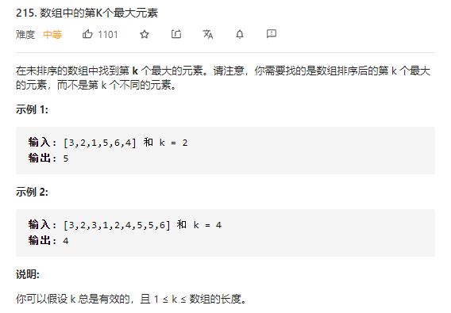
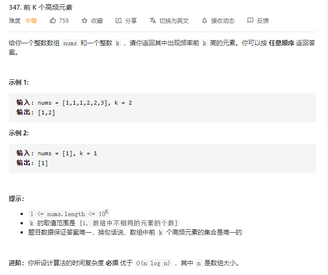
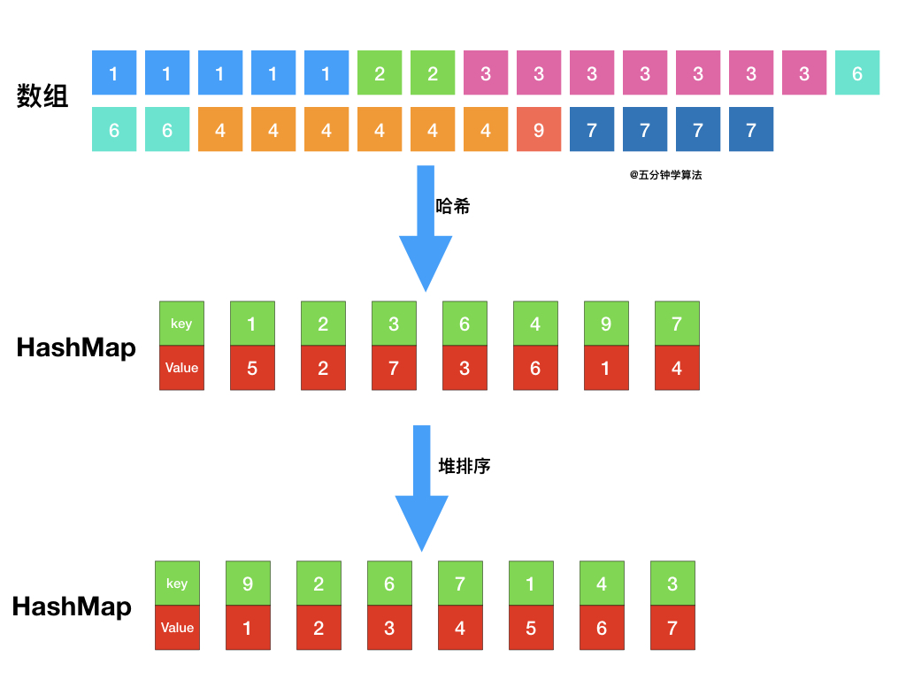
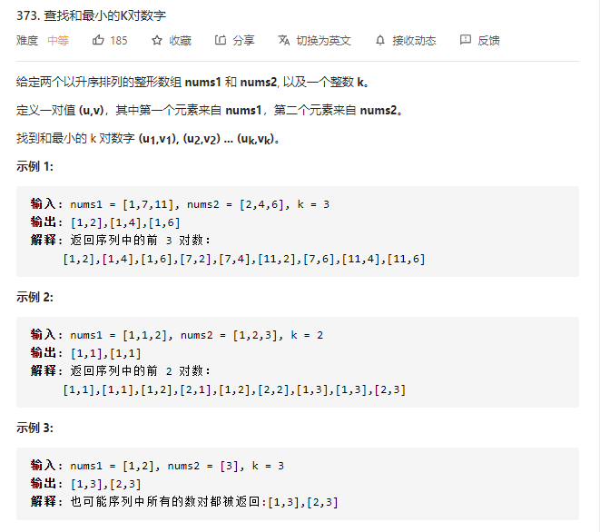
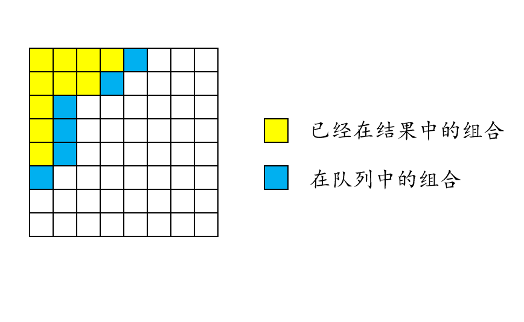
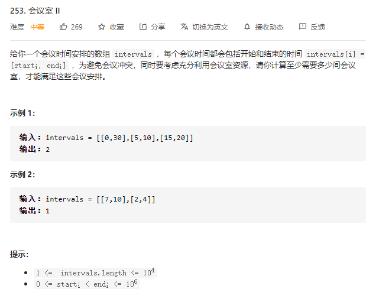
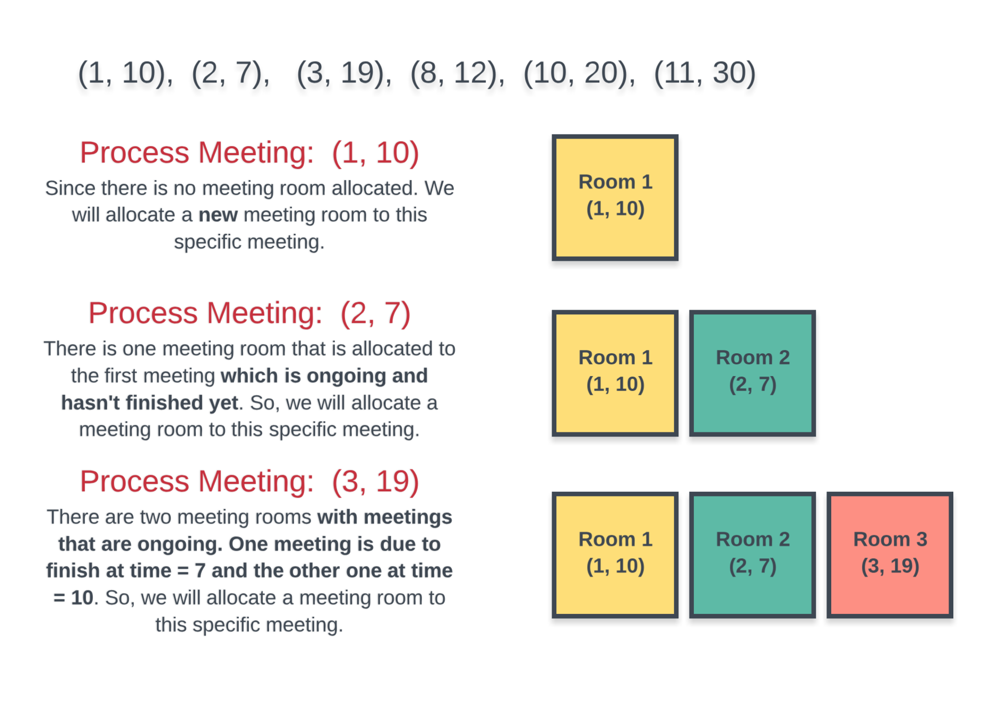
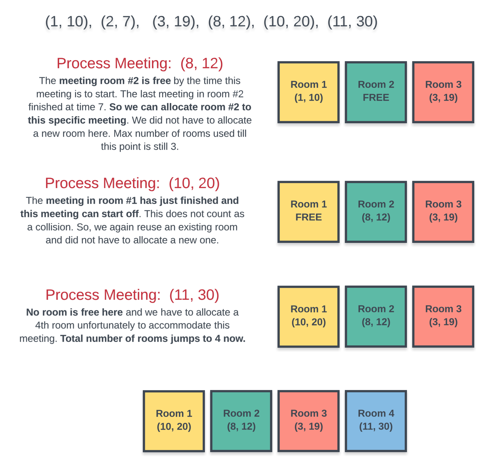
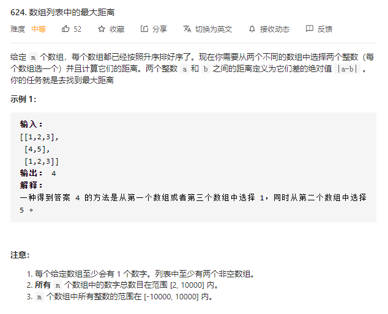

# LeetCode分类精刷

## String


## LinkedList


## Array


## StackAndQueue


## HashTable


## Tree


## BinarySearchTree


## Heap

### [215. 数组中的第K个最大元素](https://leetcode-cn.com/problems/kth-largest-element-in-an-array/)

#### 题目



#### 解题思路

**优先队列**

优先队列的思路是很朴素的。因为第 `K` 大元素，其实就是整个数组排序以后后半部分最小的那个元素。因此，我们可以维护一个有 `K` 个元素的最小堆：

1. 如果当前堆不满，直接添加；
2. 堆满的时候，如果新读到的数小于等于堆顶，肯定不是我们要找的元素，只有新都到的数大于堆顶的时候，才将堆顶拿出，然后放入新读到的数，进而让堆自己去调整内部结构。


#### code

```python
import heapq


class Solution:
    def findKthLargest(self, nums: list, k: int) -> int:
        """
        Heap
            使用容量为 k 的小顶堆
            元素个数小于 k 的时候，放进去就是了
            元素个数大于 k 的时候，小于等于堆顶元素，就扔掉，大于堆顶元素，就替换
        """
        priority_queue = list()

        for i in range(k):
            heapq.heappush(priority_queue, nums[i])

        for i in range(k, len(nums)):
            if nums[i] > priority_queue[0]:
                heapq.heapreplace(priority_queue, nums[i])
        return priority_queue[0]
```


### [347. 前 K 个高频元素](https://leetcode-cn.com/problems/top-k-frequent-elements/)

#### 题目



#### 解题思路

**最小堆**

题目最终需要返回的是前 `k`个频率最大的元素，可以想到借助堆这种数据结构，对于`k`频率之后的元素不用再去处理，进一步优化时间复杂度。



具体操作为：

- 借助 **哈希表** 来建立数字和其出现次数的映射，遍历一遍数组统计元素的频率
- 维护一个元素数目为 *k* 的最小堆
- 每次都将新的元素与堆顶元素（堆中频率最小的元素）进行比较
- 如果新的元素的频率比堆顶端的元素大，则弹出堆顶端的元素，将新的元素添加进堆中
- 最终，堆中的 *k* 个元素即为前 *k* 个高频元素


#### code

```python
import heapq
from typing import List


class Solution:
    @staticmethod
    def get_num_statics(nums) -> dict:
        hash_table = dict()
        for num in nums:
            if num in hash_table:
                hash_table[num] += 1
            else:
                hash_table[num] = 1
        return hash_table

    def topKFrequent(self, nums: List[int], k: int) -> List[int]:
        hash_table = self.get_num_statics(nums)

        priority_queue = list()
        count = 0
        for key, val in hash_table.items():
            if count < k:
                heapq.heappush(priority_queue, [val, key])
            else:
                if val > priority_queue[0][0]:
                    heapq.heappop(priority_queue)
                    heapq.heappush(priority_queue, [val, key])
            count += 1
        return [item_lis[1] for item_lis in priority_queue]


if __name__ == '__main__':
    s = Solution()
    print(s.topKFrequent([1, 1, 1, 2, 2, 3], 2))
    print(s.topKFrequent([1], 1))
```


### [373. 查找和最小的K对数字](https://leetcode-cn.com/problems/find-k-pairs-with-smallest-sums/)

#### 题目



#### 解题思路

**优先队列**

- 它仅从矩阵左上角的第一对开始，然后根据需要从那里开始扩展。 
- 每当将一对选择为输出结果时，该行中的下一对就会添加到当前选项的优先队列中。 
- 同样，如果所选对是该行中的第一对，则将下一行中的第一对添加到队列中。



#### code

```python
import heapq
from typing import List


class Solution:
    def kSmallestPairs(self, nums1: List[int], nums2: List[int], k: int) -> List[List[int]]:
        length1, length2 = len(nums1), len(nums2)
        priority_queue = list()
        ret_lis = list()

        def push_item(i, j):
            if i < length1 and j < length2:
                heapq.heappush(priority_queue, [nums1[i] + nums2[j], i, j])

        # 从矩阵左上角开始
        i, j = 0, 0
        heapq.heappush(priority_queue, [nums1[i] + nums2[j], i, j])
        while priority_queue and len(ret_lis) < k:
            _, i, j = heapq.heappop(priority_queue)
            ret_lis.append([nums1[i], nums2[j]])

            # 每当将一对选择为输出结果时，该行中的下一对就会添加到当前选项的优先队列中
            push_item(i, j + 1)
            # 如果所选对是该行中的第一对，则将下一行中的第一对添加到队列中
            if j == 0:
                push_item(i + 1, j)
        return ret_lis


if __name__ == '__main__':
    s = Solution()
    print(s.kSmallestPairs([1, 7, 11], [2, 4, 6], 3))
    print(s.kSmallestPairs([1, 1, 2], [1, 2, 3], 2))
```


### [253. 会议室 II](https://leetcode-cn.com/problems/meeting-rooms-ii/)

#### 题目




#### 解题思路

**优先队列：**

我们无法按任意顺序处理给定的会议。处理会议的最基本方式是按其 `开始时间` 顺序排序，这也是我们采取的顺序。

考虑下面的会议时间 `(1, 10), (2, 7), (3, 19), (8, 12), (10, 20), (11, 30) `。前一部分表示会议开始时间，后一部分表示结束时间。按照会议开始时间顺序考虑。图一展示了前三个会议，每个会议都由于冲突而需要新房间。



后面的三个会议开始占用现有的房间。然而，最后的会议需要一个新房间。总而言之，我们需要四个房间来容纳所有会议。



**算法：**

1. 按照 开始时间 对会议进行排序。
2. 初始化一个新的 最小堆，将第一个会议的**结束时间**加入到堆中。我们只需要记录会议的结束时间，告诉我们什么时候房间会空。
3. 对每个会议，检查堆的最小元素（即堆顶部的房间）是否空闲。
   1. 若房间空闲，则从堆顶拿出该元素，将其改为我们处理的会议的结束时间，加回到堆中。
   2. 若房间不空闲。开新房间，并加入到堆中。
4. 处理完所有会议后，堆的大小即为开的房间数量。这就是容纳这些会议需要的最小房间数。


#### code

```python
import heapq
from typing import List


class Solution:
    def minMeetingRooms(self, intervals: List[List[int]]) -> int:
        # 按会议开始时间进行排序
        intervals.sort(key=lambda item: item[0])

        priority_queue = list()
        heapq.heappush(priority_queue, intervals[0][1])

        for i in range(1, len(intervals)):
            meeting = intervals[i]
            # meeting 完全大于堆顶 则 堆顶空闲
            if meeting[0] >= priority_queue[0]:  # 房间空闲: meeting 的开始时间 大于堆顶的 结束时间
                heapq.heappop(priority_queue)
                heapq.heappush(priority_queue, meeting[1])
            else:  # 房间不空闲
                heapq.heappush(priority_queue, meeting[1])

        return len(priority_queue)


if __name__ == '__main__':
    s = Solution()
    print(s.minMeetingRooms([[1, 10], [2, 7], [3, 19], [8, 12], [10, 20], [11, 30]]))
    print(s.minMeetingRooms([[0, 30], [5, 10], [15, 20]]))
    print(s.minMeetingRooms([[7, 10], [2, 4]]))
```


### [624. 数组列表中的最大距离](https://leetcode-cn.com/problems/maximum-distance-in-arrays/)

#### 题目




#### 解题思路


#### code

```python
```


## Graph


## BitOperation


## DFS

```python
# 98, 113, 394, 547, 1273
```


## BFS

```python
# 102, 207, 301, 934
```


## IterationAndRecursion

```python
# 94, 144, 145, 230, 247, 544, 625, 687
```


## Sort

```python
# 56, 147, 220, 252
```


## BinarySearch


## DivideAndConquer

```python
# 4, 23, 53, 215, 240, 327
```


## Backtracking

```python
# 10, 17, 22, 39, 46(classical), 1239
```


## Greedy

```python
# 253, 406, 621
```


## DP

```python
# 5(classical), 10, 300, 647
```


