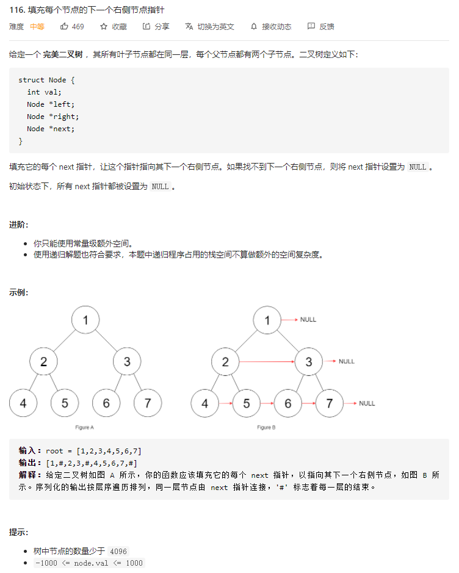
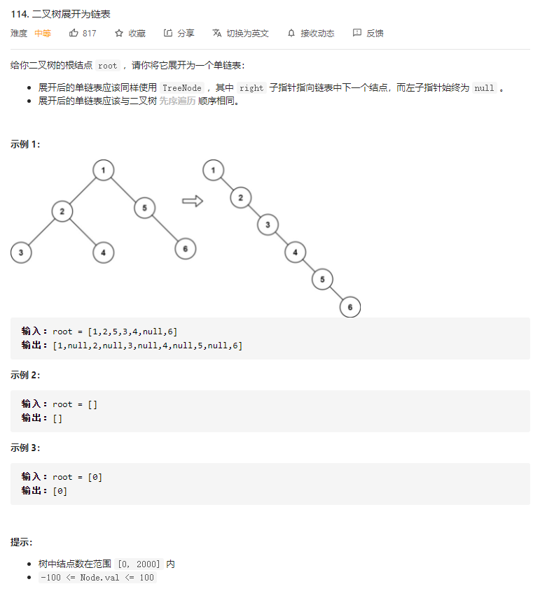
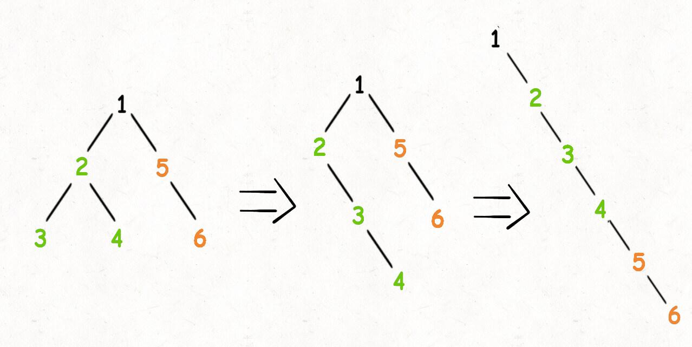
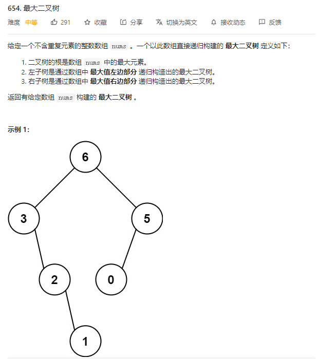
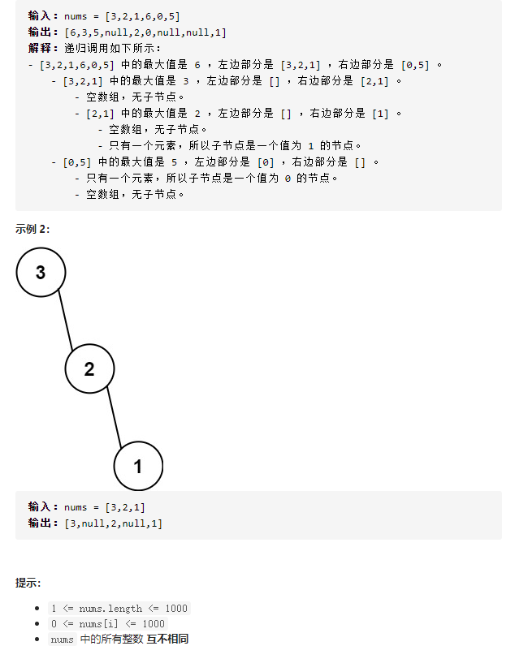
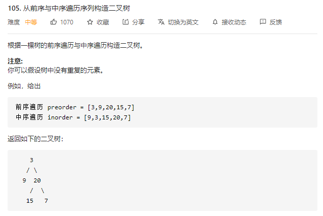
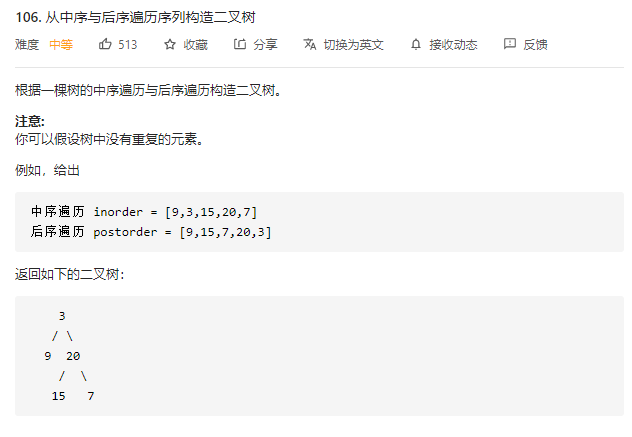
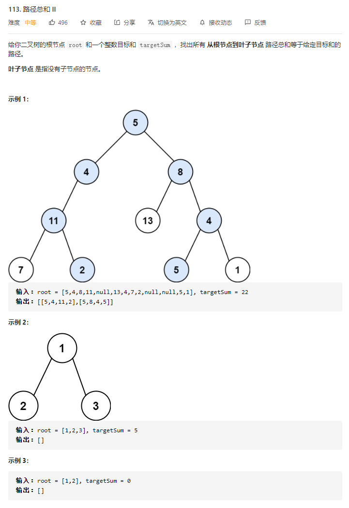

# LeetCode分类精刷

## String


## LinkedList


## Array


## StackAndQueue


## HashTable


## Tree

### [116. 填充每个节点的下一个右侧节点指针](https://leetcode-cn.com/problems/populating-next-right-pointers-in-each-node/)

#### 题目




#### 解题思路

这道题怎么做呢？把每一层的节点穿起来，是不是只要把每个节点的左右子节点都穿起来就行了？

我们可以模仿上一道题，写出如下代码：

```c
Node connect(Node root) {
    if (root == null || root.left == null) {
        return root;
    }

    root.left.next = root.right;

    connect(root.left);
    connect(root.right);

    return root;
}
```

这样其实有很大问题，再看看这张图：


节点 5 和节点 6 不属于同一个父节点，那么按照这段代码的逻辑，它俩就没办法被穿起来，这是不符合题意的。

回想刚才说的，**二叉树的问题难点在于，如何把题目的要求细化成每个节点需要做的事情**，但是如果只依赖一个节点的话，肯定是没办法连接「跨父节点」的两个相邻节点的。

那么，我们的做法就是**增加函数参数**，一个节点做不到，我们就给他安排两个节点，「将每一层二叉树节点连接起来」可以细化成「将每两个相邻节点都连接起来」


#### code

```python
class Node:
    def __init__(self, val: int = 0, left: 'Node' = None, right: 'Node' = None, next: 'Node' = None):
        self.val = val
        self.left = left
        self.right = right
        self.next = next


class Solution:
    def connect(self, root: Node) -> Node:
        if not root:
            return root

        self.connect_two_nodes(root.left, root.right)
        return root

    def connect_two_nodes(self, node1: Node, node2: Node):
        # base case
        if not node1 or not node2: return

        # 前序遍历框架
        # 将传入的两个节点连接
        node1.next = node2

        # 连接相同父节点的两个子节点
        self.connect_two_nodes(node1.left, node1.right)
        self.connect_two_nodes(node2.left, node2.right)

        # 连接跨越父节点的两个子节点
        self.connect_two_nodes(node1.right, node2.left)


if __name__ == '__main__':
    pass
```


### [114. 二叉树展开为链表](https://leetcode-cn.com/problems/flatten-binary-tree-to-linked-list/)

#### 题目




#### 解题思路

函数签名如下：

```python
def flatten(root: TreeNode):
    pass
```

我们尝试给出这个函数的定义：

**给** **`flatten`** **函数输入一个节点** **`root`****，那么以** **`root`** **为根的二叉树就会被拉平为一条链表**。

我们再梳理一下，如何按题目要求把一棵树拉平成一条链表？很简单，以下流程：

1. 将 `root` 的左子树和右子树拉平
2. 将 `root` 的右子树接到左子树下方，然后将整个左子树作为右子树。



面三步看起来最难的应该是第一步对吧，如何把 `root` 的左右子树拉平？其实很简单，按照 `flatten` 函数的定义，对 `root` 的左右子树递归调用 `flatten` 函数即可：


#### code

```python
class TreeNode:
    def __init__(self, val=0, left=None, right=None):
        self.val = val
        self.left = left
        self.right = right


class Solution:
    def flatten(self, root: TreeNode) -> None:
        """
        Do not return anything, modify root in-place instead.
        """
        # base case
        if not root:
            return

        # 1.将root的左子树和右子树拉平。
        self.flatten(root.left)
        self.flatten(root.right)

        # 2.左右子树已经被拉平成一条链表, 将左子树作为右子树
        left = root.left
        right = root.right

        root.left = None
        root.right = left

        # 3.将原先的右子树接到当前右子树的末端
        cur = root
        while cur.right:
            cur = cur.right
        cur.right = right


if __name__ == '__main__':
    pass
```

你看，这就是递归的魅力，你说 `flatten` 函数是怎么把左右子树拉平的？说不清楚，但是只要知道 `flatten` 的定义如此，相信这个定义，让 `root` 做它该做的事情，然后 `flatten` 函数就会按照定义工作。**另外注意递归框架是后序遍历，因为我们要先拉平左右子树才能进行后续操作。**


### [654. 最大二叉树](https://leetcode-cn.com/problems/maximum-binary-tree/)

#### 题目






#### 解题思路

函数签名如下：

```python
def constructMaximumBinaryTree(self, nums: List[int]) -> TreeNode:
    pass
```

按照我们刚才说的，先明确根节点做什么？**对于构造二叉树的问题，根节点要做的就是把想办法把自己构造出来**。

我们肯定要遍历数组把找到最大值 `maxVal`，把根节点 `root` 做出来，然后对 `maxVal` 左边的数组和右边的数组进行递归调用，作为 `root` 的左右子树。

按照题目给出的例子，输入的数组为 `[3,2,1,6,0,5]`，对于整棵树的根节点来说，其实在做这件事：

```c
// 伪代码
TreeNode constructMaximumBinaryTree([3,2,1,6,0,5]) {
    // 找到数组中的最大值
    TreeNode root = new TreeNode(6);
    // 递归调用构造左右子树
    root.left = constructMaximumBinaryTree([3,2,1]);
    root.right = constructMaximumBinaryTree([0,5]);
    return root;
}
```

**对于每个根节点，只需要找到当前** **`nums`** **中的最大值和对应的索引，然后递归调用左右数组构造左右子树即可**。


#### code

```python
from typing import List


class TreeNode:
    def __init__(self, x):
        self.val = x
        self.left = None
        self.right = None


class Solution:
    def __init__(self):
        self.nums = list()
    
    def get_max_index(self, start_i: int, end_i: int) -> int:
        m_index, m_val = start_i, self.nums[start_i]
        for i in range(start_i, end_i + 1):
            if self.nums[i] > m_val:
                m_val = self.nums[i]
                m_index = i
        return m_index

    def constructMaximumBinaryTree(self, nums: List[int]) -> TreeNode:
        self.nums = nums
        return self.dfs(0, len(self.nums) - 1)

    def dfs(self, start_i: int, end_i: int) -> TreeNode:
        # base case
        if start_i > end_i: return

        # 找到最大值及其索引
        m_index = self.get_max_index(start_i, end_i)
        root = TreeNode(self.nums[m_index])

        # 递归调用左右子树
        root.left = self.dfs(start_i, m_index - 1)
        root.right = self.dfs(m_index + 1, end_i)
        return root
```


### [105. 从前序与中序遍历序列构造二叉树](https://leetcode-cn.com/problems/construct-binary-tree-from-preorder-and-inorder-traversal/)

#### 题目




#### 解题思路


#### code


### [106. 从中序与后序遍历序列构造二叉树](https://leetcode-cn.com/problems/construct-binary-tree-from-inorder-and-postorder-traversal/)

#### 题目




#### 解题思路


#### code


## BinarySearchTree


## Heap

### [215. 数组中的第K个最大元素](https://leetcode-cn.com/problems/kth-largest-element-in-an-array/)

#### 题目


#### 解题思路

**优先队列**

优先队列的思路是很朴素的。因为第 `K` 大元素，其实就是整个数组排序以后后半部分最小的那个元素。因此，我们可以维护一个有 `K` 个元素的最小堆：

1. 如果当前堆不满，直接添加；
2. 堆满的时候，如果新读到的数小于等于堆顶，肯定不是我们要找的元素，只有新都到的数大于堆顶的时候，才将堆顶拿出，然后放入新读到的数，进而让堆自己去调整内部结构。


#### code

```python
import heapq


class Solution:
    def findKthLargest(self, nums: list, k: int) -> int:
        """
        Heap
            使用容量为 k 的小顶堆
            元素个数小于 k 的时候，放进去就是了
            元素个数大于 k 的时候，小于等于堆顶元素，就扔掉，大于堆顶元素，就替换
        """
        priority_queue = list()

        for i in range(k):
            heapq.heappush(priority_queue, nums[i])

        for i in range(k, len(nums)):
            if nums[i] > priority_queue[0]:
                heapq.heapreplace(priority_queue, nums[i])
        return priority_queue[0]
```


### [347. 前 K 个高频元素](https://leetcode-cn.com/problems/top-k-frequent-elements/)

#### 题目


#### 解题思路

**最小堆**

题目最终需要返回的是前 `k`个频率最大的元素，可以想到借助堆这种数据结构，对于`k`频率之后的元素不用再去处理，进一步优化时间复杂度。


具体操作为：

- 借助 **哈希表** 来建立数字和其出现次数的映射，遍历一遍数组统计元素的频率
- 维护一个元素数目为 *k* 的最小堆
- 每次都将新的元素与堆顶元素（堆中频率最小的元素）进行比较
- 如果新的元素的频率比堆顶端的元素大，则弹出堆顶端的元素，将新的元素添加进堆中
- 最终，堆中的 *k* 个元素即为前 *k* 个高频元素


#### code

```python
import heapq
from typing import List


class Solution:
    @staticmethod
    def get_num_statics(nums) -> dict:
        hash_table = dict()
        for num in nums:
            if num in hash_table:
                hash_table[num] += 1
            else:
                hash_table[num] = 1
        return hash_table

    def topKFrequent(self, nums: List[int], k: int) -> List[int]:
        hash_table = self.get_num_statics(nums)

        priority_queue = list()
        count = 0
        for key, val in hash_table.items():
            if count < k:
                heapq.heappush(priority_queue, [val, key])
            else:
                if val > priority_queue[0][0]:
                    heapq.heappop(priority_queue)
                    heapq.heappush(priority_queue, [val, key])
            count += 1
        return [item_lis[1] for item_lis in priority_queue]


if __name__ == '__main__':
    s = Solution()
    print(s.topKFrequent([1, 1, 1, 2, 2, 3], 2))
    print(s.topKFrequent([1], 1))
```


### [373. 查找和最小的K对数字](https://leetcode-cn.com/problems/find-k-pairs-with-smallest-sums/)

#### 题目


#### 解题思路

**优先队列**

- 它仅从矩阵左上角的第一对开始，然后根据需要从那里开始扩展。 
- 每当将一对选择为输出结果时，该行中的下一对就会添加到当前选项的优先队列中。 
- 同样，如果所选对是该行中的第一对，则将下一行中的第一对添加到队列中。


#### code

```python
import heapq
from typing import List


class Solution:
    def kSmallestPairs(self, nums1: List[int], nums2: List[int], k: int) -> List[List[int]]:
        length1, length2 = len(nums1), len(nums2)
        priority_queue = list()
        ret_lis = list()

        def push_item(i, j):
            if i < length1 and j < length2:
                heapq.heappush(priority_queue, [nums1[i] + nums2[j], i, j])

        # 从矩阵左上角开始
        i, j = 0, 0
        heapq.heappush(priority_queue, [nums1[i] + nums2[j], i, j])
        while priority_queue and len(ret_lis) < k:
            _, i, j = heapq.heappop(priority_queue)
            ret_lis.append([nums1[i], nums2[j]])

            # 每当将一对选择为输出结果时，该行中的下一对就会添加到当前选项的优先队列中
            push_item(i, j + 1)
            # 如果所选对是该行中的第一对，则将下一行中的第一对添加到队列中
            if j == 0:
                push_item(i + 1, j)
        return ret_lis


if __name__ == '__main__':
    s = Solution()
    print(s.kSmallestPairs([1, 7, 11], [2, 4, 6], 3))
    print(s.kSmallestPairs([1, 1, 2], [1, 2, 3], 2))
```


### [253. 会议室 II](https://leetcode-cn.com/problems/meeting-rooms-ii/)

#### 题目


#### 解题思路

**优先队列：**

我们无法按任意顺序处理给定的会议。处理会议的最基本方式是按其 `开始时间` 顺序排序，这也是我们采取的顺序。

考虑下面的会议时间 `(1, 10), (2, 7), (3, 19), (8, 12), (10, 20), (11, 30) `。前一部分表示会议开始时间，后一部分表示结束时间。按照会议开始时间顺序考虑。图一展示了前三个会议，每个会议都由于冲突而需要新房间。


后面的三个会议开始占用现有的房间。然而，最后的会议需要一个新房间。总而言之，我们需要四个房间来容纳所有会议。


**算法：**

1. 按照 开始时间 对会议进行排序。
2. 初始化一个新的 最小堆，将第一个会议的**结束时间**加入到堆中。我们只需要记录会议的结束时间，告诉我们什么时候房间会空。
3. 对每个会议，检查堆的最小元素（即堆顶部的房间）是否空闲。
   1. 若房间空闲，则从堆顶拿出该元素，将其改为我们处理的会议的结束时间，加回到堆中。
   2. 若房间不空闲。开新房间，并加入到堆中。
4. 处理完所有会议后，堆的大小即为开的房间数量。这就是容纳这些会议需要的最小房间数。


#### code

```python
import heapq
from typing import List


class Solution:
    def minMeetingRooms(self, intervals: List[List[int]]) -> int:
        # 按会议开始时间进行排序
        intervals.sort(key=lambda item: item[0])

        priority_queue = list()
        heapq.heappush(priority_queue, intervals[0][1])

        for i in range(1, len(intervals)):
            meeting = intervals[i]
            # meeting 完全大于堆顶 则 堆顶空闲
            if meeting[0] >= priority_queue[0]:  # 房间空闲: meeting 的开始时间 大于堆顶的 结束时间
                heapq.heappop(priority_queue)
                heapq.heappush(priority_queue, meeting[1])
            else:  # 房间不空闲
                heapq.heappush(priority_queue, meeting[1])

        return len(priority_queue)


if __name__ == '__main__':
    s = Solution()
    print(s.minMeetingRooms([[1, 10], [2, 7], [3, 19], [8, 12], [10, 20], [11, 30]]))
    print(s.minMeetingRooms([[0, 30], [5, 10], [15, 20]]))
    print(s.minMeetingRooms([[7, 10], [2, 4]]))
```


## Graph


## BitOperation


## DFS

```python
# 394, 547, 1273
```

### [113. 路径总和 II](https://leetcode-cn.com/problems/path-sum-ii/)

#### 题目



#### 解题思路

采用深度优先搜索的方式，枚举每一条从根节点到叶子节点的路径。当我们遍历到叶子节点，且此时路径和恰为目标和时，我们就找到了一条满足条件的路径。


#### code

```python
from copy import deepcopy
from typing import List


class TreeNode:
    def __init__(self, val=0, left=None, right=None):
        self.val = val
        self.left = left
        self.right = right


class Solution:
    def pathSum(self, root: TreeNode, targetSum: int) -> List[List[int]]:
        ret_lis = list()

        def dfs(node: TreeNode, track_path: list, dynamic_sum: int):
            # base case
            if not node: return

            # 做出选择，记录路径和动态和
            track_path.append(node.val)
            dynamic_sum -= node.val

            dfs(node.left, track_path, dynamic_sum)
            dfs(node.right, track_path, dynamic_sum)

            # 为根结点，且和满足条件
            if not node.left and not node.right:
                if dynamic_sum == 0:
                    ret_lis.append(deepcopy(track_path))
            # 回溯
            dynamic_sum += track_path.pop(-1)

        dfs(root, list(), targetSum)
        return ret_lis
```


## BFS

```python
# 102, 207, 301, 934
```


## IterationAndRecursion

```python
# 94, 144, 145, 230, 247, 544, 625, 687
```


## Sort

```python
# 56, 147, 220, 252
```


## BinarySearch


## DivideAndConquer

```python
# 4, 23, 53, 215, 240, 327
```


## Backtracking

```python
# 10, 17, 22, 39, 46(classical), 1239
```


## Greedy

```python
# 253, 406, 621
```


## DP

```python
# 5(classical), 10, 300, 647
```


