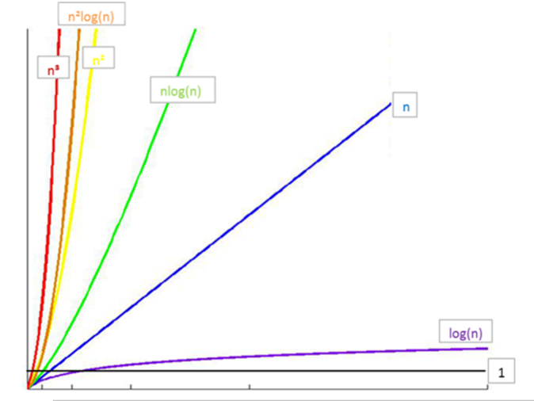

# 时间和空间复杂度

## 初识

### 算法定义

算法是独立存在的一种解决问题的方法和思想：

+ 求解一个问题步骤的描述
+ 是求解问题的方法
+ 它是指令的有限序列
+ 其中每条指令表示一个或者多个操作

对于算法而言，实现的语言并不重要，重要的是思想

### 算法特性

+ 确定性：无二义
+ 有穷性：合适时间内可以执行
+ 输入项
+ 输出项
+ 可行性：算法的每一步都是可行的

</br>

## 复杂度

### 时间复杂度

#### 定义

​	一般情况下，算法中<mark>基本操作重复执行的次数</mark>是<mark>问题规模n</mark>的某个函数，用`T(n)`表示**（语句频度）**，若有某个辅助函数`f(n)`，使得当`n`趋近于**无穷大时**，`T(n)/f(n)`的**极限值**为<mark>不等于零的常数</mark>，则称`f(n)`是`T(n)`的**同数量级函数**。记作`T(n)=O(f(n))`，称`O(f(n))`为算法的渐进时间复杂度(*O是数量级的符号* )，简称<mark>时间复杂度</mark>。

#### 求解步骤

**求解算法时间复杂度的步骤：**

1. 找出算法中的基本语句，计算**基本操作执行次数**`T(n)`

   ```python
   # 基本操作即算法中的每条语句（以;号作为分割），语句的执行次数也叫做语句的频度。在做算法分析时，一般默认为考虑最坏的情况。
   ```

2. 计算基本语句的执行次数`T(n)`的**数量级**

   ```python
    # 忽略常量、低次幂和最高次幂的系数，令f(n)=T(n)的数量级
   ```

3. 用大`O`来表示**时间复杂度**

   ```python
   # 当n趋近于无穷大时，如果lim(T(n)/f(n))的值为不等于0的常数，则称f(n)是T(n)的同数量级函数。记作T(n)=O(f(n))，即为时间复杂度。
   ```

`example_1`:

```python
n = 1000  # T(n) = 1
j = 1   # T(n) = 1
num1 = 1   # T(n) = 1
num2 = 2   # T(n) = 1
for i in range(0, n):   # T(n) = n
    num1 += 1   # T(n) = n
    while j < n:  # T(n) = n*log(n), 以2为底
        j *= 2  # T(n) = n*log(n), 以2为底
        num2 += 1  # T(n) = n*log(n), 以2为底
print(num1, num2)  # T(n) = 1
```

1. **总的T(n):** 
   $$
   T(n) = 5 + 2n + 3nlog_2n
   $$

2. 忽略掉`T(n)`中的常量、低次幂和最高次幂的系数，**数量级**
   $$
   f(n) = nlog_2n
   $$

3. **求极限**
   $$
   lim(T(n)/f(n)) = lim((3nlog_2n + 2n + 4)/(nlog_2n) = 3
   $$
   所以时**间复杂度**可以用**大O表示**，为
   $$
   O(f(n)) = O(nlog_2n)
   $$
   


**简化的计算步骤：**

可以看出，决定算法复杂度的是**执行次数最多的语句**，这里是`num2 += 1`，`j *= 2`一般也是<mark>最内循环的语句</mark>。并且，通常将求解极限是否为常量也省略掉？

1. 找到**执行次数<mark>最多</mark>的语句**
2. 计算语句执行次数的**数量级**
3. 用**大O**来表示**时间复杂度**

`example_1`

```python
# 1.执行次数最多的语句为
while  j < n:
    j *= 2
    num2 += 1
T(n) = 3n*log(n) 

# 2.数量级
f(n) = n*log(n)

# 3.求极限及大O表示
T(n) = O(nlog(n))
```

#### 几种可能

**分析算法，存在的几种可能：**

+ <mark>平均时间复杂度</mark>
+ <mark>最坏时间复杂度</mark>
+ 最优时间复杂度


#### 一些规则

+ **基本操作**，即只有常数项，认为是**O(1)**

+ **顺序结构**，时间复杂度按**加法**进行计算
  $$
  T(n, m) = T1(n) + T2(m) = O(max(f(n), g(m)))
  $$

+ **循环结构**，时间复杂度按**乘法**进行计算
  $$
  T(n, m) = T1(n) * T2(m) = O(f(n)*g(m))
  $$

+ **分支结构**，时间复杂度取**最大值**


**常见的时间复杂度算法：**

| 执行次函数举例--总的T(n) | 时间复杂度 | 非正式术语 |
| :----------------------: | :--------: | :--------: |
|            12            |    O(1)    |   常数阶   |
|          2n + 3          |    O(n)    |   线性阶   |
|      3n^2 + 2n + 1       |   O(n^2)   |   平方阶   |
|       5log(n) + 20       | O(log(n))  |   对数阶   |
|    2n + 3nlog(n) + 19    | O(nlog(n)) | nlog(n)阶  |
|   6n^3 + 2n^2 + 3n + 4   |   O(n^3)   |   立方阶   |
|           2^n            |   O(2^n)   |   指数阶   |
|    n! + nlog(n) + 15     |   O(n!)    |    阶乘    |

所消耗的时间从小到大：
$$
O(1) < O(log(n)) < O(n) < O(nlog_2(n)) < O(n^2) < O(n^3) < O(2^n) < O(n!) < O(n^n)
$$



#### 示例演练

`example_2`

```python
n = 1000
x = 1

for i in range(0, n):
    x += 1  # T(n) = n

for i in range(0, n):
    for j in range(0, n):
        x += 1  # T(n) = n*n
print(x)
```

`分析：`注意：<mark>`T(n)`为执行次数最多语句的频度</mark>

+ 第一个`for loop`, `T(n) = n;  f(n) = n`时间复杂度为`O(n)`
+ 第二个`for loop`, `T(n) = n^2;  f(n) = n^2 `,时间复杂度为`O(n^2)`
+ 整个算法的时间复杂度为`O(n + n^2) = O(n^2)`

------

`example_3`

```python
def func(n):
    for i in range(n):
        for j in range(i, n):
            print("Hello World j = %s" % j)  # T(n) = (n^2)/2 + n/2
```

`分析：`注意：==`T(n)`为执行次数最多语句的频度

+ 直接找到语句频度最高的语句为`print("Hello World j = %s" % j)`, 

  ```python
  # 当i为0时，该语句执行n次
  # 当i为1时，该语句执行n-1次
  # 。。。
  # 所以该语句的T(n) = n + (n-1) + (n-2) + ... + 1 = (n+1)*n/2 = 0.5n^2 + 0.5n
  ```

+ 数量级`f(n) = n^2`

+ 极限存在，时间复杂度 = `O(n^2)`

------

`example_4`

```python
def func(n):
    if n <= 1:
        return 1
    else:
        return func(n - 1) + func(n - 2)
```

`分析：`

```python
显然运行次数，T(0) = T(1) = 1，同时 T(n) = T(n - 1) + T(n - 2) + 1，这里的 1 是其中的加法算一次执行。
显然 T(n) = T(n - 1) + T(n - 2) 是一个斐波那契数列，通过归纳证明法可以证明，当 n >= 1 时 T(n) < (5/3)^n，同时当 n > 4 时 T(n) >= (3/2)^n。
所以该方法的时间复杂度可以表示为 O((5/3)^n)，简化后为 O(2^n)。
```


</br>

### 空间复杂度

类似于时间复杂度的讨论，一个算法的**空间复杂度(Space Complexity)**，`S(n)`定义为该算法所**耗费的存储空间**，<mark>它也是问题规模n的函数</mark>。渐近空间复杂度也常常简称为空间复杂度。
 **空间复杂度(Space  Complexity)**是对一个算法在运行过程中<mark>临时占用存储空间大小的量度</mark>。一个算法在计算机存储器上所占用的存储空间，包括:

+ **存储算法本身**所占用的存储空间
  + 存储算法本身所占用的存储空间与**算法书写的长短**成正比，要压缩这方面的存储空间，就必须编写出较短的算法
+ **算法的输入输出数据**所占用的存储空间
  + 算法的输入输出数据所占用的存储空间是**由要解决的问题决定的**，是通过参数表由调用函数传递而来的，它不随本算法的不同而改变
+ **算法在运行过程中**临时占用的存储空间
  + 算法在运行过程中临时占用的存储空间随算法的不同而异，有的算法只需要<mark>占用少量的临时工作单元，而且不随问题规模的大小而改变</mark>，我们称这种算法是“就地"进行的，是节省存储的算法；有的算法需要占用的<mark>临时工作单元数与解决问题的规模n有关</mark>，它随着n的增大而增大，当n较大时，将占用较多的存储单元，例如快速排序和归并排序算法就属于这种情况

------

**常见算法空间复杂度：**

+ 一个算法的**空间复杂度为一个常量**，即不随被处理数据量n的大小而改变时，可表示为**O(1)**；
+ 当一个算法的<mark>空间复杂度与以2为底的n的对数成正比时</mark>，可表示为**0(1og2n)**；
+ 当一个算法的<mark>空I司复杂度与n成线性比例关系时</mark>，可表示为**0(n)**.若形参为数组，则只需要为它分配一个存储由实参传送来的一个地址指针的空间，即一个机器字长空间；若形参为引用方式，则也只需要为其分配存储一个地址的空间，用它来存储对应实参变量的地址，以便由系统自动引用实参变量。

</br> 


