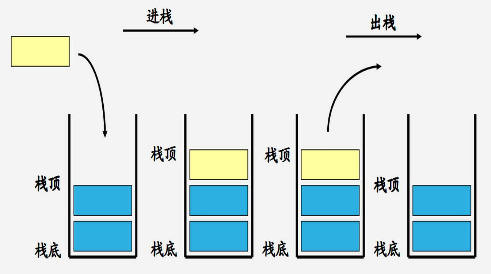
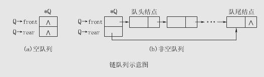
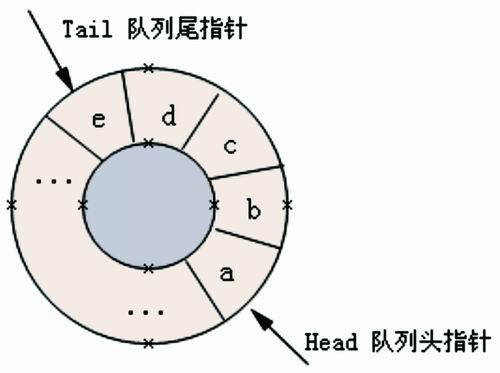

# 栈
[python版实现](https://github.com/pankypan/DataStructureAndAlgo/blob/master/data_structure/c_stack/stacks.py)

## 定义

> 栈是限定仅在表尾进行插入或删除操作的线性表。因此对栈来说，表尾端有其特殊含义，称为栈顶，表头端称为栈底。不含元素的空表称为空栈。栈顶实现元素的进出，栈的修改遵循后进先出的原则。因此，栈又称为**后进先出（last in first out）**的线性表（简称LIFO结构）。




## 表示及实现

 栈是一种 "特殊" 的线性存储结构，因此栈的具体实现有以下两种方式：

1. 顺序栈：采用顺序存储结构可以模拟栈存储数据的特点，从而实现栈存储结构；
2. 链栈：采用链式存储结构实现栈结构；


### 顺序栈

>  顺序栈，即栈的顺序存储结构是利用一组地址连续的存储单元依次存放自栈底到栈顶的数据元素，同时附设指针top指示栈顶元素在顺序栈中的位置。

先为栈分配一个基本容量，然后在应用的过程中，当栈的空间不够使用时za再逐段扩大。为此可设定两个常量：STACK_INIT_SIZE（存储空间初始分配量）和STACKINCREMENT(存储空间分配增量)，并以下述类型说明作为顺序栈的定义。

```c++
typedef struct {
	int *base;//类型要看元素是什么类型
	int *top;
	int stacksize; // 当前栈可使用的最大容量。
} Sqstack;
```

top=base可作为栈空的标记。每当插入新元素时，指针top+1；删除时，指针top-1；因此，非空栈中的栈顶指针始终在栈顶元素的下一个位置上。


### 链栈

栈的操作即在单链表操作基础上，push则是在头结点前添加元素，pop则是删除头结点。


## 应用举例

### 数制转换

```python
def number_base_conversion(input_number: int, base=8):
    stack = LinkedStack()
    while input_number:
        input_number, r = divmod(input_number, base)
        stack.push(r)

    out_put_lis = []
    data = stack.pop()
    while data is not None:
        out_put_lis.append(str(data))
        data = stack.pop()
    return ''.join(out_put_lis)
```


### 括号匹配的校验

```python
def brackets_matching_check(input_brackets: str):
    """核心: 期待的紧迫程度，利用栈"""
    def pair_brackets(a: str, b: str):
        return True if a + b in ['()', '[]'] else False
    left_bracket_lis = ['(', '[']
    right_bracket_lis = [')', ']']
    stack = LinkedStack()
    for bracket in input_brackets:
        if bracket not in left_bracket_lis + right_bracket_lis:
            return "invalid input"
        if bracket in left_bracket_lis:
            stack.push(bracket)
        elif bracket in right_bracket_lis:
            bracket_to_pair = stack.pop()
            if not pair_brackets(bracket_to_pair, bracket):
                return False
    if stack.pop():
        return False
    else:
        return True
```


### 行编辑程序

```python
def line_editor():
    """
    这个输入缓冲区为一个stack，每当从终端接受一个字符之后，
    判断：
        如果它既不是退格符(#)也不是退行符(@),则将该字符压入栈顶；
        如果它是一个退格符(#)stack出栈一个字符；
        如果它是一个退行符(@)清空stack；
    :return:
    """
    codes = []
    s = input()
    stack = LinkedStack()
    while s:
        if s == 'EOF':
            return '\n'.join(codes)
        for char in s:
            if char in ['#', '@']:
                if char == '#':
                    stack.pop()
                else:
                    while not stack.is_empty():
                        stack.pop()
            else:
                stack.push(char)
        line_code = []
        while not stack.is_empty():
            line_code.insert(0, stack.pop())
        codes.append(''.join(line_code))

        s = input()
    return '\n'.join(codes)
```


### 迷宫求解

```c
"""
do {
    if 当前位置可通:
    则 {
        将当前位置插入栈顶；
        若该位置是出口位置，则结束；
        否则切换当前位置的东邻方块为新的当前位置；
    }
    else:
        if 栈不空且栈顶位置尚有其他方向未经探索；
            则 设定新的当前位置为沿顺时针方向旋转找到的栈顶位置的下一相邻块；
        若 栈不空但栈顶位置的四周均不通
            则 {
                删去栈顶位置；
                若栈不为空，则重新测试新的栈顶位置，直到找到一个可通的相邻块或出栈至空
            }
} while (栈不空)
"""
```


### 表达式求值

```python

```


## 栈与递归的实现

**递归函数**

> 一个直接调用自己或者通过一系列的调用语句间接地调用自己的函数


 在高级语言编制的程序中，<mark>**调用函数**与**被调用函数**之间的**链接及信息**交换需通过**栈**来进行。</mark>

 通常在一个函数运行期间调用另一个函数时，在运行被调用函数之前，系统需完成三件事：

1. 将所有的实在参数，返回地址等信息传递给被调用函数保存。
2. 为被调用函数的局部变量分配储存区。
3. 将控制转移到被调函数入口


 从被调函数返回调用函数之前，系统完成三件工作：

1. 保存被调函数计算结果
2. 释放被调用函数的数据区
3. 依照被调用函数保存的返回地址将控制转移到调用函数。


递归函数运行过程类似多个函数的**嵌套调用**，只是调用与被调用函数为同一个，因此，和每次调用相关的一个重要概念是**递归函数运行的层次**。

从0层开始调用则进入1层，从i层调用进入i+1层，返回则是返回上一层，即层级递减。为了保证递归函数的正确执行，系统需设立一个“递归工作栈”作为整个递归函数运行期间使用的数据存储区。每层递归所需信息构成一个“工作记录”，其中包括所有的实在参数、所有局部变量以及上一层的返回地址。每进入一层，则产生一个新的记录压入栈顶。没退出一层，则弹出一个。当前执行层的工作记录必须是递归栈顶的工作记录，称这个记录为“活动的记录”。


# 队列

[python版实现](https://github.com/pankypan/DataStructureAndAlgo/blob/master/data_structure/d_queue/queues.py)

## 定义

> **队列(queue)**是一种**先进先出(first in first out, FIFO)**的线性表，它只允许在表的一端进行插入，而在另一端删除元素，允许插入的一端叫做**队尾(rear/tail)**, 允许删除的一端则称**队头(front)**


## 链队列

> 用链表表示的队列，称为链队列



<mark>一个链队列显然需要两个分别指示**队头和队尾的指针**才能唯一确定。</mark>为了操作方便，我们也给队列添加一个头结点，并令头指针指向头结点。由此，**空的链队列的判决条件是头指针和尾指针均指向头结点**


## 循环队列

与顺序栈类似，在队列的顺序结构中，除了用一组地址连续的存储单元依次存放从队列头到队列尾的元素之外，尚需附设两个指针front和rear分贝指示队列头元素及队列尾元素的位置。




用此方法表示循环队列，就无法用Q.front=Q.rear来判断队列空间是空还是满。可有两种处理方法：

- 另设一个标志位以区别队列是空还是满
- 少用一个元素空间，约定以“队列头指针在队列尾指针的下一位置上”作为队列呈满状态的标志


