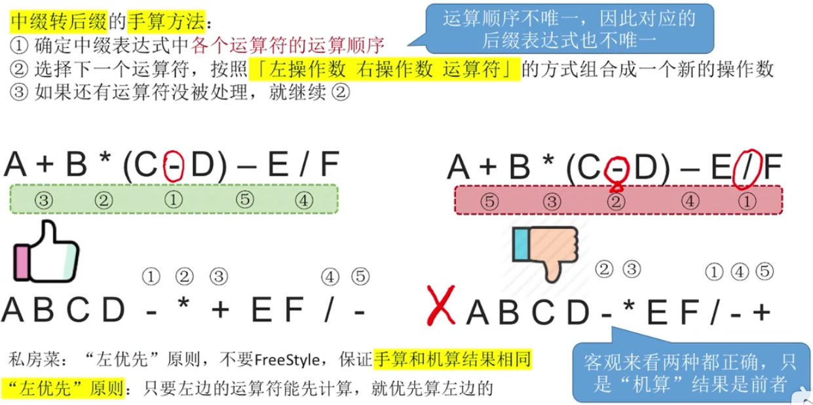
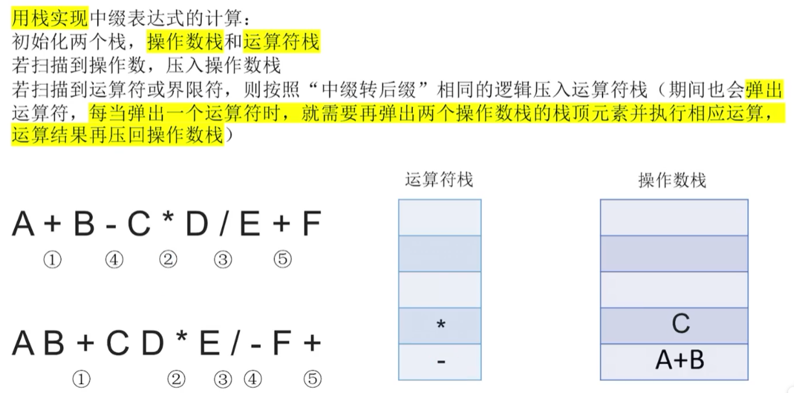
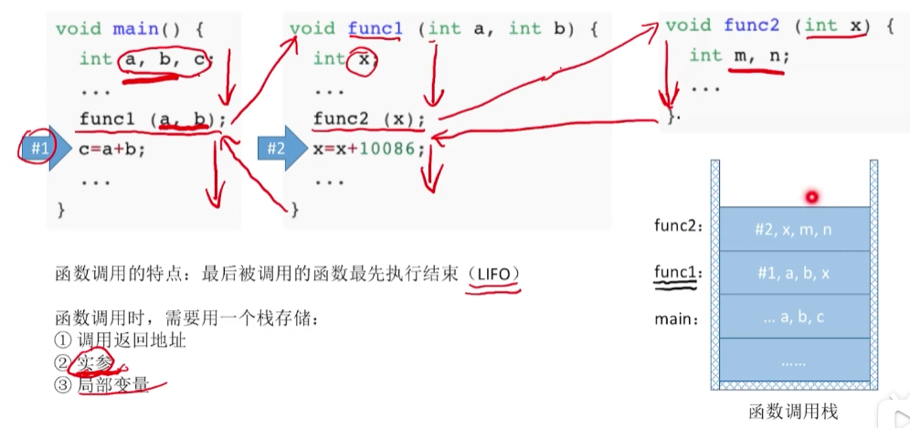

# 栈的应用

## 括号匹配

**用栈实现<mark>括号匹配：</mark>**

依次扫描所有字符，遇到左括号入栈，遇到右括号则弹出栈顶元素检查是否匹配。

匹配失败情况：

1.左括号单身；2右括号单身；3左右括号不匹配

## 表达式求值问题

### 三种表达式

**算术表达式由三部分组成：**操作数、运算符、界限符

### 中缀表达式转后缀表达式(手算)

<mark>使用“左优先”原则，可以保证运算顺序唯一</mark>

### 中缀表达式转后缀表达式(机算)

.png)

### 后缀表达式的计算(手算)

### 后缀表达式的计算(机算)

.png)

### 中缀表达式求值(用栈实现)

**<mark>就是前面两个算法(中缀表达式转后缀算法、后缀表达式求值算法)的结合</mark>**

## 栈在递归的应用

### 函数调用背后的过程

### 栈在递归中的应用

