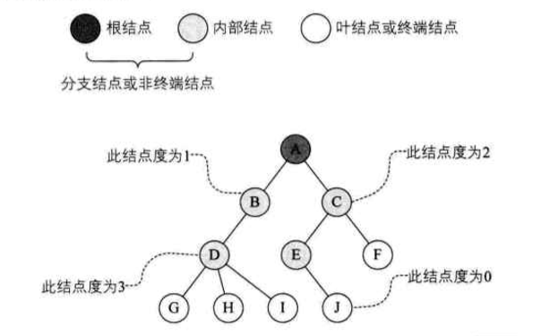
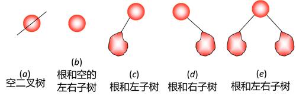
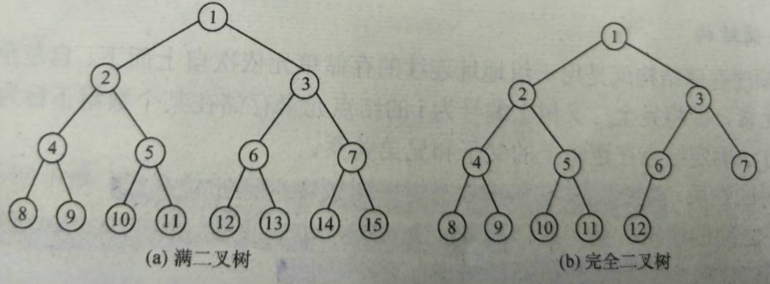
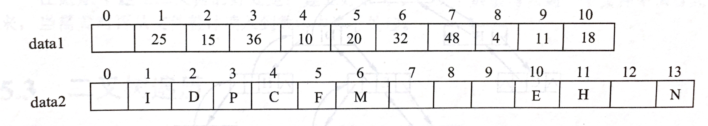
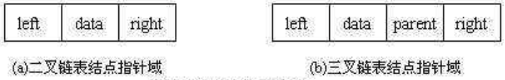
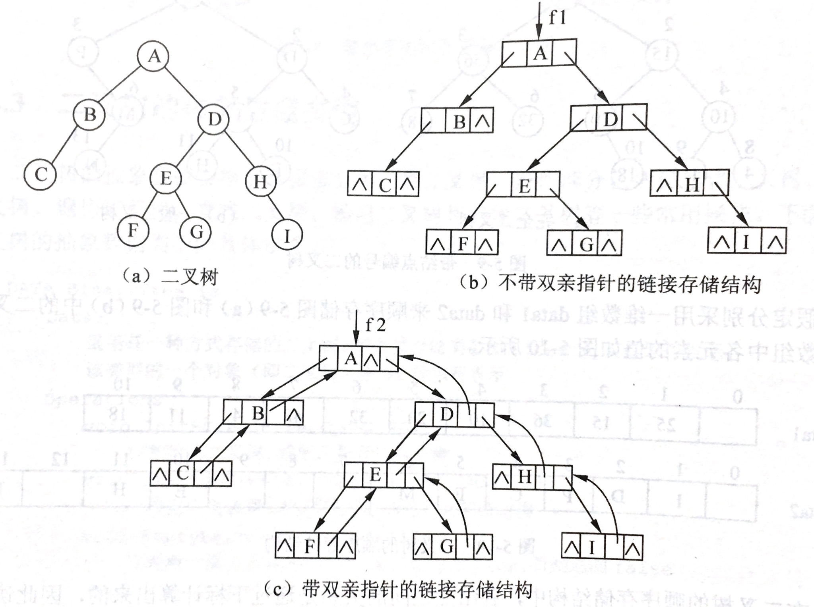
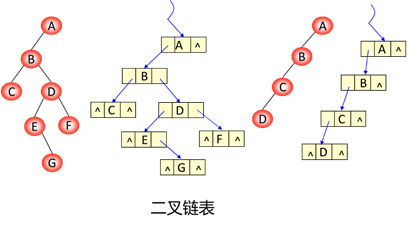

# 树的定义及基本术语

> Tree是一个n(n>=0)个结点的有限集。n=0时称为空树。

在任意一颗非空树中：

1. **有且仅有一个特定的称为根（root）的结点**；
2. **当n>1时，其余结点可分为m(m>0)个互补交互的有限集T1、T2...Tm，其中每一个集合本身又是一棵树，并称为根的子树（SubTree）**。

**结点术语：**

- Node(结点)：包含一个元素及若干指向其子树的分支；
- Degree(结点的度)：指结点拥有的子树的个数，二叉树的度不大于2；
- Leaf(叶子结点)：度为0的结点，也称为终端结点；
- Depth(高度)：叶子节点的高度为1，根节点高度最高；
- Level(层)：根在第一层，以此类推；

**结点之间的关系**

- 孩子（Child）和双亲（Parent）：结点的子树的根，相应的，该结点称为孩子的双亲。**（注意是双亲，不是单亲）**
- 兄弟（sibling）：同一个双亲的孩子之间互称兄弟。
- 结点的祖先：从根结点到该结点**所经过分支上的所有结点**。
- 子孙：以某结点为根的子树中的任一结点都称为该节点的子孙。
- 无序树和有序树：如果将树中结点的各子树看成**从左至右**是有次序的，不能互换的，则称该数为有序树，否则为无序树。
- 森林(fores):m(m>=0)棵**互不相交**的树的集合。

# 二叉树

[python版实现](https://github.com/pankypan/DataStructureAndAlgo/blob/master/data_structure/e_tree/binary_tree.py)

## 二叉树定义

> Binary Tree：由一个结点和两颗互不相交、分别称为这个根的左子树和右子树的二叉树构成（递归定义）

**特点：**

- 二叉树中结点的度<=2;
- 二叉树的子树有左右之分，其次序不能任意颠倒；

## 二叉树性质

**满二叉树**

> 满二叉树是一棵深度为k且有 $ 2^i $ 个结点的二叉树。 

**完全二叉树**

> 深度为k的，有n个结点的二叉树，当且仅当其每一个结点都与深度为k的满二叉树中编号从1至n的结点一一对应时，称为完全二叉树

### 二叉树性质

1. 二叉树的第i层上至多有  $2^{i-1}$  个结点
2. 深度为k的二叉树，至多有 $2^k-1$ 个结点
3. 对于任何一棵二叉树T，如果其Leaf个数为 $n_0$ ，度为2的结点数为 $n_2 $，则 $n_0 = n_2 + 1$

### 完全二叉树性质

1. 具有 $ n$ 个结点的完全二叉树的深度为 $ \log_2n + 1$
2. 如果将一棵有n个结点的完全二叉树(其深度为 $log_2n+1$ )的结点按层序编号(从第1层到第 $\log_2n+1$ 层，每层从左到右)，则对任意结点i( $ 1\leq i \leq n$ ))有： 
   1. 若 $i=1$，则结点i为根结点，无父结点；若 $i>1$，则结点 $i$ 的双亲 $PARENT(i)$ 为结点 $i/2$; 
   2. 如果 $2i>n$,则结点i无左孩子(结点i为叶子结点)；否则其左孩子 $LCHILD(i)$ 是结点 $2i$。
   3. 如果 $2i+1>n$,则结点i无右孩子；否则其右孩子 $RCHILD(i)$ 是结点 $2i+1$。

## 二叉树的存储结构

### 顺序存储结构

> 用一组地址连续的存储单元依次自上而下、自左至右存储完全二叉树上的结点元素

顺序存储一棵二叉树时，首先对该树中的每个结点进行编号，然后以各结点的编号为下标，把各结点的值对应存储到一个一维数组中。<mark>每个结点的编号与等深度的满二叉树中对应结点的编号相等</mark>，即树根结点的编号为1，接着按照**从上到下**和**从左到右**的次序，若一个结点的编号为$i$，则左、右孩子的编号分别为$2i$和$2i+1$。如图，各结点上方的数字就是该结点的编号。

假设分别采用一维数组data1和data2来顺序存储上图的两棵二叉树，则两数组中各元素的值如下图所示。

**顺序存储结构特点：**

- 存储完全二叉树--存储空间利用充分

- 存储一般二叉树--存储空间利用不充分

  特别是对于那些单支结点较多的二叉树来说是很不合适的，因为可能只有少数存储位置被利用

- 易于访问每个结点的双亲和左、右孩子结点

  在<mark>二叉树的顺序存储结构中，各结点之间的关系是通过下标计算出来的，因此访问每一个结点的双亲和左、右孩子都非常方便。</mark>如对于编号为i的结点，其双亲结点的下标为⌊i/2⌋，若存在左孩子，则左孩子结点的下标为2i，若存在右孩子，则右孩子结点的下标为2i+1。

### 链式存储结构

在二叉树的链接存储中，使用链表存储。

**二叉链表中的结点：**

- 数据域
- 左指针域
- 右指针域

**三叉链表中的结点：**

- 数据域
- 左指针域
- 右指针域
- 双亲指针域

data域存放某结点的数据信息；lchild与rchild分别存放指向左孩子和右孩子的指针，当左孩子或右孩子不存在时，相应指针域值为空。利用这样的结点结构表示的二叉树的链式存储结构被称为**二叉链表**，如下图所示：

由上图可知，在n个结点的二叉链表中有n + 1个空指针域。因为n个结点有2n个指针域，其中用了n - 1指针域（头结点没用指针域）。

# 遍历二叉树

[python版实现](https://github.com/pankypan/DataStructureAndAlgo/blob/master/data_structure/e_tree/binary_tree.py)

**traversing binary tree:**

> 按某条搜索路径巡访树中每个结点，使得每个结点均被访问之且一次

## 四种遍历算法

**遍历二叉树递归算法定义**

二叉树是由3个基本单元组成：

- 根结点
- 左子树
- 右子树

如果能够依次遍历这3部分，便是遍历了整个二叉树；

**层次遍历**

层次遍历方式：按照二叉树中的层次从左到右依次遍历每层中的结点。

**先序遍历**

**先序遍历**首先访问根节点，然后遍历左子树，最后遍历右子树。 <mark>根—左—右</mark>

**中序遍历**

**中序遍历**是先遍历左子树，然后访问根节点，然后遍历右子树。<mark>左—根—右</mark>

**后序遍历**

**后序遍历**是先遍历左子树，然后遍历右子树，最后访问树的根节点。<mark>左—右—根</mark>

## 遍历常考

对于二叉树的遍历有一类典型题型。

1）已知前序遍历序列和中序遍历序列，确定一棵二叉树。

例题：若一棵二叉树的前序遍历为ABCDEF，中序遍历为CBAEDF，请画出这棵二叉树。

分析：前序遍历第一个输出结点为根结点，故A为根结点。早中序遍历中根结点处于左右子树结点中间，故结点A的左子树中结点有CB，右子树中结点有EDF。

如图所示：

按照同样的分析方法，对A的左右子树进行划分，最后得出二叉树的形态如图所示：

2）已知后序遍历序列和中序遍历序列，确定一棵二叉树。

后序遍历中最后访问的为根结点，因此可以按照上述同样的方法，找到根结点后分成两棵子树，进而继续找到子树的根结点，一步步确定二叉树的形态。

<mark>**注**：已知前序遍历序列和后序遍历序列，不可以唯一确定一棵二叉树。</mark>

