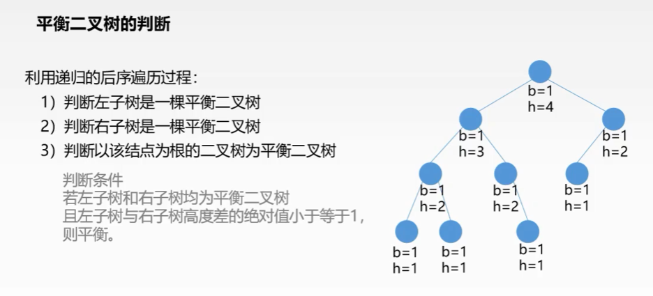

# AVL树(平衡二叉查找树)

AVL树本质上是一颗二叉查找树，但是它又具有以下特点：它是一棵空树或它的左右两个子树的高度差的绝对值不超过1，并且左右两个子树都是一棵平衡二叉树。在AVL树中任何节点的两个子树的高度最大差别为一，所以它也被称为平衡二叉树。下面是平衡二叉树和非平衡二叉树对比的例图：


平衡因子(bf)：结点的左子树的深度减去右子树的深度，那么显然-1<=bf<=1;


## AVL树的定义

**平衡二叉查找树**：简称平衡二叉树。由前苏联的数学家Adelse-Velskil和Landis在1962年提出的高度平衡的二叉树，根据科学家的英文名也称为AVL树。它具有如下几个性质：

1. 可以是空树。
2. 假如不是空树，任何一个结点的左子树与右子树都是平衡二叉树，并且高度之差的绝对值不超过1

平衡之意，如天平，即两边的分量大约相同。如定义，假如一棵树的左右子树的高度之差超过1，如左子树的树高为2，右子树的树高为0，子树树高差的绝对值为2就打破了这个平衡。如依次插入1，2，3三个结点（如下图）后，根结点的右子树树高减去左子树树高为2，树就失去了平衡。


那么在建立树的过程中，我们如何知道左右子树的高度差呢？在这里我们采用了平衡因子进行记录。

**平衡因子**：左子树的高度减去右子树的高度。由平衡二叉树的定义可知，平衡因子的取值只可能为0,1,-1.分别对应着左右子树等高，左子树比较高，右子树比较高。如下图


说到这里，我们已经可以大概知道平衡二叉树的结构定义需要什么内容了，数据成员，平衡因子，以及左右分支。所以，我们给出如下的结构定义。大家主要首先先了解平衡因子的各个取值及其含义即可。

```c
typedef char KeyType;                   //关键字

typedef struct MyRcdType            //记录
{
    KeyType key;
}RcdType,*RcdArr;

typedef enum MyBFStatus //为了方便平衡因子的赋值，这里进行枚举
{//RH,EH,LH分别表示右子树较高，左右子树等高，左子树较高
    RH,EH,LH
}BFStatus;

typedef struct MyBBSTNode       //树结点类型定义
{
    RcdType data;                             //数据成员
    BFStatus bf;                                 //平衡因子
    struct MyBBSTNode *lchild,*rchild;        //左右分支
}BBSTNode,*BBSTree;
```


## 平衡二叉树的应用

### 求高度为h的最小平衡二叉树的结点数


### 平衡二叉树的判断




## 插入与平衡

<mark>**平衡二叉树的失衡调整主要是通过旋转最小失衡子树来实现的**。</mark>

**最小失衡子树**：在新插入的结点向上查找，以第一个平衡因子的绝对值超过1的结点为根的子树称为最小不平衡子树。也就是说，一棵失衡的树，是有可能有多棵子树同时失衡的，如下。而这个时候，我们只要调整最小的不平衡子树，就能够将不平衡的树调整为平衡的树。

[平衡二叉树的插入与平衡](https://www.cnblogs.com/aspirant/p/7190513.html)


