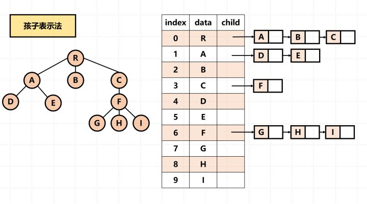
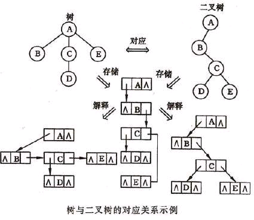
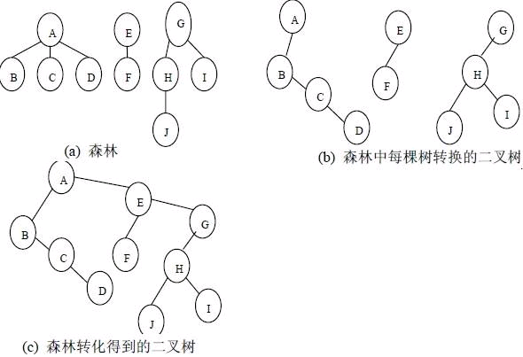

# 树的定义及基本术语

> Tree是一个n(n>=0)个结点的有限集。n=0时称为空树。


在任意一颗非空树中：

1. **有且仅有一个特定的称为根（root）的结点**；
2. **当n>1时，其余结点可分为m(m>0)个互补交互的有限集T1、T2...Tm，其中每一个集合本身又是一棵树，并称为根的子树（SubTree）**。


**结点术语：**

- Node(结点)：包含一个元素及若干指向其子树的分支；
- Degree(结点的度)：指结点拥有的子树的个数，二叉树的度不大于2；
- Leaf(叶子结点)：度为0的结点，也称为终端结点；
- Depth(高度)：叶子节点的高度为1，根节点高度最高；
- Level(层)：根在第一层，以此类推；


**结点之间的关系**

- 孩子（Child）和双亲（Parent）：结点的子树的根，相应的，该结点称为孩子的双亲。**（注意是双亲，不是单亲）**
- 兄弟（sibling）：同一个双亲的孩子之间互称兄弟。
- 结点的祖先：从根结点到该结点**所经过分支上的所有结点**。
- 子孙：以某结点为根的子树中的任一结点都称为该节点的子孙。
- 无序树和有序树：如果将树中结点的各子树看成**从左至右**是有次序的，不能互换的，则称该数为有序树，否则为无序树。
- 森林(fores):m(m>=0)棵**互不相交**的树的集合。


# 二叉树

## 二叉树定义

> Binary Tree：由一个结点和两颗互不相交、分别称为这个根的左子树和右子树的二叉树构成（递归定义）


**特点：**

- 二叉树中结点的度<=2;
- 二叉树的子树有左右之分，其次序不能任意颠倒；


## 二叉树性质


**满二叉树**

> 满二叉树是一棵深度为k且有 $ 2^i $ 个结点的二叉树。 


**完全二叉树**

> 深度为k的，有n个结点的二叉树，当且仅当其每一个结点都与深度为k的满二叉树中编号从1至n的结点一一对应时，称为完全二叉树


### 二叉树性质

1. 二叉树的第i层上至多有  $2^{i-1}$  个结点
2. 深度为k的二叉树，至多有 $2^k-1$ 个结点
3. 对于任何一棵二叉树T，如果其Leaf个数为 $n_0$ ，度为2的结点数为 $n_2 $，则 $n_0 = n_2 + 1$


### 完全二叉树性质

1. 具有 $ n$ 个结点的完全二叉树的深度为 $ \log_2n + 1$
2.  如果将一棵有n个结点的完全二叉树(其深度为 $log_2n+1$ )的结点按层序编号(从第1层到第 $\log_2n+1$ 层，每层从左到右)，则对任意结点i( $ 1\leq i \leq n$ ))有： 
   1. 若 $i=1$，则结点i为根结点，无父结点；若 $i>1$，则结点 $i$ 的双亲 $PARENT(i)$ 为结点 $i/2$; 
   2. 如果 $2i>n$,则结点i无左孩子(结点i为叶子结点)；否则其左孩子 $LCHILD(i)$ 是结点 $2i$。
   3. 如果 $2i+1>n$,则结点i无右孩子；否则其右孩子 $RCHILD(i)$ 是结点 $2i+1$。


## 二叉树的存储结构

### 顺序存储结构

> 用一组地址连续的存储单元依次自上而下、自左至右存储完全二叉树上的结点元素

顺序存储一棵二叉树时，首先对该树中的每个结点进行编号，然后以各结点的编号为下标，把各结点的值对应存储到一个一维数组中。<mark>每个结点的编号与等深度的满二叉树中对应结点的编号相等</mark>，即树根结点的编号为1，接着按照**从上到下**和**从左到右**的次序，若一个结点的编号为i，则左、右孩子的编号分别为2i和2i+1。如图，各结点上方的数字就是该结点的编号。


假设分别采用一维数组data1和data2来顺序存储上图的两棵二叉树，则两数组中各元素的值如下图所示。


**顺序存储结构特点：**

- 存储完全二叉树--存储空间利用充分

- 存储一般二叉树--存储空间利用不充分

  特别是对于那些单支结点较多的二叉树来说是很不合适的，因为可能只有少数存储位置被利用

- 易于访问每个结点的双亲和左、右孩子结点

  在<mark>二叉树的顺序存储结构中，各结点之间的关系是通过下标计算出来的，因此访问每一个结点的双亲和左、右孩子都非常方便。</mark>如对于编号为i的结点，其双亲结点的下标为⌊i/2⌋，若存在左孩子，则左孩子结点的下标为2i，若存在右孩子，则右孩子结点的下标为2i+1。


### 链式存储结构

在二叉树的链接存储中，使用链表存储。


**二叉链表中的结点：**

- 数据域
- 左指针域
- 右指针域

**三叉链表中的结点：**

- 数据域
- 左指针域
- 右指针域
- 双亲指针域


data域存放某结点的数据信息；lchild与rchild分别存放指向左孩子和右孩子的指针，当左孩子或右孩子不存在时，相应指针域值为空。利用这样的结点结构表示的二叉树的链式存储结构被称为**二叉链表**，如下图所示：


由上图可知，在n个结点的二叉链表中有n + 1个空指针域。因为n个结点有2n个指针域，其中用了n - 1指针域（头结点没用指针域）。


# 遍历二叉树

**traversing binary tree:**

> 按某条搜索路径巡访树中每个结点，使得每个结点均被访问之且一次


## 四种遍历算法

**遍历二叉树递归算法定义**

二叉树是由3个基本单元组成：

- 根结点
- 左子树
- 右子树

如果能够依次遍历这3部分，便是遍历了整个二叉树；


**层次遍历**

层次遍历方式：按照二叉树中的层次从左到右依次遍历每层中的结点。


**先序遍历**

**先序遍历**首先访问根节点，然后遍历左子树，最后遍历右子树。 <mark>根—左—右</mark>


**中序遍历**

**中序遍历**是先遍历左子树，然后访问根节点，然后遍历右子树。<mark>左—根—右</mark>


**后序遍历**

**后序遍历**是先遍历左子树，然后遍历右子树，最后访问树的根节点。<mark>左—右—根</mark>


## 遍历算法实现


详见`binary_tree.py`


## 遍历常考

对于二叉树的遍历有一类典型题型。

1）已知前序遍历序列和中序遍历序列，确定一棵二叉树。

例题：若一棵二叉树的前序遍历为ABCDEF，中序遍历为CBAEDF，请画出这棵二叉树。

分析：前序遍历第一个输出结点为根结点，故A为根结点。早中序遍历中根结点处于左右子树结点中间，故结点A的左子树中结点有CB，右子树中结点有EDF。

如图所示：


按照同样的分析方法，对A的左右子树进行划分，最后得出二叉树的形态如图所示：


2）已知后序遍历序列和中序遍历序列，确定一棵二叉树。

后序遍历中最后访问的为根结点，因此可以按照上述同样的方法，找到根结点后分成两棵子树，进而继续找到子树的根结点，一步步确定二叉树的形态。

<mark>**注**：已知前序遍历序列和后序遍历序列，不可以唯一确定一棵二叉树。</mark>


# 线索二叉树

## 产生背景

现有一棵结点数目为n的二叉树，采用二叉链表的形式存储。对于每个结点均有指向左右孩子的两个指针域，而结点为n的二叉树一共有n-1条有效分支路径。那么，则二叉链表中存在2n-(n-1)=n+1个空指针域。那么，这些空指针造成了空间浪费。
 例如：下图所示一棵二叉树一共有10个结点，空指针^有11个。


此外，当对二叉树进行中序遍历时可以得到二叉树的中序序列。例如：图所示二叉树的中序遍历结果为HDIBJEAFCG，可以得知A的前驱结点为E，后继结点为F。但是，这种关系的获得是建立在完成遍历后得到的，那么可不可以在建立二叉树时就记录下前驱后继的关系呢，那么在后续寻找前驱结点和后继结点时将大大提升效率。


## 线索化

现将某结点的空指针域指向该结点的前驱后继，定义规则如下：

> 若结点的左子树为空，则该结点的左孩子指针指向其前驱结点。
>  若结点的右子树为空，则该结点的右孩子指针指向其后继结点。

这种指向前驱和后继的指针称为**线索**。<mark>将一棵普通二叉树以某种次序遍历，并添加线索的过程称为线索化。</mark>

按照规则将上图所示二叉树线索化后如图所示：


图中黑色点画线为指向后继的线索，紫色虚线为指向前驱的线索。
可以看出通过线索化，既解决了空间浪费问题，又解决了前驱后继的记录问题。


## 线索化带来的新问题

将一棵二叉树线索化为一棵线索二叉树，那么新的问题产生了。我们如何区分一个结点的lchild指针是指向左孩子还是前驱结点呢？例如：对于图2.2所示的结点E，如何区分其lchild的指向的结点J是其左孩子还是前驱结点呢？

 为了解决这一问题，现需要添加标志位ltag，rtag。并定义规则如下：

> ltag为0时，指向左孩子，为1时指向前驱
> rtag为0时，指向右孩子，为1时指向后继

添加ltag和rtag属性后的结点结构如下：


将线索二叉树转变为图所示的添加标志位的二叉树。


## 线索二叉树结点数据结构

```c
//#define Link 0//指针标志  
//#define Thread 1//线索标志  
typedef char TElemType;   
//中序线索二叉树  
typedef enum PointerTag {Link, Thread};//结点的child域类型，link表示是指针，指向孩子结点，thread表示是线索，指示前驱或后继结点  
//定义结点数据结构
typedef struct ThrBiNode{  
    TElemType data;  
    ThrBiNode *lchild, *rchild;//左右孩子指针  
    PointerTag lTag, rTag;//左右标志  
}ThrBiNode, *ThrBiTree;  
```


## 中序遍历建立线索二叉树

中序遍历实现线索化的过程就是在中序遍历同时修改结点空指针的指向。

```c
//中序遍历进行中序线索化
void inThreading(ThrBiTree T, ThrBiTree &pre){  
    if(T){  
        inThreading(T->lchild, pre);//左子树线索化  
  
        if(!T->lchild){//当前结点的左孩子为空  
            T->lTag = Thread;  
            T->lchild = pre;  
        }else{  
            T->lTag = Link;  
        }  
  
        if(!pre->rchild){//前驱结点的右孩子为空  
            pre->rTag = Thread;  
            pre->rchild = T;  
        }else{  
            pre->rTag = Link;  
        }  
        pre = T;          
        inThreading(T->rchild, pre);//右子树线索化  
    }  
}  
```


## 加上头结点，遍历线索二叉树

加上线索的二叉树结构是一个双向链表结构，为了便于遍历线索二叉树，我们为其添加一个头结点，头结点左孩子指向原二叉树的根结点，右孩子指针指向中序遍历的最后一个结点。同时，将第一个结点左孩子指针指向头结点，最后一个结点的右孩子指针指向头结点。

线索二叉树添加头结点后如图所示：


带有头结点的线索二叉树遍历代码如下：

```c
//T指向头结点，头结点的lchild链域指针指向二叉树的根结点  
//中序遍历打印二叉线索树T（非递归算法）  
void inOrderTraversePrint(ThrBiTree T){  
    ThrBiNode *p = T->lchild;//p指向根结点  
      
    while(p != T){//空树或遍历结束时，p == T  
        while(p->lTag == Link){  
            p = p->lchild;  
        }  
        //此时p指向中序遍历序列的第一个结点（最左下的结点）  
  
        printf("%c ", p->data);//打印（访问）其左子树为空的结点  
  
        while(p->rTag == Thread && p->rchild != T){  
            p = p->rchild;  
            printf("%c ", p->data);//访问后继结点  
        }  
        //当p所指结点的rchild指向的是孩子结点而不是线索时，p的后继应该是其右子树的最左下的结点，即遍历其右子树时访问的第一个节点  
        p = p->rchild;  
    }  
    printf("\n");  
}  
```


## 结语

**线索二叉树充分利用了指针空间，同时又便于寻找结点的前驱结点和后继结点。**线索二叉树适用于经常需要遍历寻找结点前驱或者后继结点的二叉树。


# 树和森林

## 树的存储结构

> 对于存储结构，可能会联想到前面的**顺序存储和链式存储结构**。但是对于数这种可能会有很多孩子的特殊数据结构，只用顺序存储结构或者链式存储结构很难实现，那么可以将这两者结合，产生主要的三种存储结构表示法：**双亲表示法、孩子表示法、孩子兄弟表示法。**


### 双亲表示法

**定义：**

> 假设以<mark>一组连续空间存</mark>储树的结点，同时在每个结点中，**附设一个指示器指示其双亲结点到链表中的位置**。


**结点结构：**

|    data(数据域)    |          parent(指针域)          |
| :----------------: | :------------------------------: |
| 存储结点的数据信息 | 存储该结点的双亲所在数组中的下标 |


**Code**

```c
/* 树的双亲表法结点结构定义*/
#define MAX_TREE_SIZE 100
typedef int  ElemeType;

typedef struct PTNode{ // 结点结构
    ElemeType data; //结点数据
    int parent;    // 双亲位置
}PTNode;

typedef struct { // 树结构
    PTNode nodes[MAX_TREE_SIZE];   // 结点数组
    int r; // 根的位置
    int n; // 结点数
}PTree;
```


**特点：**

- 由于**根结点是没有双亲的**，约定根结点的位置位置域为-1.
- 根据结点的`parent`指针**很容易找到它的双亲结点**。所用时间复杂度为O(1)，直到parent为-1时，表示找到了树结点的根。
- 缺点：如果要找到孩子结点，**需要遍历整个结构才行**。


### 孩子表示法

**定义：**

> 把每个结点的孩子结点排列起来，以**单链表作为存储结构**，则n个结点有n个孩子链表，如果是叶子结点则此单链表为空。然后**n个头指针又组成一个线性表，采用顺序存储结构**，存放进一个一维数组中。


**结点结构：**

孩子表示法有两种结点结构：**孩子链表的孩子结点**和**表头数组的表头结点**

- 孩子链表的孩子结点

  |         child(数据域)          |             next(指针域)             |
  | :----------------------------: | :----------------------------------: |
  | 存储某个结点在表头数组中的下标 | 存储指向某结点的下一个孩子结点的指针 |

- 表头数组的表头结点

  |      data(数据域)      |     firstchild(头指针域)     |
  | :--------------------: | :--------------------------: |
  | 存储某个结点的数据信息 | 存储该结点的孩子链表的头指针 |



**Code**

```c
/* 树的孩子表示法结构定义*/
#define MAX_TREE_SIZE 100
typedef int  ElemeType;

typedef struct CTNode{  // 孩子结点
    int child; // 孩子结点的下标
    struct CTNode * next; // 指向下一结点的指针
}*ChildPtr;

typedef struct {  // 表头结构
    ElemeType data; // 存放在数中的结点数据
    ChildPtr firstchild; // 指向第一个孩子的指针
}CTBox;

typedef struct {  // 树结构
    CTBox nodes[MAX_TREE_SIZE]; // 结点数组
    int r;  // 根的位置
    int n;  // 结点树
}CTree;
```


**特点：**

- 适用于查找某结点的孩子结点，不适用于查找其父结点


### 孩子兄弟表示法

**定义：**

> 又称为二叉树表示法，或二叉链表表示法。即以二叉链表作树的存储结构。链表中结点的两个链域分别指向该结点的第一个孩子结点和下一个兄弟结点。


**结点结构：**

|    data(数据域)    |        firstchild(指针域)        |           nextsib(指针域)            |
| :----------------: | :------------------------------: | :----------------------------------: |
| 存储结点的数据信息 | 存储该结点的第一个孩子的存储地址 | **存储该结点的右兄弟结点的存储地址** |


**Code**

```c
/* 树的孩子兄弟表示法结构定义*/
#define MAX_TREE_SIZE 100
typedef int  ElemeType;

typedef struct CSNode{
    ElemeType data;
    struct CSNode * firstchild;
    struct CSNode * rightsib;
    
}CSNode, *CSTree;
```


## 森林与二叉树的转换

### 转换原理

二叉树和树都可用**二叉链表**作为存储结构，则二叉链表作为媒介可导出树与二叉树之间的一个对应关系。也就是说，给定一棵树，可以找到唯一的一棵二叉树与之对应。从物理结构上看，它们的二叉链表是相同的，只是解释不同而已




### 转换步骤



而森林是由多棵树组成，为了便于对森林的遍历等操作，需要将森林中的所有树都组合成一颗大的二叉树，转化步骤为：

1. 首先将森林中树各自转化为二叉树；
2. 森林中第一棵二叉树的树根作为转化后二叉树的树根；
3. 其他树的树根作为第一棵树树根的兄弟结点，进行连接；

 


## 树和森林的遍历


# Huffman树


