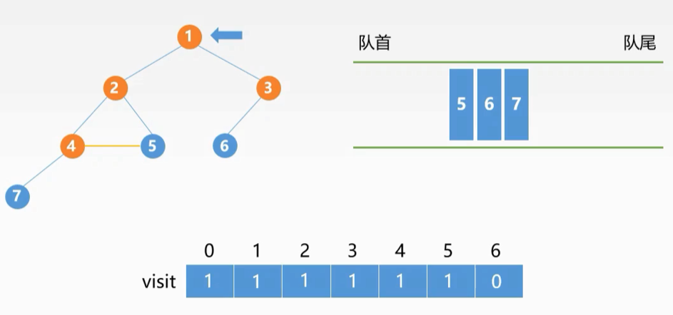
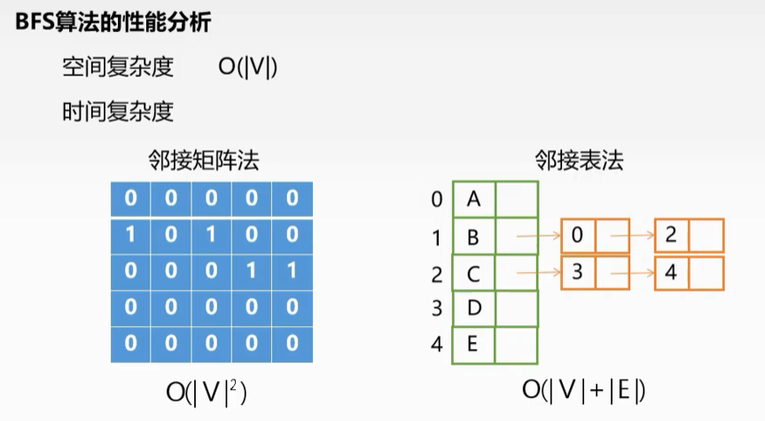
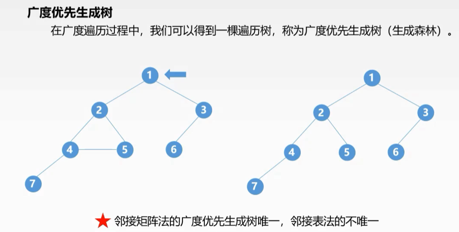
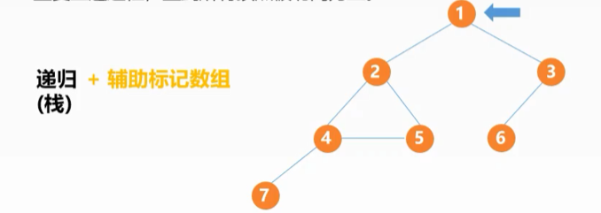
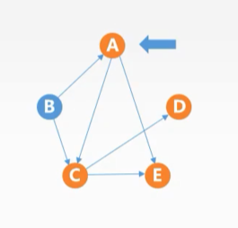
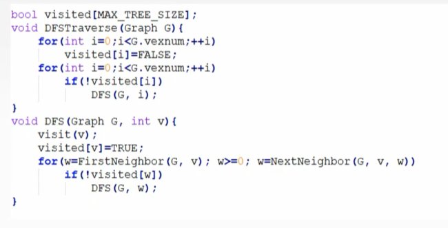
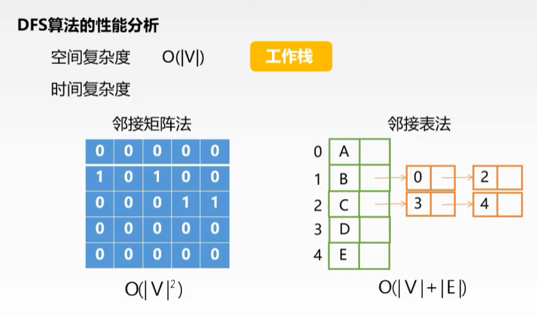
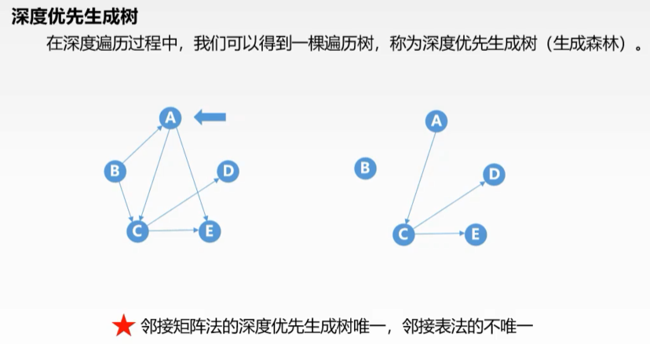
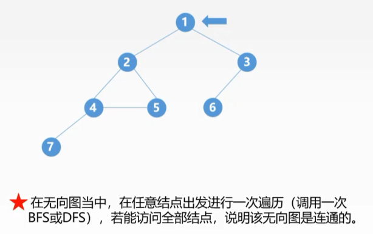
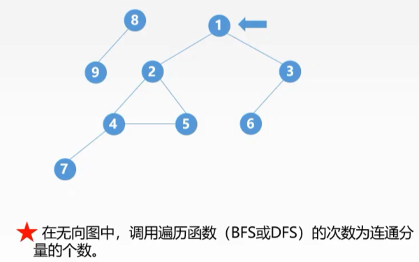

# 数据结构与算法(6-3)--图的遍历

> **图的遍历**：从图中某一顶点出发，按照某种搜索方法沿着图中的边对图中的所有顶点访问一次且仅访问一次。

## 广度优先搜索

### 定义

**BFS：**

- 首先访问起始顶点v;
- 接着由出发依次访问v的各个<mark>未被访问过</mark>的邻接顶点$W_1,W_2,W_3,...W_i$;
- 然后依次访问$W_1,W_2,W_3,...W_i$的所有<mark>未被访问过</mark>的邻接顶点;
- 在从这些访问过的顶点出发，访问它们所有<mark>未被访问</mark>过的邻接顶点;
- .....，以此类推;

### 实现

**队列 + 辅助标记数组**实现图的广度优先搜索遍历

### BFS算法的性能分析

### BFS经典应用

#### 最短路径

#### BFS生成树

## 深度优先搜索

### 定义

**DFS：**

- 首先访问起始顶点$v$;
- 接着由$v$出发访问$v$的任意一个<mark>**邻接且未被访问**</mark>的邻接顶点$w_i$;
- 然后再访问与$w_i$**邻接且未被访问**的任意顶点$y_i$;
- 若$w_i$没有**邻接且未被访问**的顶点时，退回到它的上一层顶点$v$;
- 重复上述过程，直到所有顶点被访问为止。

**递归(栈) + 辅助标记数组**实现DFS

### 代码实现

### 算法性能

### 深度优先生成树

## 遍历与连通性问题

