# 数据结构与算法(7)--查找

## 查找的基本概念

### 查找、查找表

### 关键字、平均查找长度

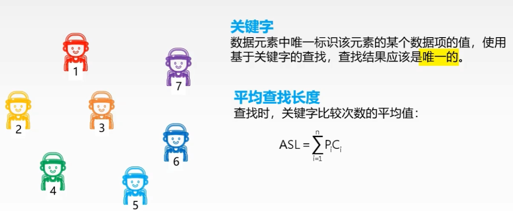

$$
P_i表示第i个元素的查找概率；C_i表示第i个元素的查找长度；
$$

## 顺序查找

### 概念

### 无序线性表顺序查找

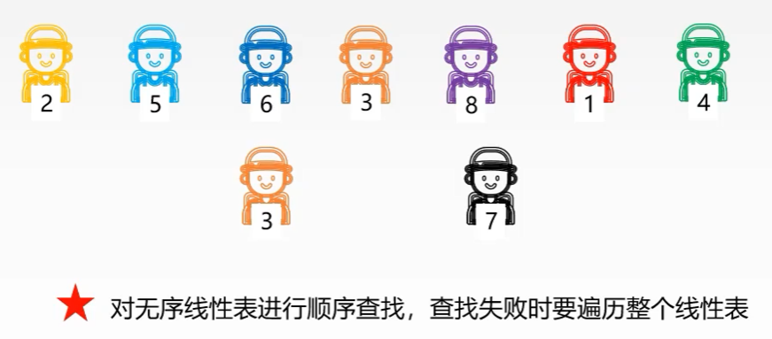

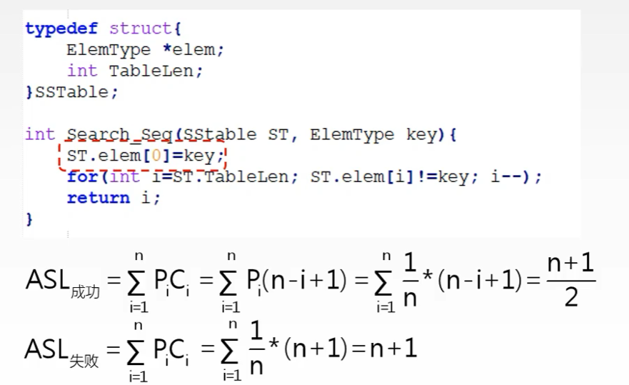

**增加了哨兵`ST.elem[0]=key;`，减少条件判断**

### 有序线性表顺序查找

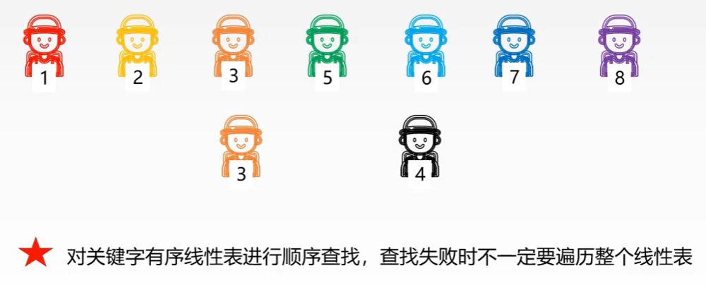

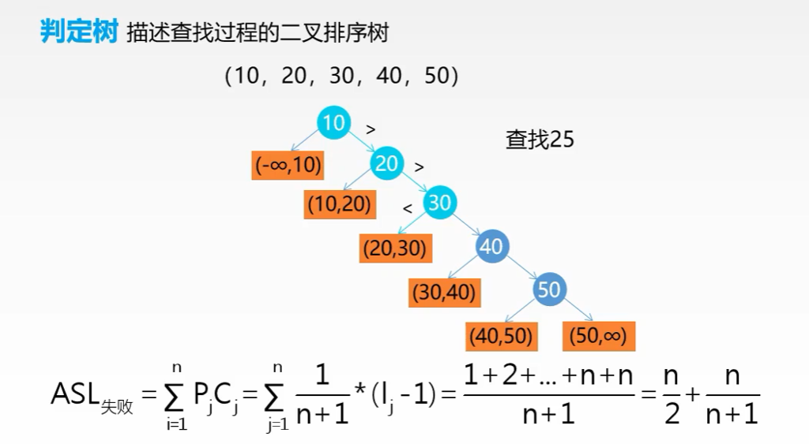

## 二分查找

<mark>**基于有序表**</mark>

### 概念

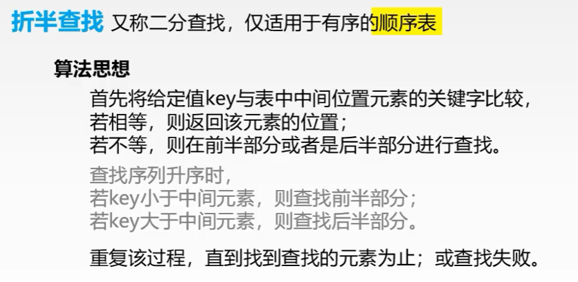

### 代码实现

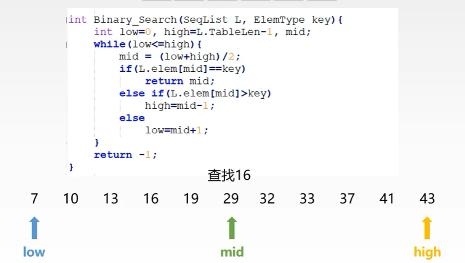

### 二分查找的判定树

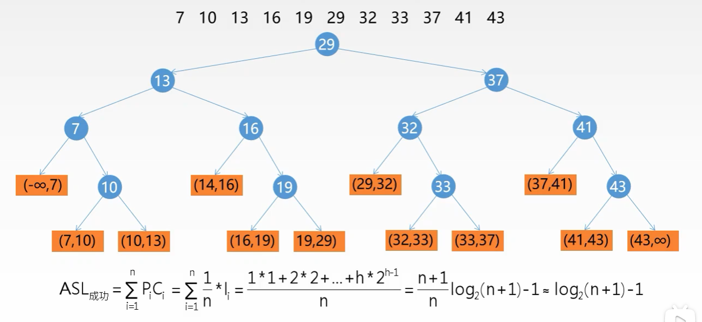

## 分块查找

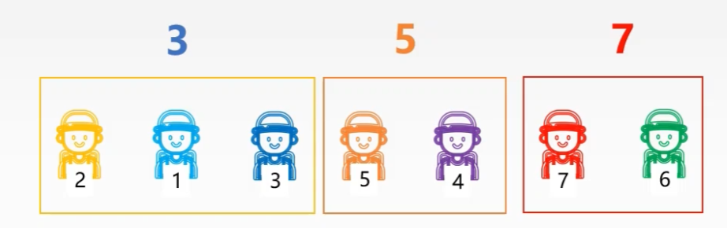

### 概念

### 如何分块

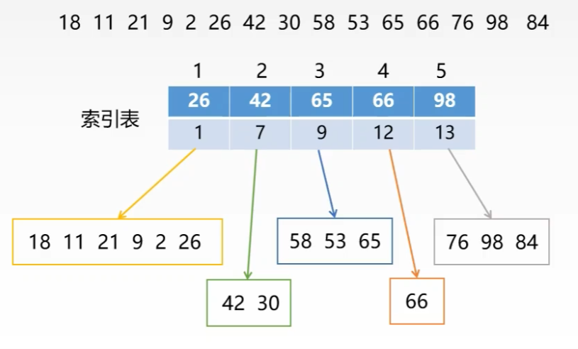

### 如何查找

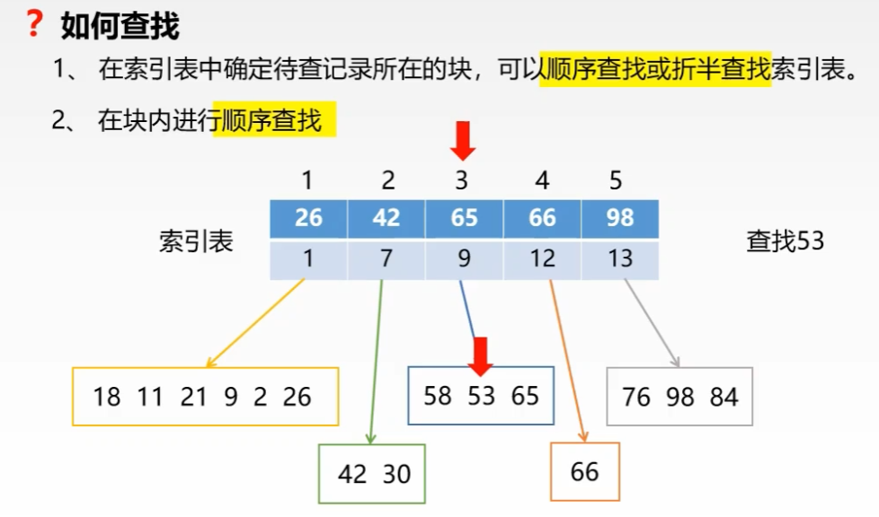

### 平均查找长度

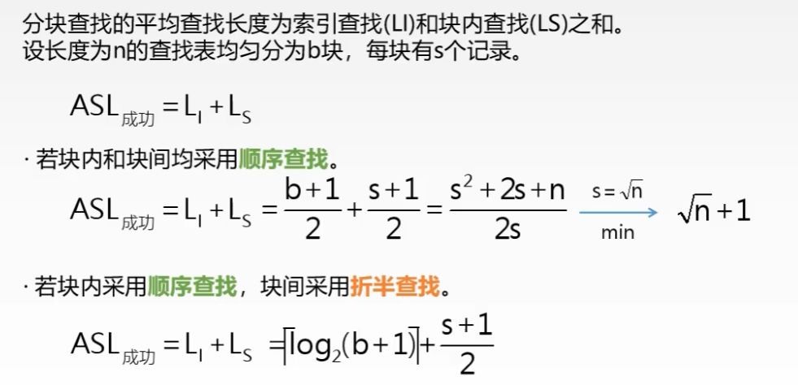

