# 数据结构与算法(8-2)--内部排序算法

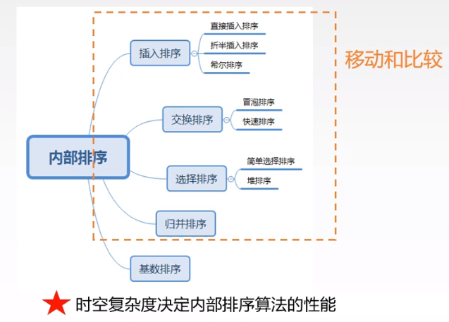

## 插入排序

### 直接插入排序

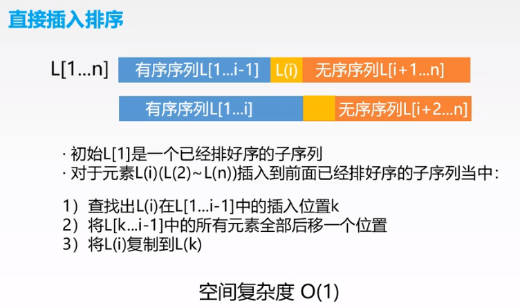

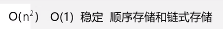

### 折半插入排序

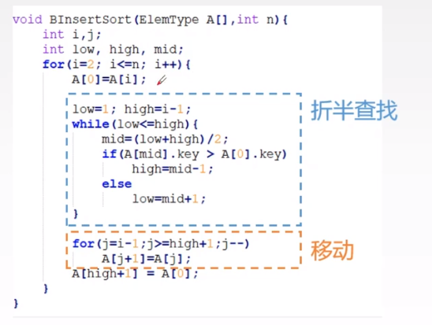

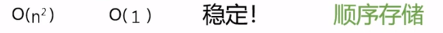

### 希尔排序

**缩小增量：即逐步缩小步长**

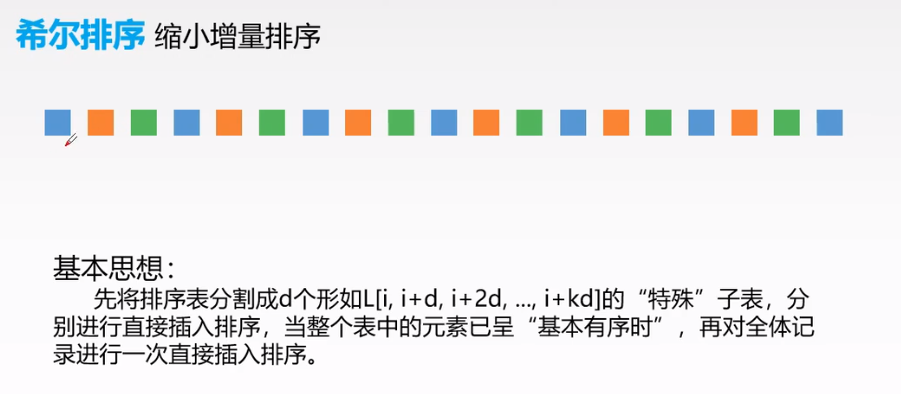

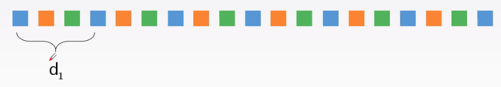

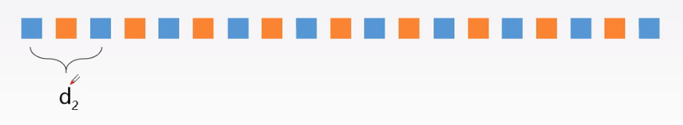

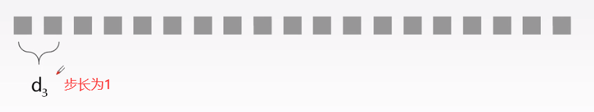

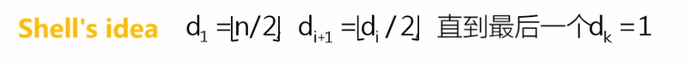

### 复杂度分析

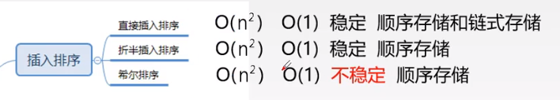

## 交换排序

### 冒泡排序

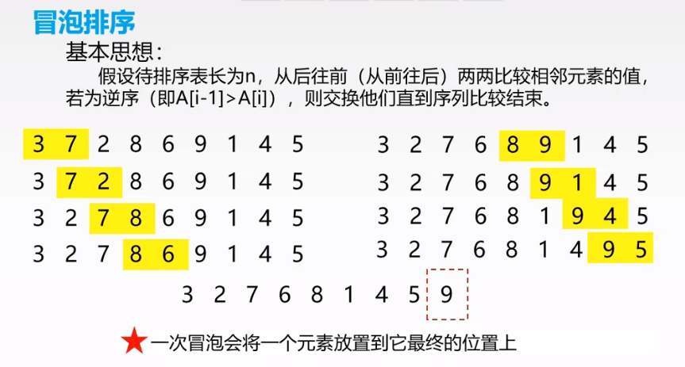

### 快速排序

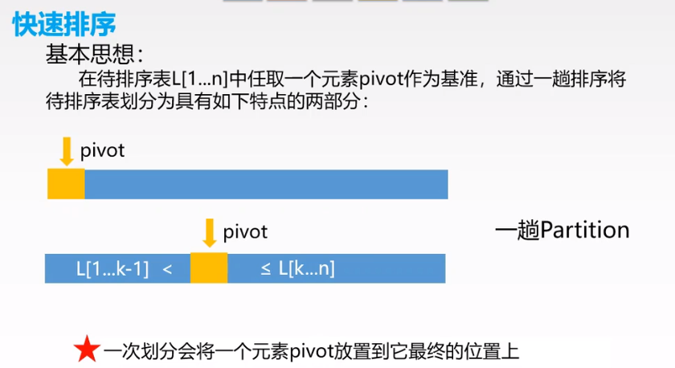

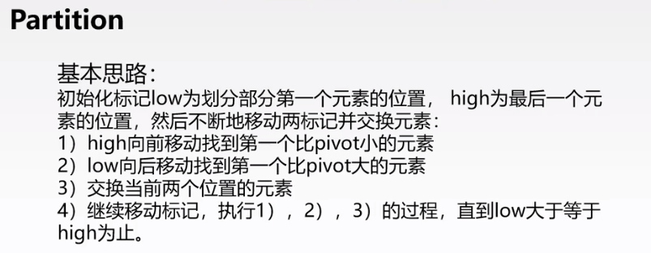

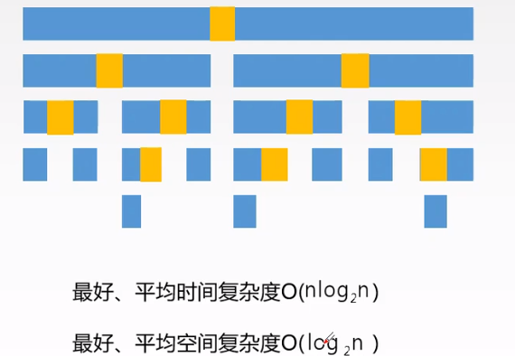

### 复杂度分析

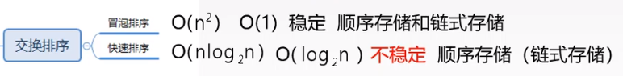

## 选择排序

### 简单选择排序

### 堆排序

### 复杂度分析

## 归并排序

## 基数排序

