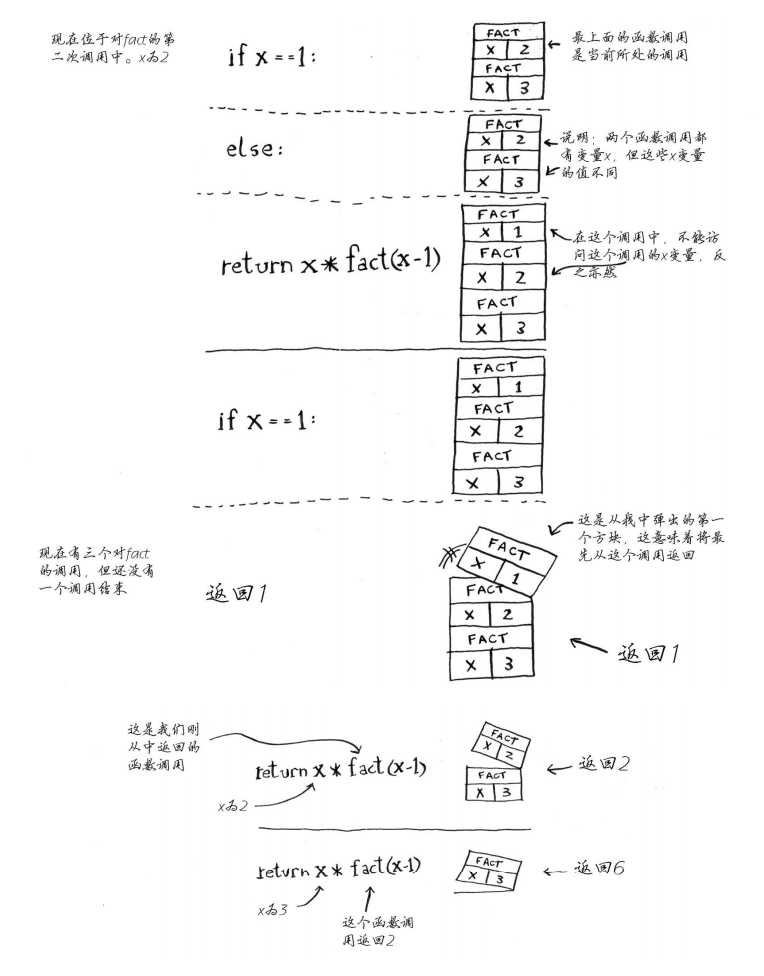
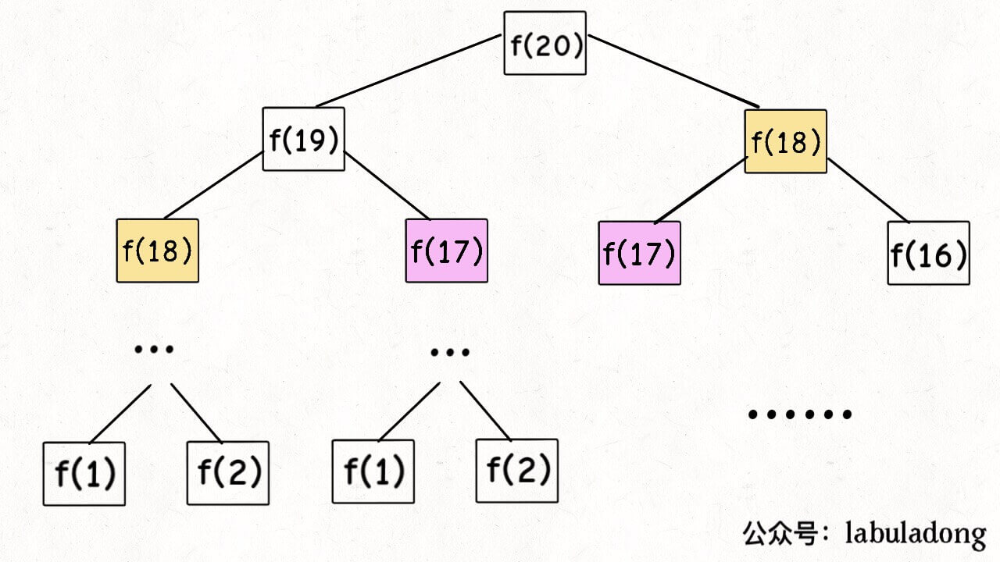

# 数据结构与算法Algo(1)--递归

## 递归函数

> 递归是一种解决问题的有效方法，在递归过程中，函数将自身作为子例程调用


你可能想知道如何实现调用自身的函数。诀窍在于，每当递归函数调用自身时，它都会**将给定的问题拆解为子问题**。递归调用继续进行，直到到子问题无需进一步递归就可以解决的地步。

为了确保递归函数不会导致无限循环，它应具有以下属性：

1. 一个简单的<mark>`基本情况（basic case）`</mark>（或一些案例） —— 能够不使用递归来产生答案的终止方案。
2. 一组规则，也称作<mark>`递推关系（recurrence relation）`</mark>，可将所有其他情况拆分到基本案例。

注意，函数可能会有多个位置进行自我调用。


**递归小结：**

- 递归指的是调用自己的函数。
-  每个递归函数都有两个条件：基线条件和递归条件。
- 所有函数调用都进入调用栈。
- 调用栈可能很长，这将占用大量的内存 


## 画调用栈理解递归

### 调用栈概念

> 这个栈用于存储多个函数的变量，被称为调用栈。 

<mark>一个函数调用另一个函数时，当前函数暂停并处于未完成状态。  </mark>


### 递归调用栈案例

```python
def fact(x):
    """阶乘函数"""
    if x == 1:
        return 1
    else:
        res = x * fact(x - 1)
        return res
```


!

<mark>注意，每个fact调用都有自己的x变量。在一个函数调用中不能访问另一个的x变量  </mark>


## 画递归执行树理解递归

### 斐波那契数列案例

**斐波那契数列的递归实现:**

```python
def fib(n):
    if n == 1 or n == 2:
        return 1
    ret = fib(n - 1) + fib(n - 2)
    return ret
```


### 画出递归执行树




## 记忆化技术

通常情况下，递归是一种直观而有效的实现算法的方法。 但是，如果我们不明智地使用它，可能会给性能带来一些不希望的损失，*例如*重复计算。

`记忆化（memoization）`，可以用来避免这个问题

为了消除上述情况中的重复计算，正如许多人已经指出的那样，其中一个想法是将中间结果**存储**在**缓存**中，以便我们以后可以重用它们，而不需要重新计算。

这个想法也被称为*记忆化*，这是一种经常与递归一起使用的技术。

> [记忆化](https://baike.so.com/doc/4953402-5174974.html) 是一种优化技术，主要用于**加快**计算机程序的速度，方法是**存储**昂贵的函数调用的结果，并在相同的输入再次出现时返回缓存的结果


## 递归--时间复杂度


## 递归--空间复杂度


## 尾递归


## 递归经典案例实战

### leetcode_24 两两交换链表中的节点

给定一个链表，两两交换其中相邻的节点，并返回交换后的链表。

**你不能只是单纯的改变节点内部的值**，而是需要实际的进行节点交换。

 

**示例:**

```
给定 1->2->3->4, 你应该返回 2->1->4->3.
```


按照我们上面列出的步骤，我们可以按下面的流程来实现函数：

1. 首先，我们交换列表中的前两个节点，也就是 `head` 和 `head.next`；
2. 然后我们以 `swap(head.next.next)` 的形式调用函数自身，以交换头两个节点之后列表的其余部分。
3. 最后，我们将步骤（2）中的子列表的返回头与步骤（1）中交换的两个节点相连，以形成新的链表。

```python
# Definition for singly-linked list.
# class ListNode:
#     def __init__(self, x):
#         self.val = x
#         self.next = None

class Solution:
    def swapPairs(self, head: ListNode) -> ListNode:
        def swap(head):
            if not head or not head.next:
                return head
            temp = head.next.next
            head_right = head.next
            head_right.next = head
            head.next = swap(temp)
            return head_right
        return swap(head)
```


### leetcode_118 杨辉三角

给定一个非负整数 *numRows，*生成杨辉三角的前 *numRows* 行。


在杨辉三角中，**每个数是它左上方和右上方的数的和**。

**示例:**

```
输入: 5
输出:
[
     [1],
    [1,1],
   [1,2,1],
  [1,3,3,1],
 [1,4,6,4,1]
]
```


#### 递推关系

首先，我们定义一个函数$f(i, j)$，它将会返回帕斯卡三角形`第 i 行`、`第 j 列`的数字。

我们可以用下面的公式来表示这一递推关系：
$$
f(i, j) = f(i-1, j-1) + f(i -1, j)
$$


#### 基本情况

可以看到，每行的最左边和最右边的数字是`基本情况`，在这个问题中，它总是等于 1。

因此，我们可以将基本情况定义如下:
$$
f(i, j) = 1 \quad where \; j=1 \; or\; j=i
$$


<mark>一旦我们定义了 `递推关系` 和 `基本情况`，递归函数的实现变得更加直观</mark>

```python
class Solution:
    memory_cache = {}  # 使用缓存

    def generate(self, numRows: int) -> list:
        if numRows == 0:
            return []
        ret = [[self.get_item_value(i, j) for j in range(1, i + 1)] for i in range(1, numRows + 1)]
        return ret

    def get_item_value(self, i, j):
        """
        获取第i行，第j列的值
        :param i:
        :param j:
        :return:
        """
        if self.memory_cache.get((i, j)):  # 取缓存
            return self.memory_cache[(i, j)]
        if j == 1 or i == j:
            return 1
        ret = self.get_item_value(i - 1, j - 1) + self.get_item_value(i - 1, j)
        self.memory_cache[(i, j)] = ret  # 载入缓存
        return ret

    def generate_ii(self, numRows: int) -> list:
        """
        递归法
        :param numRows:
        :return:
        """
        if numRows == 0:
            return []
        if numRows == 1:
            return [[1]]
        elif numRows == 2:
            return [[1], [1, 1]]

        ret = self.generate(numRows - 1) + [[self.get_item_value(numRows, j) for j in range(1, numRows + 1)]]
        return ret
```


