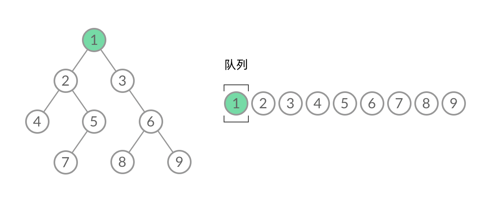
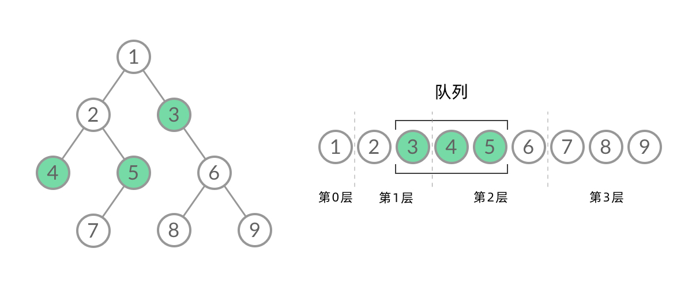

# 算法Algo(8)--BFS

如果我们使用 DFS/BFS 只是为了遍历一棵树、一张图上的所有结点的话，那么 DFS 和 BFS 的能力没什么差别，我们当然更倾向于更方便写、空间复杂度更低的 DFS 遍历。不过，某些使用场景是 DFS 做不到的，只能使用 BFS 遍历。这就是本文要介绍的两个场景：「层序遍历」、「最短路径」。


## DFS 与 BFS

让我们先看看在二叉树上进行 DFS 遍历和 BFS 遍历的代码比较。

DFS 遍历使用**递归**：

```python
def dfs(root: TreeNode):
    if root is None:
        return
    dfs(root.left)
    print(root.val)
    dfs(root.right)
```


BFS 遍历使用**队列**数据结构：

```python
def bfs(root: TreeNode):
    queue = Queue()
    queue.push(root)
    
    while not queue.is_empty():
        node = queue.pop()
        
        if node.left is not None:
            queue.push(node.left)
            pass
        if node.right is not None:
            queue.push(node.right)
            pass
```

只是比较两段代码的话，最直观的感受就是：DFS 遍历的代码比 BFS 简洁太多了！这是因为递归的方式隐含地使用了系统的 栈，我们不需要自己维护一个数据结构。如果只是简单地将二叉树遍历一遍，那么 DFS 显然是更方便的选择。


## BFS的应用(1)--层序遍历

[LeetCode 102. Binary Tree Level Order Traversal](https://leetcode-cn.com/problems/binary-tree-level-order-traversal/) 

> 给定一个二叉树，返回其按层序遍历得到的节点值。 层序遍历即逐层地、从左到右访问所有结点。


乍一看来，这个遍历顺序和 BFS 是一样的，我们可以直接用 BFS 得出层序遍历结果。然而，层序遍历要求的输入结果和 BFS 是不同的。层序遍历要求我们区分每一层，也就是返回一个二维数组。而 BFS 的遍历结果是一个一维数组，无法区分每一层。


那么，怎么给 BFS 遍历的结果分层呢？我们首先来观察一下 BFS 遍历的过程中，结点进队列和出队列的过程：



截取 BFS 遍历过程中的某个时刻：



可以看到，此时队列中的结点是 3、4、5，分别来自第 1 层和第 2 层。这个时候，第 1 层的结点还没出完，第 2 层的结点就进来了，而且两层的结点在队列中紧挨在一起，我们无法区分队列中的结点来自哪一层。


因此，我们需要稍微修改一下代码，<mark>**在每一层遍历开始前，先记录队列中的结点数量 n（也就是这一层的结点数量），然后一口气处理完这一层的 n个结点**。</mark>

```python
def bfs(root: TreeNode):
    queue = Queue()
    queue.push(root)
    
    while not queue.is_empty():
        n = queue.size  # 记录每一层的结点的数量
        
        for i in range(n):  # 处理(pop)完当前层的结点
            node = queue.pop()
            
            if node.left is not None:
                queue.push(node.left)
                pass
            if node.right is not None:
                queue.push(node.right)
                pass
```

这样，我们就将 BFS 遍历改造成了层序遍历。在遍历的过程中，结点进队列和出队列的过程为：


**解题代码：**

```python
class Solution:
    def levelOrder(self, root: TreeNode) -> List[List[int]]:
        """
        核心：
            1.队列 + BFS
            2.记录分层
        :param root:
        :return:
        """
        res_lis = []
        if not root:
            return res_lis
        q = Queue()
        q.push(root)

        while not q.is_empty():
            level_size = q.size  # 记录每一层的结点的数量

            level_res = []
            for i in range(level_size):  # 处理(pop)完当前层的结点
                node = q.pop()
                level_res.append(node.val)

                if node.left is not None:
                    q.push(node.left)
                if node.right is not None:
                    q.push(node.right)
            res_lis.append(level_res)
        return res_lis
```


## BFS的应用(2)--最短路径

[BFS参考](https://leetcode-cn.com/problems/binary-tree-level-order-traversal/solution/bfs-de-shi-yong-chang-jing-zong-jie-ceng-xu-bian-l/)


